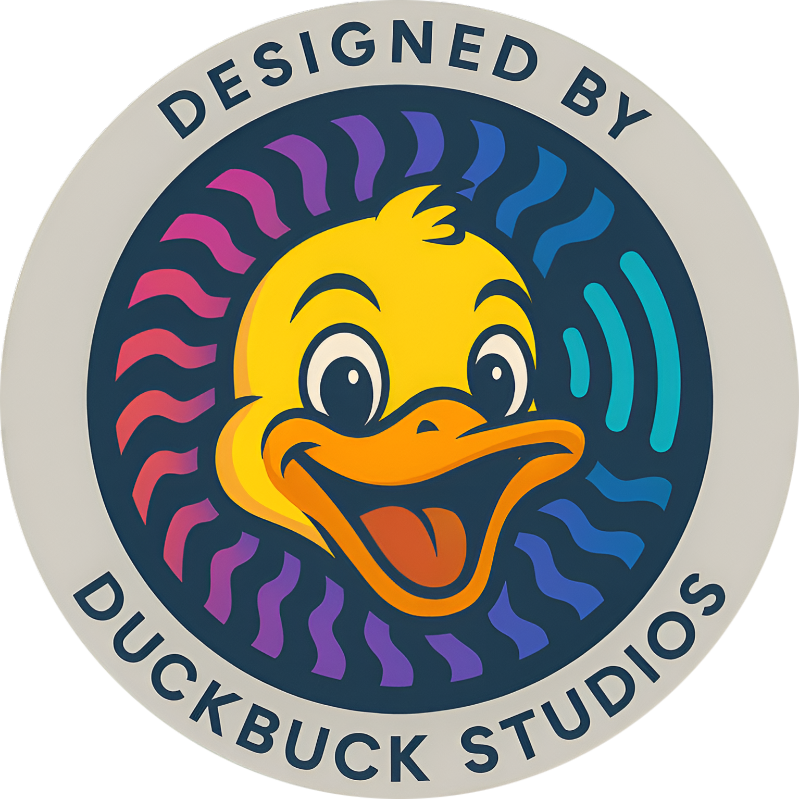

# DuckBuck

<div align="center">
  
</div>

DuckBuck is a feature-rich mobile application built with Flutter that provides a secure and intuitive platform for social connections and messaging.

## 🚀 Features

- **Robust Authentication System**
  - Multiple sign-in methods (Email/Password, Google, Apple, Phone)
  - Secure session management
  - Profile management capabilities

- **Comprehensive Friend System**
  - Friend request management
  - Friend relationship tracking
  - Blocking capabilities for privacy

- **Real-time Messaging System**
  - Text, photo, video, and voice messages
  - Real-time updates and notifications
  - Media file management
  - Message status tracking

## 🏗️ Architecture

DuckBuck follows a clean architecture pattern that emphasizes separation of concerns:

### Layered Design
- **UI Layer**: Flutter widgets, screens, and state management
- **Feature Layer**: Controllers and business logic for specific features
- **Repository Layer**: Coordination layer for domain operations
- **Service Layer**: Core services handling specific domains
- **Model Layer**: Data models representing system entities

### System Integrations

The three main systems (Authentication, Friend, and Messaging) work together with clear boundaries and well-defined interfaces:

```
┌───────────────────┐     ┌──────────────────┐     ┌────────────────────┐
│  Authentication   │────>│   Friend System  │────>│   Messaging System  │
│  (Identity)       │     │  (Relationships) │     │  (Communication)    │
└───────────────────┘     └──────────────────┘     └────────────────────┘
```

## 🛠️ Technology Stack

- **Frontend**: Flutter
- **Backend**: Firebase
  - Authentication
  - Firestore Database
  - Storage
  - Analytics
  - Messaging
- **State Management**: Flutter's ChangeNotifier pattern
- **Dependency Injection**: GetIt service locator

## 📦 Dependencies

- Firebase Core, Auth, Firestore, Storage, Messaging
- Google Sign-In
- Apple Sign-In
- Image Picker
- URL Launcher
- Shared Preferences
- Package Info Plus

## 🔒 Security Features

- Secure authentication with Firebase Auth
- Friend relationship security with mutual consent
- Message permissions based on friendship status
- Media storage with proper access controls
- Comprehensive blocking system

## 💻 Development Setup

1. Clone the repository:
```bash
git clone https://github.com/yourusername/duckbuck.git
cd duckbuck
```

2. Install dependencies:
```bash
flutter pub get
```

3. Configure Firebase:
   - Create a Firebase project
   - Add Android & iOS apps to your Firebase project
   - Download configuration files and place them in the appropriate directories
   - Enable authentication methods in Firebase console

4. Run the app:
```bash
flutter run
```

## 📚 Documentation

Comprehensive documentation is available in the `/docs` folder including:
- System architecture documentation
- Authentication system documentation
- Friend system documentation
- Messaging system documentation
- Security implementation details
- System diagrams using Mermaid syntax

For more detailed information, check out our documentation:

- [Authentication System](docs/authentication_system.md)
- [Friend System](docs/friend_system.md)
- [Messaging System](docs/messaging_system.md)
- [System Architecture](docs/system_architecture.md)
- [Friend-Messaging Integration](docs/friend_messaging_integration.md)
- [Security Implementation](docs/security_implementation.md)

See the [Documentation Index](/docs/README.md) for a complete list of available documentation.

## 🤝 Contributing

Contributions are welcome! Please feel free to submit a Pull Request.

## 📄 License

This project is licensed under the MIT License - see the LICENSE file for details.

## 👏 Acknowledgements

- Flutter team for the amazing framework
- Firebase for the powerful backend services
- All contributors who have helped shape this project

---

<div align="center">
  <p>Designed by DuckBuck Studios</p>
</div>
