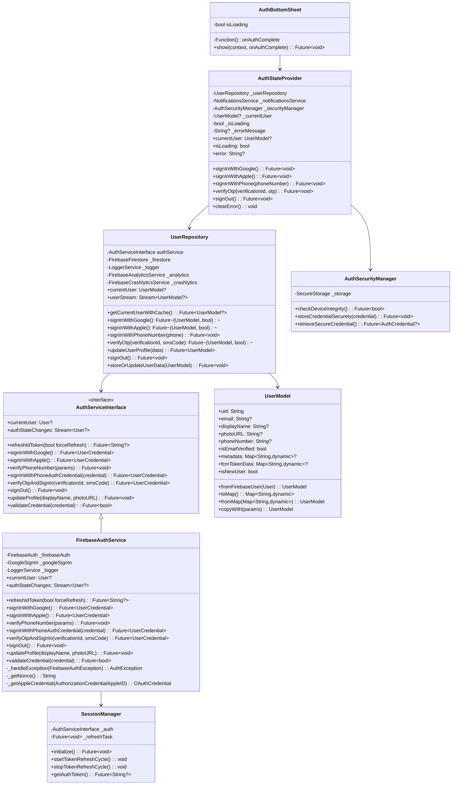

# DuckBuck Authentication Architecture Documentation

This documentation provides a comprehensive overview of the authentication system in the DuckBuck app. It explains the structure, workflows, and best practices to follow when maintaining or extending the authentication functionality.

## Table of Contents

1. [Architecture Overview](#architecture-overview)
2. [Class Diagram](#class-diagram)
3. [Authentication Flow](#authentication-flow)
4. [Core Authentication Components](#core-authentication-components)
5. [UI Authentication Components](#ui-authentication-components)
6. [Security Considerations](#security-considerations)
7. [Best Practices for Maintenance](#best-practices-for-maintenance)
8. [Testing Authentication](#testing-authentication)

## Architecture Overview

The DuckBuck authentication system follows a layered architecture pattern with clear separation of concerns:

1. **UI Layer** - Handles user interactions through welcome screen, onboarding flow, and authentication bottom sheet
2. **Provider Layer** - Manages authentication state and propagates changes to the UI
3. **Repository Layer** - Coordinates authentication operations and user data persistence
4. **Service Layer** - Implements authentication operations through Firebase services
5. **Model Layer** - Defines data structures representing user information

The authentication system supports three authentication methods:
- Google Sign-In
- Apple Sign-In
- Phone Number Authentication with OTP verification

This architecture ensures:
- Clear separation between UI and business logic
- Testable components with dependency injection
- Consistent error handling across the authentication flow
- Secure token management and user session handling

## Class Diagram



## Authentication Flow

### 1. User Onboarding & Authentication Entry Points

The authentication flow starts at one of two entry points:
1. **New User Flow**: Welcome Screen → Onboarding Screens → Authentication Bottom Sheet
2. **Returning User Flow**: Direct access to Authentication Bottom Sheet

**Onboarding Container Flow:**
```
WelcomeScreen (slide-to-action) → OnboardingContainer → [Screen1 → Screen2 → Screen3 → SignupScreen]
```

**Authentication Methods Flow:**
```
AuthBottomSheet → [Google Sign-In OR Apple Sign-In OR Phone Authentication]
```

**Phone Authentication Flow:**
```
Phone Number Entry → OTP Verification → Authentication Complete
```

### 2. Authentication State Management

The `AuthStateProvider` acts as the central manager for authentication state across the app:
- Listens to authentication state changes from Firebase Auth
- Broadcasts state changes to UI components
- Handles login, registration, and logout operations
- Manages loading and error states
- Updates user information in database after successful authentication

### 3. Session Management

The `SessionManager` manages authentication tokens and session persistence:
- Handles automatic token refresh
- Secures authentication credentials
- Manages session timeout and expiration

## Core Authentication Components

### 1. AuthServiceInterface

The foundation of the authentication system that defines all authentication operations:

```dart
abstract class AuthServiceInterface {
  User? get currentUser;
  Stream<User?> get authStateChanges;
  Future<String?> refreshIdToken({bool forceRefresh = false});
  Future<UserCredential> signInWithGoogle();
  Future<UserCredential> signInWithApple();
  Future<void> verifyPhoneNumber({...});
  Future<UserCredential> signInWithPhoneAuthCredential(PhoneAuthCredential credential);
  Future<UserCredential> verifyOtpAndSignIn(String verificationId, String smsCode);
  Future<void> signOut();
  Future<void> updateProfile({String? displayName, String? photoURL});
  Future<bool> validateCredential(AuthCredential credential);
}
```

### 2. FirebaseAuthService

The concrete implementation of AuthServiceInterface using Firebase Authentication:

- Handles all Firebase Auth operations (Google, Apple, Phone)
- Translates Firebase exceptions to app-specific AuthExceptions
- Implements secure authentication flows with proper error handling
- Manages token refresh and session state

**Key Methods:**
- `signInWithGoogle()` - Authenticates using GoogleSignIn
- `signInWithApple()` - Authenticates using Apple Sign-In with secure nonce
- `verifyPhoneNumber()` - Initiates phone authentication flow
- `verifyOtpAndSignIn()` - Completes phone authentication with OTP
- `refreshIdToken()` - Securely refreshes authentication tokens

### 3. UserRepository

Coordinates authentication operations and user data persistence:

- Bridges authentication services and user data storage
- Handles user profile creation and updates
- Manages user metadata and authentication methods
- Provides caching mechanisms for better performance
- Records authentication events with analytics

**Key Methods:**
- `signInWithGoogle()` - Handles Google authentication and user creation
- `signInWithApple()` - Handles Apple authentication and user creation
- `signInWithPhoneNumber()` - Initiates phone verification
- `verifyOtp()` - Completes phone verification and user creation
- `storeOrUpdateUserData()` - Persists user information to database
- `getCurrentUserWithCache()` - Retrieves user with caching for performance

### 4. UserModel

Data class representing authenticated users:

```dart
class UserModel {
  final String uid;
  final String? email;
  final String? displayName;
  final String? photoURL;
  final String? phoneNumber;
  final bool isEmailVerified;
  final Map<String, dynamic>? metadata;
  final Map<String, dynamic>? fcmTokenData;
  final bool isNewUser;
  
  // Factory constructors and utility methods
  factory UserModel.fromFirebaseUser(firebase.User user);
  Map<String, dynamic> toMap();
  factory UserModel.fromMap(Map<String, dynamic> map);
  UserModel copyWith({...});
}
```

### 5. AuthSecurityManager

Ensures secure authentication operations:

- Validates device integrity
- Secures credential storage
- Detects jailbroken or rooted devices
- Handles secure credential persistence and retrieval
- Manages secure token storage

## UI Authentication Components

### 1. WelcomeScreen

The entry point to the app for new users:
- Slide-to-action mechanism to enter onboarding flow
- UI animations for smooth transitions
- Analytics tracking for onboarding funnel

### 2. OnboardingContainer

Manages the onboarding flow:
- Liquid swipe navigation between onboarding screens
- Progress tracking and persistence
- Transition to authentication screen

### 3. OnboardingSignupScreen

The final screen in the onboarding flow:
- Presents the "Get Started" button to trigger authentication
- Transitions to AuthBottomSheet for auth options

### 4. AuthBottomSheet

Modal bottom sheet offering authentication options:
- Google Sign-In button
- Apple Sign-In button (iOS only)
- Phone authentication with OTP
- Animated transitions between auth states
- Individual loading indicators for each auth method
- Error handling and user feedback
- Country code picker for international phone numbers

**Auth Stages:**
1. `AuthStage.options` - Initial auth method selection
2. `AuthStage.phoneEntry` - Phone number input screen
3. `AuthStage.otpVerification` - OTP verification screen

## Security Considerations

### 1. Secure Token Management

- Tokens are refreshed automatically by SessionManager
- Auth tokens are never stored in plain text
- Token refresh failures trigger proper re-authentication

### 2. Credential Security

- AuthSecurityManager handles secure credential storage
- Device security state is verified before auth operations
- Sensitive auth data is stored in secure enclave where available

### 3. OTP Security

- OTP verification uses Firebase's secure verification flow
- Automatic SMS code detection where supported
- Rate limiting protection for verification attempts
- Secure verification ID handling

### 4. Session Management

- Token expiration is handled gracefully
- Auto-refresh occurs before token expiration
- Proper security measures for token storage

## Best Practices for Maintenance

### Code Standards

1. **Dependency Injection**
   - Always use dependency injection for services and repositories
   - This enables mock services for testing

2. **Error Handling**
   - Use the custom AuthException class for all auth errors
   - Always include logging with appropriate severity levels
   - Present user-friendly error messages

3. **Analytics**
   - Track authentication events for funnel analysis
   - Log failed authentication attempts with reason (not PII)
   - Monitor authentication conversion rates

### Common Modification Scenarios

#### 1. Adding a New Authentication Method

1. Update the `AuthServiceInterface` with the new method
2. Implement the method in `FirebaseAuthService`
3. Add corresponding methods in `UserRepository`
4. Update the `AuthStateProvider` to expose the new functionality
5. Add UI components to `AuthBottomSheet`
6. Update analytics tracking

#### 2. Modifying User Profile Data

1. Update the `UserModel` class with new fields
2. Modify the `toMap()` and `fromMap()` methods
3. Update the `updateUserProfile()` method in `UserRepository`
4. Ensure backward compatibility for existing users

#### 3. Updating Authentication UI

1. Modify the `AuthBottomSheet` component
2. Ensure proper loading states and error handling
3. Test on both iOS and Android for platform-specific behaviors
4. Verify accessibility support for all UI changes

## Testing Authentication

### Unit Testing

- Test the `AuthServiceInterface` implementation with mock Firebase services
- Test `UserRepository` with mock AuthService
- Test `AuthStateProvider` with mock UserRepository
- Validate error handling scenarios

### Integration Testing

- Test the complete authentication flow with Firebase emulators
- Verify proper user creation in the database
- Test token refresh and session handling

### UI Testing

- Test authentication UI components on different screen sizes
- Verify loading states and transitions
- Test error scenarios and error messages
- Ensure accessibility compliance

### Security Testing

- Verify secure token storage
- Test session timeout and re-authentication
- Validate rate limiting for OTP verification

---

## Conclusion

The DuckBuck authentication system is designed with security, flexibility, and user experience in mind. Following the patterns and practices outlined in this documentation will ensure the authentication system remains robust, secure, and maintainable as the app evolves.

For any new authentication features or modifications, always ensure that security is the primary consideration, followed by user experience and code maintainability.
