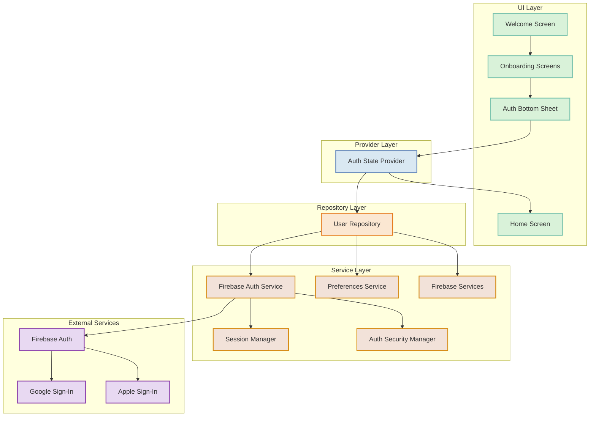
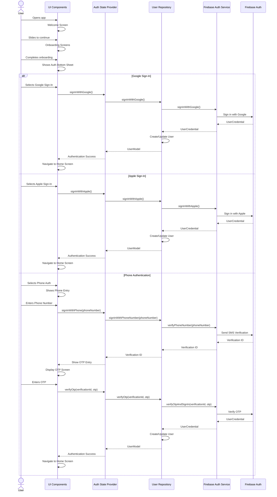
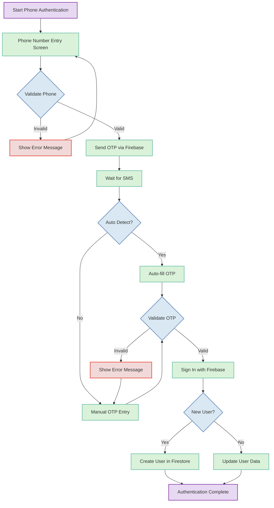
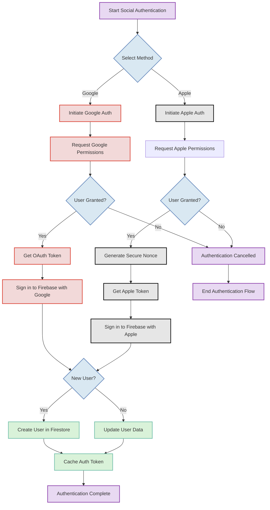
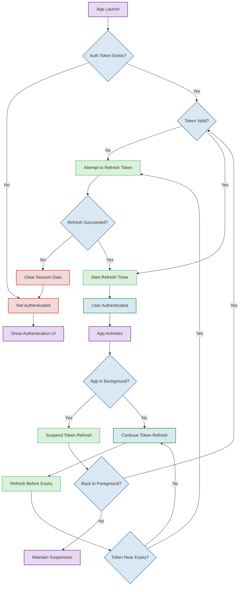

# DuckBuck Authentication Flow Diagrams

This document provides visual diagrams of the authentication flows implemented in the DuckBuck application.

## Table of Contents
1. [Authentication Architecture](#authentication-architecture)
2. [Authentication Flow Sequence](#authentication-flow-sequence)
3. [Phone Authentication Flow](#phone-authentication-flow)
4. [Social Authentication Flow](#social-authentication-flow)
5. [Session Management Flow](#session-management-flow)

## Authentication Architecture

## Authentication Flow Sequence

## Phone Authentication Flow

## Social Authentication Flow

## Session Management Flow

