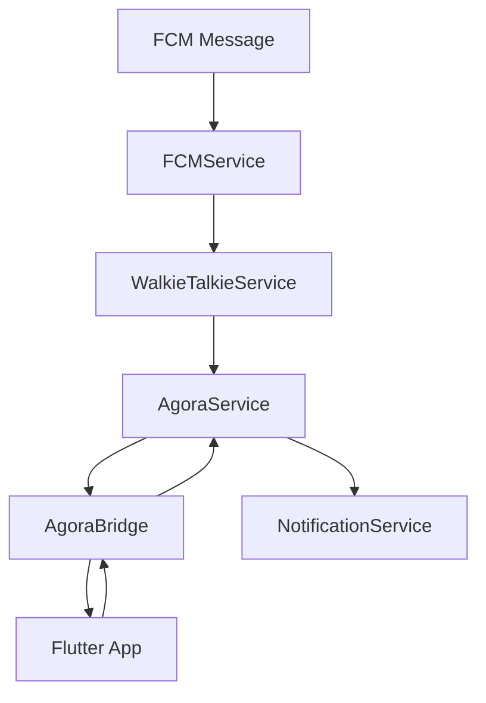

# Android Service Architecture Overview

This document outlines the Android service architecture for the DuckBuck walkie-talkie system, showing the separation of concerns and modular structure.

## Directory Structure

```
android/app/src/main/kotlin/com/duckbuck/app/
├── MainActivity.kt
├── bridges/
│   └── AgoraBridge.kt                 # Flutter ↔ Native communication
├── services/
│   ├── agora/                         # 🤖 Agora RTC & AI Audio
│   │   └── AgoraService.kt           # Core Agora functionality with AI enhancements
│   ├── fcm/
│   │   └── FCMService.kt             # Firebase Cloud Messaging
│   ├── notification/
│   │   └── NotificationService.kt    # System notifications
│   └── walkietalkie/
│       ├── WalkieTalkieService.kt    # Foreground service for calls
│       └── utils/
│           ├── TimestampValidator.kt
│           └── WalkieTalkiePrefsUtil.kt
```

## Service Responsibilities

### 🤖 AgoraService (`services/agora/`)
**Core Agora RTC functionality with AI audio enhancements**

**Key Features:**
- RTC Engine lifecycle management
- Channel joining/leaving with participant tracking
- AI-powered audio enhancements (denoising, echo cancellation)
- Audio routing and device management
- Real-time audio quality monitoring
- Event handling and callbacks

**AI Audio Enhancements:**
- Dynamic plugin loading (`libagora_ai_denoise_extension`, `libagora_ai_echo_cancellation_extension`)
- AI scenario configuration (`AUDIO_SCENARIO_AI_CLIENT`)
- Advanced audio parameter optimization
- Automatic reconfiguration on audio route changes

### 📞 WalkieTalkieService (`services/walkietalkie/`)
**Foreground service for handling walkie-talkie calls**

**Key Features:**
- FCM data-only notification processing
- Foreground service management
- Call state persistence
- Channel auto-leave logic (WhatsApp-style)
- Timestamp validation for security
- Call interruption protection

### 🔔 NotificationService (`services/notification/`)
**System notification management**

**Key Features:**
- Incoming call notifications
- Ongoing call notifications
- Notification channel management
- Action button handling

### 📱 FCMService (`services/fcm/`)
**Firebase Cloud Messaging handler**

**Key Features:**
- FCM message routing
- Data-only notification processing
- Service delegation based on message type

### 🌉 AgoraBridge (`bridges/`)
**Flutter-Native communication bridge**

**Key Features:**
- MethodChannel implementation
- All AgoraService method exposure
- Error handling and logging
- Type-safe parameter passing

## Communication Flow



## Import Structure

### Current Import Paths
```kotlin
// AgoraService (moved to dedicated folder)
import com.duckbuck.app.services.agora.AgoraService

// WalkieTalkieService
import com.duckbuck.app.services.walkietalkie.WalkieTalkieService

// Other services
import com.duckbuck.app.services.fcm.FCMService
import com.duckbuck.app.services.notification.NotificationService

// Bridge
import com.duckbuck.app.bridges.AgoraBridge

// Utilities
import com.duckbuck.app.services.walkietalkie.utils.WalkieTalkiePrefsUtil
import com.duckbuck.app.services.walkietalkie.utils.TimestampValidator
```

## Benefits of This Structure

### 🎯 **Separation of Concerns**
- **AgoraService**: Pure RTC functionality with AI enhancements
- **WalkieTalkieService**: Call management and lifecycle
- **NotificationService**: UI notifications only
- **FCMService**: Message routing only

### 🔧 **Modularity**
- Each service has a single responsibility
- Easy to test individual components
- Clean dependency injection
- Reusable across different features

### 🤖 **AI Audio Integration**
- Dedicated location for Agora-specific functionality
- AI enhancements isolated from call management
- Easy to extend with more AI features
- Clean separation from business logic

### 🔄 **Maintainability**
- Clear file organization
- Logical grouping of related functionality
- Easy to locate and modify specific features
- Consistent import patterns

### 📱 **Flutter Integration**
- Single bridge for all Agora functionality
- Type-safe method channel communication
- Comprehensive error handling
- Consistent API surface

## Future Extensibility

This structure allows for easy addition of:
- **More AI features**: Add to `services/agora/`
- **Additional call types**: Extend `services/walkietalkie/`
- **New notification types**: Extend `services/notification/`
- **Other messaging protocols**: Add to `services/`
- **More bridges**: Add to `bridges/`

## Testing Strategy

Each service can be tested independently:
- **Unit tests**: Individual service methods
- **Integration tests**: Service-to-service communication
- **End-to-end tests**: Flutter-to-native workflows
- **AI audio tests**: Audio quality validation
