# DuckBuck Authentication Architecture

## Overview

The DuckBuck authentication system implements a secure, multi-provider authentication flow that supports:
- Google Sign-In
- Apple Sign-In
- Phone Authentication with OTP verification

The architecture follows a layered design pattern with clear separation of concerns to ensure maintainability, scalability, and testability. This structured approach enables robust security features, comprehensive error handling, and a smooth user experience while maintaining code quality.

## Architecture Diagram

```mermaid
graph TD
    %% UI Layer
    subgraph "UI Layer"
        WS[Welcome Screen]
        ABS[Auth Bottom Sheet]
        PCS[Profile Completion Screen]
        HS[Home Screen]
        PS[Preferences Screen]
    end
    
    %% Provider Layer
    subgraph "Provider Layer"
        ASP[Auth State Provider]
        USP[User Settings Provider]
    end
    
    %% Repository Layer
    subgraph "Repository Layer"
        UR[User Repository]
    end
    
    %% Service Layer
    subgraph "Service Layer"
        %% Auth Services
        subgraph "Auth Services"
            AuthService[Auth Service Interface]
            FireAuth[Firebase Auth Service]
            SecManager[Auth Security Manager]
            SessManager[Session Manager]
        end
        
        %% User Data Services
        subgraph "User Services"
            UserService[User Service Interface]
            FireUser[Firebase User Service]
            PrefService[Preferences Service]
        end
        
        %% Support Services
        subgraph "Support Services"
            AnalService[Analytics Service]
            ApiService[API Service]
            CrashService[Crashlytics Service]
            NotifService[Notifications Service]
            LogService[Logger Service]
        end
    end
    
    %% Model Layer
    subgraph "Model Layer"
        UserModel[User Model]
        AuthExceptions[Auth Exceptions]
        TokenModel[Auth Token Model]
    end
    
    %% External Services
    subgraph "External Services"
        Firebase[Firebase Auth]
        GoogleAuth[Google Sign-In SDK]
        AppleAuth[Apple Sign-In SDK]
        Firestore[Firestore]
        FCM[Firebase Cloud Messaging]
    end
    
    %% UI Flow
    WS --> ABS
    ABS --> PCS
    PCS --> HS
    WS -.-> HS
    HS --> PS
    
    %% Provider Dependencies
    ABS --> ASP
    PCS --> ASP
    HS --> ASP
    PS --> ASP
    PS --> USP
    
    %% Provider to Repository
    ASP --> UR
    ASP --> SecManager
    ASP --> NotifService
    USP --> UR
    
    %% Repository Dependencies
    UR --> AuthService
    UR --> UserService
    UR --> PrefService
    UR --> AnalService
    UR --> CrashService
    UR --> LogService
    UR --> ApiService
    
    %% Service Implementation
    AuthService --> FireAuth
    UserService --> FireUser
    
    %% Service to External
    FireAuth --> Firebase
    FireAuth --> GoogleAuth
    FireAuth --> AppleAuth
    FireUser --> Firestore
    NotifService --> FCM
    
    %% Security Components
    SecManager --> AuthService
    SecManager --> UR
    SecManager --> SessManager
    SecManager --> LogService
    
    %% Models Usage
    FireAuth --> UserModel
    FireAuth --> TokenModel
    FireUser --> UserModel
    UR --> UserModel
    UR --> TokenModel
    ASP --> UserModel
    SecManager --> TokenModel
    FireAuth --> AuthExceptions
    FireUser --> AuthExceptions
    ASP --> AuthExceptions
    
    %% Data Flow for Sign-In
    ABS -->|"1. Sign-In Request"| ASP
    ASP -->|"2. Process Auth"| UR
    UR -->|"3. Authenticate"| AuthService
    AuthService -->|"4. Provider Auth"| Firebase
    Firebase -->|"5. Auth Response"| AuthService
    AuthService -->|"6. User Data"| UR
    UR -->|"7. Create/Update User"| UserService
    UserService -->|"8. Store User Data"| Firestore
    UR -->|"9. Cache User"| PrefService
    UR -->|"10. User Object"| ASP
    ASP -->|"11. Auth State Update"| ABS
    UR -->|"12. Analytics Event"| AnalService
    UR -->|"13. Register Device"| NotifService
    SecManager -->|"14. Initialize Session"| SessManager
    
    %% Color coding
    classDef uiLayer fill:#d0e0ff,stroke:#333,stroke-width:1px;
    classDef providerLayer fill:#ffe0b0,stroke:#333,stroke-width:1px;
    classDef repositoryLayer fill:#d5f5e3,stroke:#333,stroke-width:1px;
    classDef serviceLayer fill:#ffd5d5,stroke:#333,stroke-width:1px;
    classDef modelLayer fill:#e0d0ff,stroke:#333,stroke-width:1px;
    classDef externalLayer fill:#f0f0f0,stroke:#333,stroke-width:1px;
    
    class WS,ABS,PCS,HS uiLayer;
    class ASP providerLayer;
    class UR repositoryLayer;
    class AuthService,FireAuth,UserService,FireUser,PrefService,SecManager,SessManager,AnalService,ApiService,CrashService,NotifService serviceLayer;
    class UserModel,AuthExceptions modelLayer;
    class Firebase,GoogleAuth,AppleAuth,Firestore externalLayer;
```

## Layer Responsibilities

### 1. UI Layer

The UI layer provides the interface for users to interact with the authentication system.

#### Components:
- **Welcome Screen**: Entry point for authentication, offering sign-in options
- **Auth Bottom Sheet**: Modal interface for authentication method selection
- **Profile Completion Screen**: For new users to complete their profile after authentication
- **Home Screen**: Main application screen after successful authentication

#### Responsibilities:
- Present authentication options to users
- Handle UI state (loading, error messages, etc.)
- Capture user inputs (phone number, OTP, etc.)
- Navigate between authentication stages
- Display appropriate feedback during authentication process

### 2. Provider Layer

The provider layer manages application state related to authentication and acts as a bridge between the UI and repository layers.

#### Components:
- **Auth State Provider**: Central state management for authentication
- **User Settings Provider**: Manages user preferences and settings

#### Responsibilities:
- Provide authentication state to UI components
- Broadcast authentication state changes
- Handle authentication operations (sign-in, sign-out)
- Maintain current user information
- Manage loading states and error messages
- Initialize notification services and security managers
- Handle auth-related side effects (navigation, token registration)
- Coordinate between multiple UI components during auth flow
- Provide optimistic UI updates during authentication operations
- Cache authentication state for quick UI hydration

### 3. Repository Layer

The repository layer coordinates between multiple services to handle complete authentication flows.

#### Components:
- **User Repository**: Central coordinator for authentication and user data management

#### Responsibilities:
- Coordinate authentication operations across multiple services
- Manage user data persistence and caching
- Handle user creation and update workflows
- Track analytics events for authentication
- Implement complete sign-in/sign-out processes
- Ensure proper FCM token management during authentication
- Bridge between UI state and backend services
- Handle complex business logic around user authentication
- Coordinate timing-sensitive operations (token refresh, session management)
- Provide a clean abstraction over multiple authentication providers
- Centralize authentication error handling
- Orchestrate multi-step authentication flows (e.g., phone + profile completion)

### 4. Service Layer

The service layer provides specialized functionality for different aspects of authentication, organized into three subgroups: Auth Services, User Services, and Support Services.

#### Auth Service Components:
- **Auth Service Interface**: Defines authentication operation contract
- **Firebase Auth Service**: Implements authentication with Firebase
- **Auth Security Manager**: Manages security aspects of authentication
- **Session Manager**: Handles user session timing and expiration

#### Auth Service Responsibilities:
- Implement provider-specific authentication (Google, Apple, Phone)
- Abstract platform-specific authentication details
- Handle token refresh and validation
- Manage secure credential storage and verification
- Implement multi-factor authentication flows
- Provide standardized error handling for auth operations
- Detect and prevent common authentication attacks
- Manage secure session handling and timeout logic

#### User Service Components:
- **User Service Interface**: Defines user data operations contract
- **Firebase User Service**: Implements user data operations with Firestore
- **Preferences Service**: Handles secure local storage of user data

#### User Service Responsibilities:
- Store and retrieve user profile data securely
- Manage user metadata synchronization
- Handle user account linking across auth methods
- Implement user data migration strategies
- Provide data validation for user information
- Manage user preferences and settings

#### Support Service Components:
- **Analytics Service**: Tracks authentication events and metrics
- **API Service**: Communicates with backend services
- **Crashlytics Service**: Records authentication errors
- **Notifications Service**: Manages device tokens and notifications
- **Logger Service**: Provides structured logging for auth operations

#### Support Service Responsibilities:
- Track authentication analytics and errors
- Send welcome emails and notifications
- Register and manage notification tokens
- Log security and authentication events
- Support remote configuration of auth features
- Provide diagnostic information for troubleshooting

### 5. Model Layer

The model layer defines the data structures used across the authentication system.

#### Components:
- **User Model**: Represents authenticated user data
- **Auth Exceptions**: Standardized authentication error handling
- **Auth Token Model**: Manages authentication tokens and credentials

#### Responsibilities:
- Define data structures for user information
- Provide methods to convert between different data representations
- Standardize error handling for authentication operations
- Ensure consistency of authentication data across the application
- Support serialization/deserialization for data persistence
- Implement data validation rules for auth-related information
- Handle type safety across authentication boundaries
- Support mapping between external (Firebase) and internal data structures
- Provide immutability for security-critical data objects

## Authentication Flows

### Google Authentication Flow

1. **Initiation**: User taps Google sign-in button in Auth Bottom Sheet
2. **UI State Update**: Auth Bottom Sheet shows loading indicator and disables inputs
3. **Provider Handling**: Auth State Provider delegates to User Repository
4. **Authentication Request**: User Repository calls Auth Service to perform Google sign-in
5. **SDK Interaction**: Firebase Auth Service launches Google Sign-In SDK
6. **User Consent**: User grants permissions through Google's consent dialog
7. **External Auth**: Google SDK returns authentication credential
8. **Firebase Authentication**: Credential is exchanged with Firebase for UserCredential
9. **User Creation/Retrieval**: User Repository checks if user exists in Firestore
10. **Analytics Event**: First-time sign-in or return user event is logged
11. **Profile Data Sync**: User profile information is synchronized with Firestore
12. **FCM Token Registration**: Device token is registered for push notifications
13. **Local Caching**: User information is securely cached in preferences
14. **Session Initialization**: Session Manager initializes new user session
15. **State Update**: Auth State Provider updates with new user information
16. **Navigation**: UI navigates to Profile Completion (new user) or Home Screen (existing user)

### Apple Authentication Flow

1. **Initiation**: User taps Apple sign-in button in Auth Bottom Sheet
2. **UI State Update**: Auth Bottom Sheet shows loading indicator and disables inputs
3. **Provider Handling**: Auth State Provider delegates to User Repository
4. **Authentication Request**: User Repository calls Auth Service to perform Apple sign-in
5. **SDK Interaction**: Firebase Auth Service launches Apple Sign-In dialog
6. **User Consent**: User grants permissions through Apple's consent dialog
7. **Privacy Relay**: Apple's private email relay processes user information
8. **External Auth**: Apple SDK returns authentication credential
9. **Firebase Authentication**: Credential is exchanged with Firebase for UserCredential
10. **User Creation/Retrieval**: User Repository checks if user exists in Firestore
11. **Analytics Event**: First-time sign-in or return user event is logged
12. **Profile Data Handling**: Private email is properly handled if user selected "Hide My Email"
13. **FCM Token Registration**: Device token is registered for push notifications
14. **Local Caching**: User information is securely cached in preferences
15. **Session Initialization**: Session Manager initializes new user session
16. **State Update**: Auth State Provider updates with new user information
17. **Navigation**: UI navigates to Profile Completion (new user) or Home Screen (existing user)

### Phone Authentication Flow

1. **Initiation**: User enters phone number in Auth Bottom Sheet
2. **Phone Validation**: Client-side validation of phone number format
3. **UI State Update**: Auth Bottom Sheet shows loading indicator and disables inputs
4. **Verification Start**: Auth State Provider delegates to User Repository to start phone verification
5. **Auth Request**: User Repository calls Auth Service to start phone verification
6. **OTP Request**: Firebase Auth sends OTP to user's phone
7. **Analytics Event**: Phone verification attempt is logged
8. **UI Update**: Bottom sheet transitions to OTP input mode
9. **Auto-Detection**: SMS Retriever API attempts to auto-fill code on Android
10. **Code Entry**: User enters received OTP code manually if needed
11. **UI Validation**: Client validates code format before submission
12. **Code Verification**: Auth Service verifies the OTP code with Firebase
13. **Security Check**: App performs additional security validations for phone auth
14. **User Creation/Retrieval**: User data is created or retrieved based on verification result
15. **FCM Token Registration**: Device token is registered for push notifications
16. **Local Caching**: User information is securely cached in preferences
17. **Session Initialization**: Session Manager initializes new user session
18. **State Update**: Auth State Provider updates with new user information
19. **Navigation**: UI navigates to Profile Completion (new user) or Home Screen (existing user)

## Security Features

### Token Management

- Automatic token refresh using Firebase's internal mechanisms
- Proactive token refresh before expiration to prevent auth gaps
- Token validation for all sensitive operations
- Secure token storage with platform-specific encryption
- Token rotation policies to limit credential lifetime
- ID token and refresh token separate handling
- Token revocation on suspicious activities

### Session Handling

- Session timeout management via SessionManager
- Configurable session duration based on authentication method
- Automatic logout on session expiration
- Activity tracking to prevent premature session expiration
- Force logout capability for security incidents
- Multi-device session awareness
- Session continuity across app updates
- Graduated timeout based on operation sensitivity

### Data Protection

- Encrypted local storage using EncryptedSharedPreferences
- Secure memory handling for sensitive information
- Selective persistence of authentication data
- Auth method-specific data handling (different fields for phone vs. social auth)
- Minimal privilege principle in stored credentials
- Auto-clearing of sensitive fields from memory
- Screen security (prevent screenshots of auth screens)
- Biometric protection for locally stored credentials

### Security Verification

- App signature verification via TamperDetector
- Certificate pinning for network communications
- Device integrity checks for jailbreak/root detection
- Emulator and simulator detection
- Runtime environment validation
- Secure random number generation for cryptographic operations
- Library integrity verification
- Debug mode detection

## Exception Handling

The authentication system uses a standardized exception handling approach:

1. Firebase Auth exceptions are mapped to application-specific error codes
2. Each authentication method has dedicated error handling logic
3. User-friendly error messages are generated from error codes
4. Error messages support localization for multiple languages
5. Authentication errors are logged to Crashlytics with appropriate privacy filtering
6. Critical security exceptions trigger immediate security responses
7. Network-related auth failures implement appropriate retry policies
8. Temporary vs. permanent auth errors are distinguished
9. Rate limiting is applied to prevent brute force attacks
10. Analytics events track authentication failures for monitoring

## Analytics Integration

Authentication events tracked include:

### User Journey Events
- Authentication attempts (by method)
- Authentication completions
- Authentication failures (categorized)
- Sign-ups vs. sign-ins
- Authentication method usage distribution
- Time spent on auth screens
- Auth method switching behavior
- Profile completion rate and time

### Session Metrics
- Session duration
- Session frequency
- Auth retention (return user auth)
- Time between sessions
- Multiple device usage patterns

### Security Events
- Suspicious login attempts
- Geographical anomalies
- Device switching patterns
- Failed verification attempts
- Token refresh patterns
- Password reset frequency

### Performance Metrics
- Auth method response times
- OTP delivery success rates
- Auth screen render performance
- Biometric auth success rates

## Best Practices Implemented

### Architecture Principles
1. **Dependency Injection**: Services are injected for better testability and modularity
2. **Interface Abstraction**: Service interfaces allow for multiple implementations and better testing
3. **Single Responsibility**: Each component focuses on a specific responsibility
4. **Clean Architecture**: Clear separation of concerns between layers
5. **Repository Pattern**: Abstraction over data sources for simplified business logic

### Authentication Implementation
6. **Multi-factor Authentication**: Support for additional verification when needed
7. **Secure Token Handling**: Proper management of authentication tokens
8. **Session Management**: Controlled session lifetimes and proper timeout handling
9. **Privacy Compliance**: Handling of user data according to privacy regulations
10. **Social Auth Integration**: Standards-compliant OAuth implementations

### Development Practices
11. **Error Standardization**: Consistent error handling across the application
12. **Comprehensive Logging**: Structured logging for debugging and auditing
13. **Proper Analytics**: Comprehensive event tracking for all authentication flows
14. **Security First**: Multiple security layers protect user authentication
15. **State Management**: Centralized auth state management with Provider
16. **Reactive Programming**: Stream-based authentication state updates
17. **Testability**: Authentication components designed for automated testing

### Mobile-Specific Practices
18. **Deep Link Handling**: Security-aware deep link processing
19. **Biometric Integration**: Secure integration with device biometrics
20. **Offline Authentication**: Graceful handling of offline authentication states
21. **Low-End Device Support**: Authentication optimized for performance on all devices
