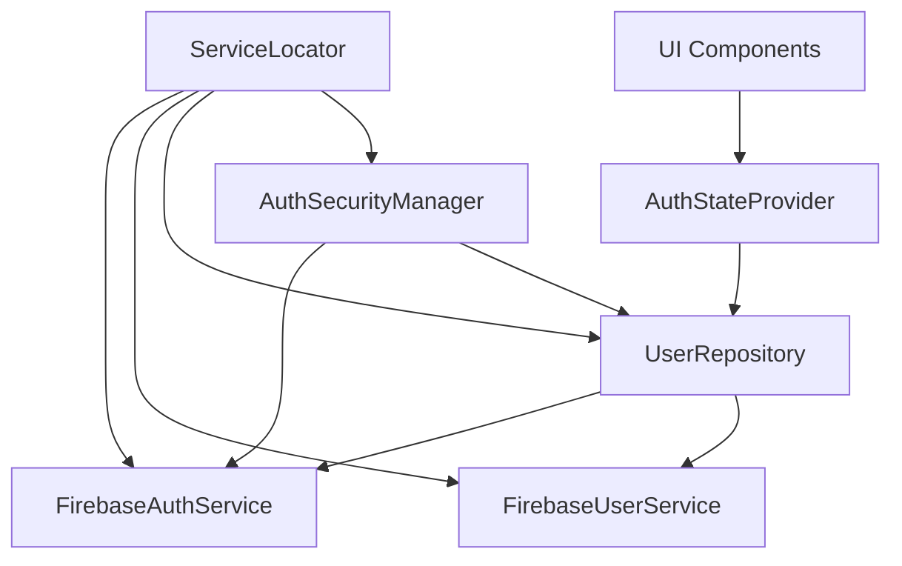
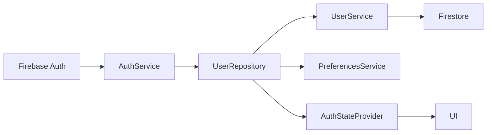
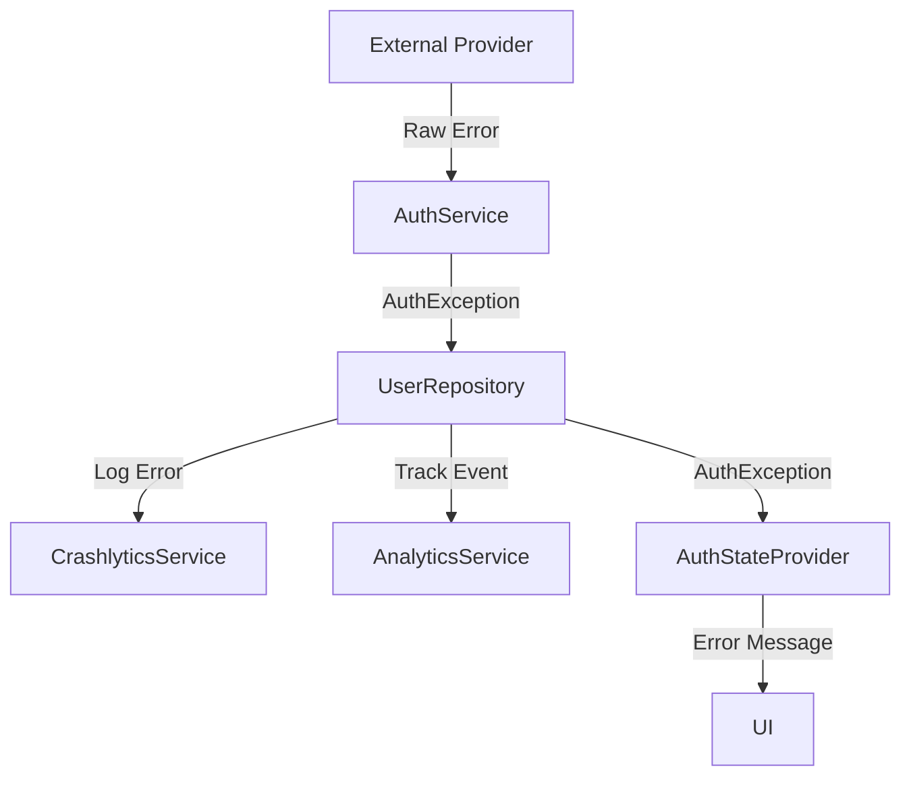

# Authentication Code Organization

This document outlines the code organization of DuckBuck's authentication system, with detailed class responsibilities and relationships. The authentication system follows a layered architecture pattern with clear separation of concerns to ensure:

- **Maintainability**: Code is organized in logical units with well-defined responsibilities
- **Testability**: Components are decoupled to allow for proper unit and integration testing
- **Scalability**: New authentication methods can be added with minimal changes to existing code
- **Security**: Authentication implementation follows best practices for mobile security

## Directory Structure

```
lib/
├── core/
│   ├── constants/
│   │   └── auth_constants.dart            # Auth-related constants
│   ├── exceptions/
│   │   └── auth_exceptions.dart           # Authentication error handling
│   ├── models/
│   │   └── user_model.dart                # User data structure
│   ├── repositories/
│   │   └── user_repository.dart           # Authentication coordination
│   ├── services/
│   │   ├── api/
│   │   │   └── api_service.dart           # Backend API communication
│   │   ├── auth/
│   │   │   ├── auth_security_manager.dart # Auth security handling
│   │   │   ├── auth_service_interface.dart # Auth service contract
│   │   │   ├── firebase_auth_service.dart  # Firebase auth implementation
│   │   │   └── session_manager.dart        # Session management
│   │   ├── firebase/
│   │   │   ├── firebase_analytics_service.dart  # Analytics tracking
│   │   │   ├── firebase_crashlytics_service.dart # Error reporting
│   │   │   └── firebase_database_service.dart    # Firestore operations
│   │   ├── logger/
│   │   │   └── logger_service.dart         # Logging system
│   │   ├── notifications/
│   │   │   └── notifications_service.dart   # Push notifications
│   │   ├── preferences_service.dart        # Local storage
│   │   ├── service_locator.dart            # Dependency injection
│   │   └── user/
│   │       ├── firebase_user_service.dart  # User data operations
│   │       └── user_service_interface.dart # User service contract
├── features/
│   ├── auth/
│   │   ├── components/
│   │   │   ├── auth_bottom_sheet.dart      # Auth UI component
│   │   │   └── bottom_sheet_components/    # UI subcomponents
│   │   ├── providers/
│   │   │   └── auth_state_provider.dart    # Auth state management
│   │   └── screens/
│   │       └── profile_completion_screen.dart # Profile setup UI
│   └── home/
│       └── screens/
│           └── home_screen.dart            # Post-auth main screen
└── main.dart                               # App initialization
```

## Key Classes and Responsibilities

### Model Layer

#### `UserModel` (user_model.dart)
- **Purpose**: Represents authenticated user data
- **Responsibilities**:
  - Store user identity (uid, email, phone)
  - Store profile information (displayName, photoURL)
  - Track authentication method and provider
  - Handle user metadata (createdAt, lastLoginAt)
  - Support conversion to/from Firebase User
  - Support conversion to/from Map for storage
  - Provide immutable data structure for security
  - Validate user data completeness
- **Key Methods**:
  - `fromFirebaseUser()`: Convert Firebase User to UserModel
  - `fromMap()`: Create UserModel from data map
  - `toMap()`: Convert UserModel to data map
  - `copyWith()`: Create modified copy of UserModel
  - `isProfileComplete()`: Check if required profile fields are set
  - `mergeWithCredential()`: Update model with fresh auth data

#### `AuthCredentialModel` (auth_credentials.dart)
- **Purpose**: Encapsulate authentication credentials
- **Responsibilities**:
  - Safely store auth tokens and credentials
  - Provide access to auth tokens with validation
  - Manage token expiration
  - Support serialization/deserialization
- **Key Methods**:
  - `isExpired()`: Check if the credentials are expired
  - `needsRefresh()`: Check if token refresh is recommended
  - `withRefreshedToken()`: Create new model with refreshed token

#### `AuthErrorCodes` (auth_exceptions.dart)
- **Purpose**: Define standardized error codes
- **Responsibilities**:
  - Provide consistent error codes across the authentication system
  - Group error codes by authentication method
  - Map external auth errors to internal codes
  - Support localization of error messages

#### `AuthException` (auth_exceptions.dart)
- **Purpose**: Standardized authentication error
- **Responsibilities**:
  - Wrap provider-specific errors in a consistent format
  - Provide user-friendly error messages
  - Track error metadata (timestamp, context)
  - Support analytics tracking of errors
  - Classify errors by severity and type
- **Key Methods**:
  - `getMessage()`: Get user-friendly message for error code
  - `isNetworkError()`: Check if error is network-related
  - `isTemporaryError()`: Check if error is temporary
  - `shouldRetry()`: Determine if operation should be retried
  - `toMap()`: Convert to data structure for logging

#### `AuthErrorMessages` (auth_exceptions.dart)
- **Purpose**: Error handling utilities
- **Responsibilities**:
  - Convert Firebase errors to AuthExceptions
  - Provide human-readable error messages
  - Support localization of error messages
  - Group related error messages
  - Provide recovery suggestions
- **Key Methods**:
  - `handleError()`: Process Firebase errors into AuthExceptions
  - `getMessageForCode()`: Get message for error code
  - `getRecoverySuggestion()`: Get suggestion for resolving error
  - `getLocalizedMessage()`: Get message in user's locale

### Service Layer

#### `AuthServiceInterface` (auth_service_interface.dart)
- **Purpose**: Define authentication service contract
- **Responsibilities**:
  - Abstract authentication operations across providers
  - Define contract for all authentication methods
  - Support token refreshing and validation
  - Enable mockable auth for testing
- **Key Methods**:
  - `currentUser`: Get the current authenticated user
  - `authStateChanges`: Stream of authentication state changes
  - `signInWithGoogle()`: Google authentication
  - `signInWithApple()`: Apple authentication
  - `verifyPhoneNumber()`: Start phone verification
  - `verifyOtpAndSignIn()`: Complete phone auth
  - `signInWithPhoneAuthCredential()`: Sign in with phone credential
  - `refreshIdToken()`: Refresh authentication token
  - `validateCredential()`: Validate an auth credential
  - `signOut()`: Sign out the current user
  - `updateProfile()`: Update user profile information

#### `FirebaseAuthService` (firebase_auth_service.dart)
- **Purpose**: Implement authentication with Firebase
- **Responsibilities**:
  - Provide Firebase-specific authentication implementations
  - Handle platform differences in auth flows (iOS/Android)
  - Manage authentication tokens securely
  - Convert between Firebase and app-specific models
  - Handle Firebase-specific authentication errors
- **Key Methods**:
  - `signInWithGoogle()`: Platform-specific Google auth implementation
  - `signInWithApple()`: Platform-specific Apple auth implementation
  - `verifyPhoneNumber()`: Firebase phone verification with SMS
  - `_handleException()`: Process Firebase errors with context
  - `_configureAuthSettings()`: Configure Firebase Auth settings
  - `_processUserCredential()`: Process auth credential into UserModel

#### `UserServiceInterface` (user_service_interface.dart)
- **Purpose**: Define user data operations contract
- **Responsibilities**:
  - Abstract user data storage operations
  - Define consistent API for user data management
  - Support user creation, retrieval, and updates
  - Enable mockable user service for testing
- **Key Methods**:
  - `createUser()`: Create a new user record
  - `getUser()`: Get user data by ID
  - `updateUser()`: Update user information
  - `markUserOnboardingComplete()`: Mark onboarding as complete
  - `deleteUser()`: Delete a user account
  - `getUserByPhone()`: Get user by phone number
  - `userExists()`: Check if user exists
- **Key Methods**:
  - `getUserData()`: Get user from database
  - `createUserData()`: Create new user record
  - `updateUserData()`: Update user record
  - `checkIfUserIsNew()`: Check if user needs onboarding

#### `FirebaseUserService` (firebase_user_service.dart)
- **Purpose**: Implement user operations with Firestore
- **Responsibilities**:
  - Store and retrieve user data
  - Track user state (new vs. returning)
  - Handle user profile updates
- **Key Methods**:
  - `createUserData()`: Create user in Firestore
  - `updateUserData()`: Update user in Firestore
  - `markUserOnboardingComplete()`: Complete onboarding

#### `PreferencesService` (preferences_service.dart)
- **Purpose**: Handle local data storage
- **Responsibilities**:
  - Store authentication state
  - Cache user data for performance
  - Manage authentication timestamps
- **Key Methods**:
  - `setLoggedIn()`: Update login state
  - `cacheUserData()`: Store user data locally
  - `clearAll()`: Remove authentication data

#### `AuthSecurityManager` (auth_security_manager.dart)
- **Purpose**: Manage authentication security
- **Responsibilities**:
  - Handle session timeout
  - Manage token refreshing
  - Track user activity
- **Key Methods**:
  - `startUserSession()`: Begin session tracking
  - `updateUserActivity()`: Update last active timestamp
  - `ensureValidToken()`: Check/refresh auth token

#### `SessionManager` (session_manager.dart)
- **Purpose**: Track user session timing
- **Responsibilities**:
  - Implement session timeout
  - Track user activity
  - Handle session expiration
- **Key Methods**:
  - `startSessionTimer()`: Begin inactivity tracking
  - `updateActivity()`: Reset inactivity timer
  - `clearSession()`: End active session

### Repository Layer

#### `UserRepository` (user_repository.dart)
- **Purpose**: Coordinate authentication operations
- **Responsibilities**:
  - Manage complete authentication flows
  - Coordinate between services
  - Handle analytics for authentication
  - Manage user data consistency
- **Key Methods**:
  - `signInWithGoogle()`: Complete Google auth flow
  - `signInWithApple()`: Complete Apple auth flow
  - `verifyPhoneNumber()`: Start phone auth flow
  - `verifyOtpAndSignIn()`: Complete phone auth flow
  - `signOut()`: Complete sign-out process
  - `updateProfile()`: Update user profile
  - `getCurrentUserWithCache()`: Get cached user data

### Provider Layer

#### `AuthStateProvider` (auth_state_provider.dart)
- **Purpose**: Manage authentication state
- **Responsibilities**:
  - Maintain current authenticated user
  - Broadcast auth state changes to UI
  - Track loading and error states
  - Interface between UI and repository
- **Key Methods**:
  - `signInWithGoogle()`: Initiate Google auth
  - `signInWithApple()`: Initiate Apple auth
  - `verifyPhoneNumber()`: Start phone verification
  - `verifyOtpAndSignIn()`: Complete phone auth
  - `signOut()`: Handle user sign-out
  - `updateProfile()`: Update user profile

### UI Layer

#### `AuthBottomSheet` (auth_bottom_sheet.dart)
- **Purpose**: Present authentication options
- **Responsibilities**:
  - Display authentication methods
  - Handle authentication UI states
  - Navigate between authentication stages
  - Process authentication callbacks
- **Key Methods**:
  - `_handleGoogleSignIn()`: Process Google auth UI
  - `_handleAppleSignIn()`: Process Apple auth UI
  - `_handlePhoneAuth()`: Process phone auth UI
  - `_verifyOtp()`: Handle OTP verification

#### `ProfileCompletionScreen` (profile_completion_screen.dart)
- **Purpose**: Complete user onboarding
- **Responsibilities**:
  - Collect user profile information
  - Upload profile photos
  - Update user profiles
  - Mark onboarding as complete
- **Key Methods**:
  - `_completeProfile()`: Finalize profile setup
  - `_uploadProfileImage()`: Handle photo upload
  - `_navigateToHome()`: Complete onboarding flow

## Component Interaction Patterns

### Dependency Injection



The application uses a service locator pattern to inject dependencies:

1. `ServiceLocator` holds singleton instances of all services
2. Components request dependencies through `serviceLocator<T>()`
3. Alternate implementations can be provided for testing
4. Circular dependencies are avoided through careful injection

### Authentication Data Flow



Authentication data flows from external providers through the system:

1. External providers (Firebase, Google, Apple) supply authentication
2. AuthService converts provider-specific data to standardized format
3. UserRepository coordinates data handling between services
4. UserService persists data to the database
5. PreferencesService caches data locally
6. AuthStateProvider broadcasts state changes to UI

### Error Handling Flow



Errors are standardized and propagated through the system:

1. External provider errors are caught by AuthService
2. AuthService converts to standardized AuthException
3. UserRepository logs errors and tracks analytics
4. AuthStateProvider receives and stores error message
5. UI displays appropriate error feedback to user

## Authentication State Management

### State Variables

The `AuthStateProvider` maintains these key state variables:

- `_currentUser`: The currently authenticated user (UserModel)
- `_isLoading`: Whether an authentication operation is in progress
- `_errorMessage`: The latest authentication error message

### State Change Broadcasting

When authentication state changes:

1. Firebase Auth broadcasts changes through `authStateChanges` stream
2. UserRepository transforms Firebase User to UserModel
3. AuthStateProvider listens to this stream and updates state
4. UI components listen to AuthStateProvider through Provider pattern
5. UI updates to reflect authentication state

### Session Management

1. AuthSecurityManager initializes SessionManager on authentication
2. Activity updates are sent to SessionManager on user interaction
3. SessionManager maintains a timer for inactivity
4. On timeout, SessionManager triggers onSessionExpired callback
5. App signs out user and navigates to welcome screen

## Authentication Persistence

### Local Storage Strategy

1. **During Authentication**:
   - Authentication state stored in SharedPreferences
   - User data cached in EncryptedSharedPreferences
   - Timestamp recorded for cache validation

2. **On Application Launch**:
   - Check Firebase.currentUser for auth status
   - Validate against SharedPreferences isLoggedIn flag
   - Load cached user data if available and recent
   - Sync auth state if discrepancies found

3. **Cache Invalidation**:
   - Time-based expiration (1 hour)
   - Forced invalidation on sign-out
   - Automatic refresh after user updates

## Security Considerations

### Token Management
1. Tokens automatically refreshed by Firebase SDK
2. Token refresh errors trigger re-authentication
3. Token validation performed for security-sensitive operations

### Data Protection
1. User data cached using EncryptedSharedPreferences
2. Sensitive operations require re-authentication
3. Session timeout for inactive users

### App Security
1. App signature validation protects against tampering
2. Different handling for debug vs. release builds
3. Root and emulator detection for added security

## Migration Path

The codebase shows evidence of evolution:
1. Removal of email/password authentication in favor of social and phone auth
2. Enhanced security through AuthSecurityManager and SessionManager
3. Improved caching for better performance

For future authentication methods:
1. Implement new method in FirebaseAuthService
2. Add corresponding methods in UserRepository
3. Expose method through AuthStateProvider
4. Create UI components for the new auth method
