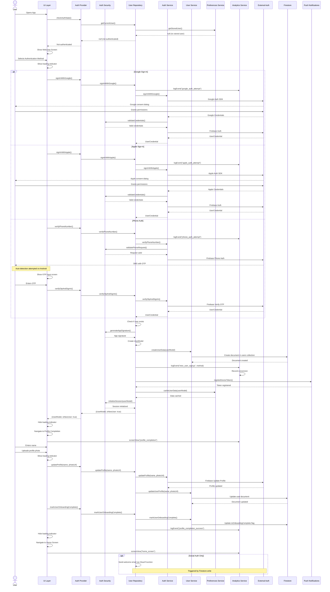
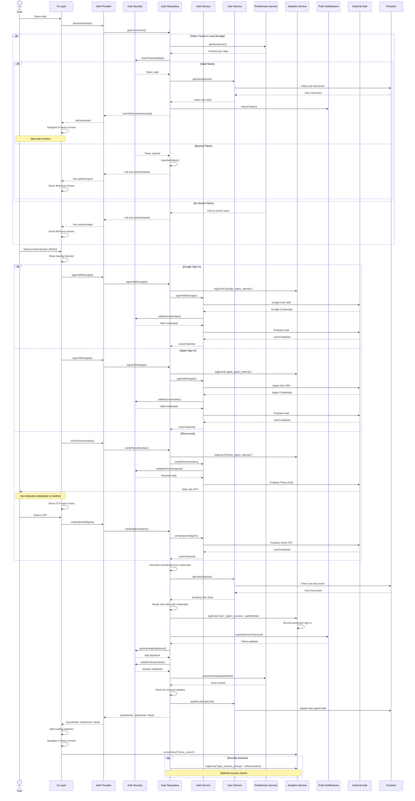
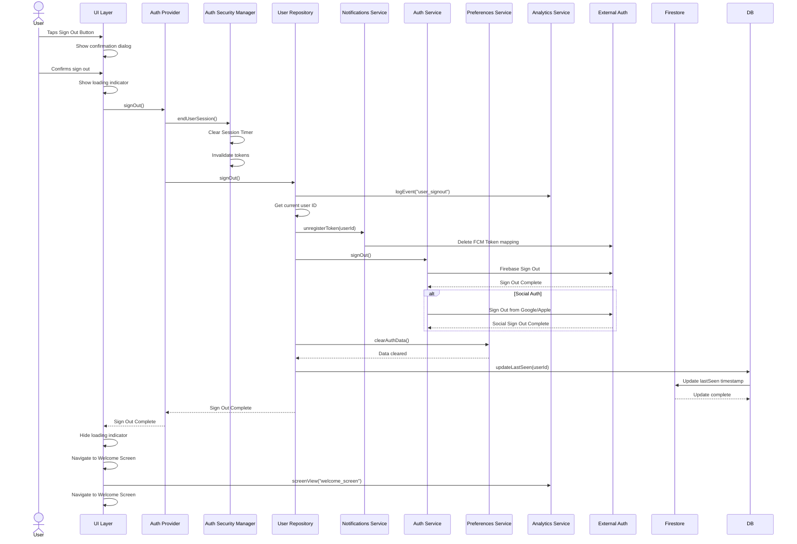
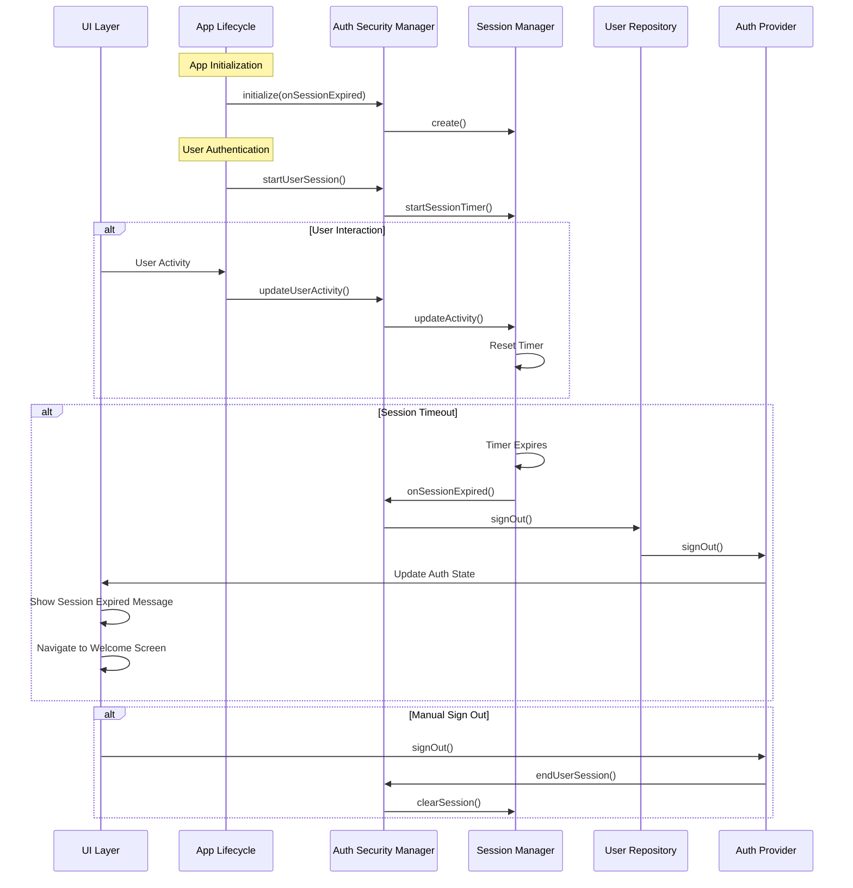
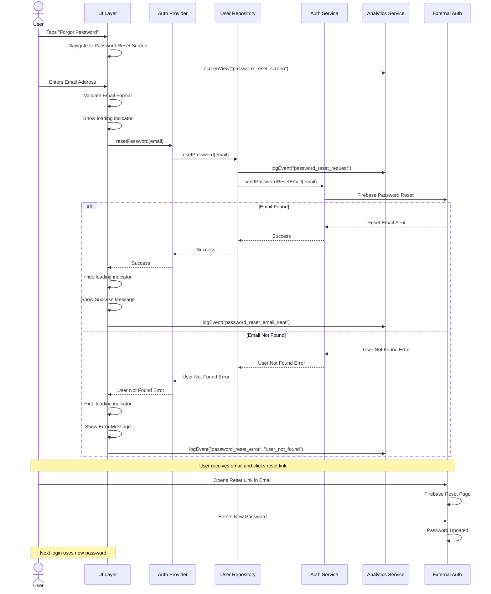

# Authentication User Flows

This document describes the detailed user flows for authentication in the DuckBuck application. These flows illustrate the interactions between components in the authentication system, showing how data and control flow during authentication processes.

## User Flow Diagrams

### New User Sign-Up Flow

### Returning User Sign-In Flow

### Sign-Out Flow

### Session Management Flow

### Password Reset Flow

## Detailed Authentication Workflows

### Google Authentication

1. **Authentication Initiation**
   - User taps Google sign-in button
   - UI shows loading indicator
   - Analytics logs auth attempt

2. **Credential Acquisition**
   - SDK presents Google account picker
   - User selects account
   - Google returns OAuth tokens

3. **Firebase Authentication**
   - Google credentials exchanged for Firebase credentials
   - Firebase returns UserCredential object

4. **User Processing**
   - UserModel created from Firebase User
   - Check if user is new to Firestore
   - If new: Create user document with isNewUser flag
   - If existing: Update last login timestamp

5. **Post-Authentication**
   - Cache user data in preferences
   - Register FCM token for notifications
   - Start session timer
   - Log analytics event (sign-up or login)
   - Update UI state

6. **User Flow Branching**
   - If new user: Navigate to Profile Completion
   - If returning user: Navigate to Home Screen

### Apple Authentication

1. **Authentication Initiation**
   - User taps Apple sign-in button
   - UI shows loading indicator
   - Analytics logs auth attempt

2. **Platform-Specific Flow**
   - On iOS/macOS: Native Apple Sign-In flow
   - On Android: Web authentication flow with redirect

3. **Credential Processing**
   - Generate secure nonce for CSRF protection
   - Retrieve Apple ID credentials
   - Create Firebase credential from Apple tokens

4. **Firebase Authentication**
   - Apple credentials exchanged for Firebase credentials
   - Firebase returns UserCredential object

5. **User Processing**
   - UserModel created from Firebase User
   - Check if user is new to Firestore
   - If new: Create user document with isNewUser flag
   - If existing: Update last login timestamp

6. **Post-Authentication**
   - Cache user data in preferences
   - Register FCM token for notifications
   - Start session timer
   - Log analytics event (sign-up or login)
   - Update UI state

7. **User Flow Branching**
   - If new user: Navigate to Profile Completion
   - If returning user: Navigate to Home Screen

### Phone Authentication

1. **Phone Number Entry**
   - User enters phone number in formatted field
   - UI validates phone format
   - Analytics logs phone verification attempt

2. **Verification Code Request**
   - Phone number sent to Firebase
   - Firebase sends SMS with OTP
   - UI shows OTP entry screen

3. **OTP Verification**
   - User enters OTP code
   - Code sent to Firebase for verification
   - Firebase returns UserCredential on success

4. **User Processing**
   - UserModel created from Firebase User
   - Check if user is new to Firestore
   - If new: Create user document with isNewUser flag
   - If existing: Update last login timestamp

5. **Post-Authentication**
   - Cache user data in preferences
   - Register FCM token for notifications
   - Start session timer
   - Log analytics event (sign-up or login)
   - Update UI state

6. **User Flow Branching**
   - If new user: Navigate to Profile Completion
   - If returning user: Navigate to Home Screen

### Profile Completion

1. **Data Collection**
   - User enters display name
   - User optionally uploads profile photo
   - Validate inputs

2. **Profile Update**
   - Upload photo to Firebase Storage (if selected)
   - Update user profile in Firebase Auth
   - Update user data in Firestore

3. **Onboarding Completion**
   - Mark user onboarding as complete (remove isNewUser flag)
   - Send welcome email for social auth users
   - Log analytics event for profile completion

4. **Navigation**
   - Transition to Home Screen

### Auto-Login

1. **App Initialization**
   - Check Firebase currentUser
   - Check preferences isLoggedIn flag

2. **Synchronization**
   - If both agree user is logged in: Restore session
   - If mismatch: Clear preferences and require new login

3. **Session Restoration**
   - Load cached user data
   - Start session timer
   - Register FCM token
   - Navigate directly to Home Screen

## Error Handling Strategies

### Network Errors
- Retry mechanism for transient network failures
- Clear error messages to distinguish network from auth failures
- Local caching to minimize network dependency

### Authentication Failures
- Standardized error messages for common scenarios
- Detailed logging for debugging purposes
- Analytics to track failure patterns

### Platform-Specific Issues
- Separate handling for iOS/Android differences in social auth
- Fallback mechanisms when platform features are unavailable
- Platform detection for optimal authentication flow

### Security Concerns
- Token refresh failures trigger re-authentication
- Invalid sessions are cleared immediately
- Suspicious activities trigger additional verification
- Comprehensive logging for security auditing
