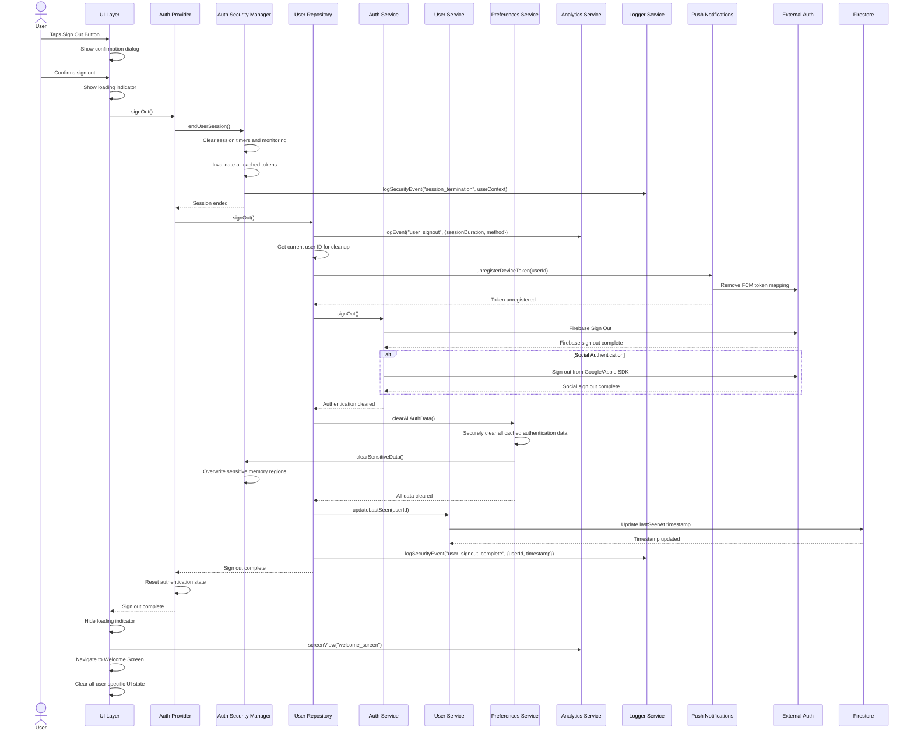
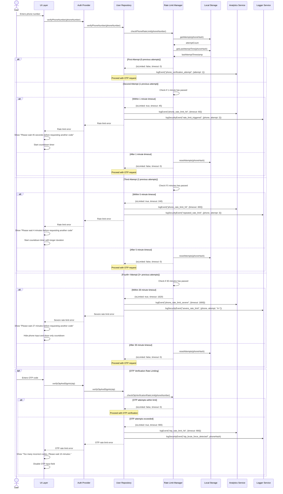
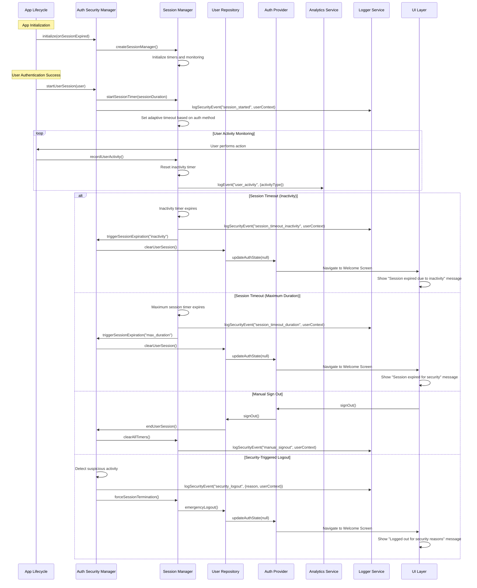
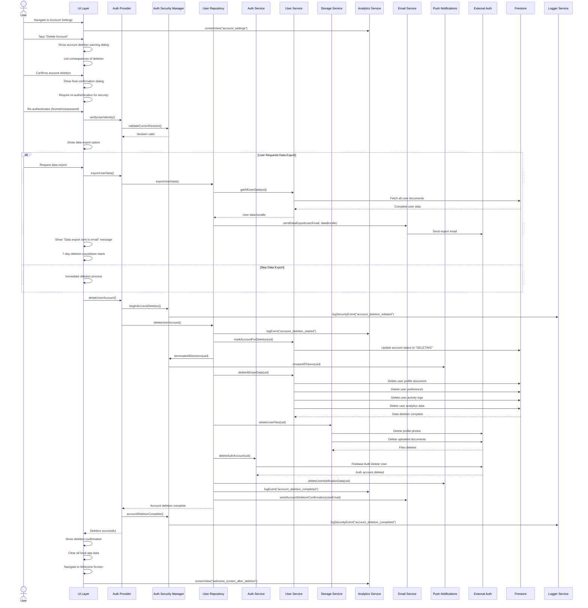
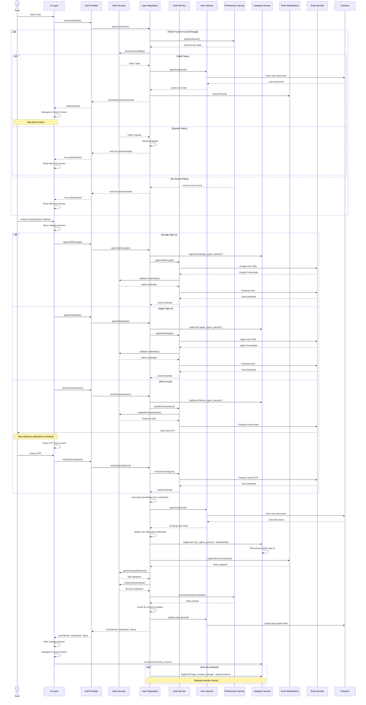
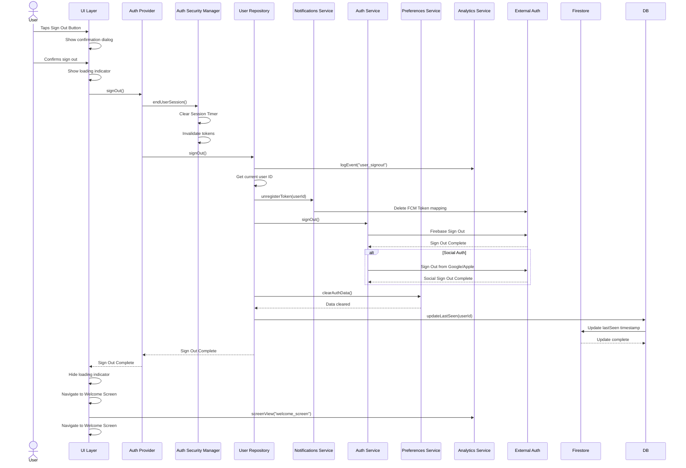
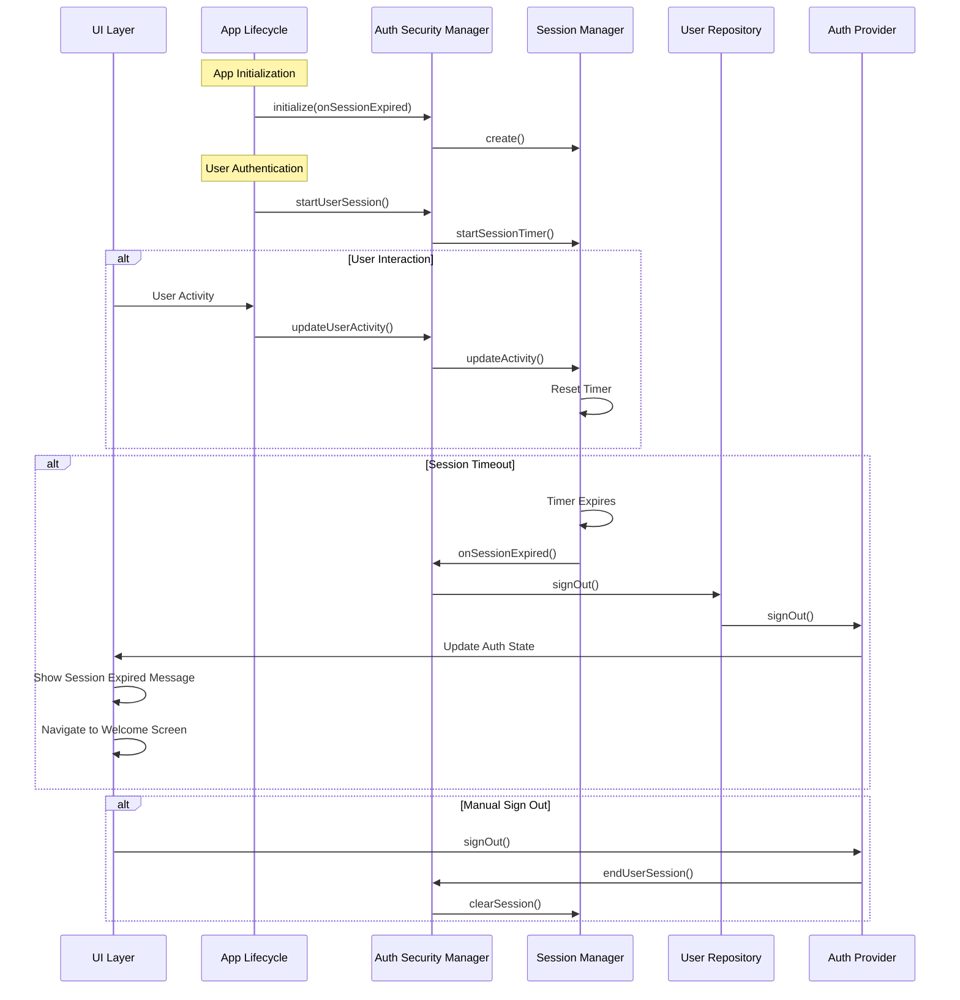
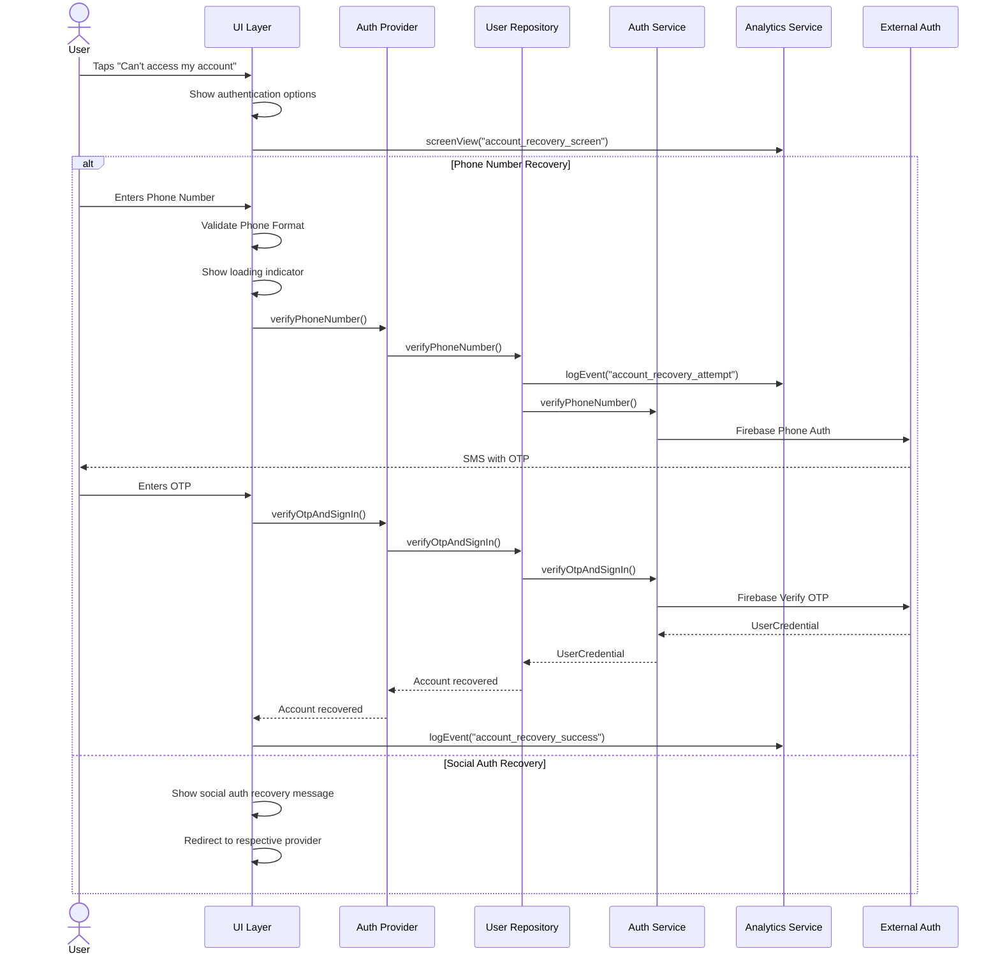

# Authentication User Flows

This document describes the comprehensive user flows for authentication in the DuckBuck application. These flows illustrate the interactions between all components in the authentication system, including rate limiting, email notifications, security enhancements, and all service integrations.

## Architecture Flow

The user flows incorporate all the features from the DuckBuck authentication architecture:

- **Rate Limiting System**: Phone and OTP rate limiting with graduated timeouts
- **Email Notification Service**: Welcome emails and login notifications
- **Enhanced API Service**: Circuit breaker pattern and production-ready features
- **Security Manager**: Enhanced token management and security verification
- **Analytics Integration**: Comprehensive event tracking and performance monitoring
- **Logger Service**: Structured logging throughout all flows

## User Flow Diagrams

### New User Sign-Up Flow

```mermaid
sequenceDiagram
    actor User
    participant UI as UI Layer
    participant Provider as Auth Provider
    participant Security as Auth Security Manager
    participant Repository as User Repository
    participant Auth as Auth Service
    participant DB as User Service
    participant Storage as Preferences Service
    participant Analytics as Analytics Service
    participant Email as Email Notification Service
    participant API as API Service
    participant Logger as Logger Service
    participant RateLimit as Rate Limit Manager
    participant External as External Auth
    participant Firestore as Firestore
    participant FCM as Push Notifications
    
    User->>UI: Opens App
    UI->>Provider: checkAuthState()
    Provider->>Repository: getCurrentUser()
    Repository->>Storage: getStoredUser()
    Storage-->>Repository: null (no stored user)
    Repository-->>Provider: null (not authenticated)
    Provider-->>UI: Not authenticated
    UI->>UI: Show Welcome Screen
    
    User->>UI: Selects Authentication Method
    UI->>UI: Show loading indicator
    UI->>Analytics: logEvent("auth_method_selected", method)
    
    alt Google Sign-In
        UI->>Provider: signInWithGoogle()
        Provider->>Repository: signInWithGoogle()
        Repository->>Logger: logAuthAttempt("google_signin")
        Repository->>Analytics: logEvent("google_auth_attempt")
        Repository->>Auth: signInWithGoogle()
        Auth->>External: Google Auth SDK
        External-->>User: Google consent dialog
        User->>External: Grants permissions
        External-->>Auth: Google Credentials
        Auth->>Security: validateCredentials()
        Security->>Security: Perform security checks
        Security-->>Auth: Valid credentials
        Auth->>External: Firebase Auth
        External-->>Auth: UserCredential
        Auth-->>Repository: UserCredential
    else Apple Sign-In
        UI->>Provider: signInWithApple()
        Provider->>Repository: signInWithApple()
        Repository->>Logger: logAuthAttempt("apple_signin")
        Repository->>Analytics: logEvent("apple_auth_attempt")
        Repository->>Auth: signInWithApple()
        Auth->>External: Apple Auth SDK
        External-->>User: Apple consent dialog
        User->>External: Grants permissions (with Privacy Relay option)
        External-->>Auth: Apple Credentials
        Auth->>Security: validateCredentials()
        Security->>Security: Perform security checks
        Security-->>Auth: Valid credentials
        Auth->>External: Firebase Auth
        External-->>Auth: UserCredential
        Auth-->>Repository: UserCredential
    else Phone Auth
        UI->>Provider: verifyPhoneNumber(phoneNumber)
        Provider->>Repository: verifyPhoneNumber(phoneNumber)
        Repository->>RateLimit: checkPhoneRateLimit(phoneNumber)
        RateLimit-->>Repository: (isLimited: false, timeout: 0)
        Repository->>Logger: logAuthAttempt("phone_verification", phoneNumber)
        Repository->>Analytics: logEvent("phone_auth_attempt")
        Repository->>Auth: verifyPhoneNumber(phoneNumber)
        Auth->>Security: validatePhoneRequest(phoneNumber)
        Security->>Security: Perform security validation
        Security-->>Auth: Request valid
        Auth->>External: Firebase Phone Auth
        External-->>User: SMS with OTP
        Note over UI,User: Auto-detection attempted via SMS Retriever API
        UI->>UI: Show OTP input screen
        User->>UI: Enters OTP
        UI->>Provider: verifyOtpAndSignIn(otp)
        Provider->>Repository: verifyOtpAndSignIn(otp)
        Repository->>RateLimit: checkOtpVerificationRateLimit(phoneNumber)
        RateLimit-->>Repository: (isLimited: false, timeout: 0)
        Repository->>Auth: verifyOtpAndSignIn(otp)
        Auth->>External: Firebase Verify OTP
        External-->>Auth: UserCredential
        Auth-->>Repository: UserCredential
    end
    
    Repository->>Repository: Check if user exists in Firestore
    Repository->>Security: generateAppSignature()
    Security->>Security: Generate secure app signature
    Security-->>Repository: App signature
    
    Repository->>Repository: Create UserModel from credentials
    Repository->>DB: createUserData(userModel)
    DB->>Firestore: Create document in users collection
    Firestore-->>DB: Document created successfully
    DB-->>Repository: User creation complete
    
    Repository->>Analytics: logEvent("new_user_signup", {method, timestamp})
    Analytics->>Analytics: Record user conversion metrics
    
    Repository->>Email: sendWelcomeEmail(userEmail, userName, deviceInfo)
    Email->>API: POST /send-welcome-email (fire-and-forget)
    API->>API: Apply circuit breaker and rate limiting
    Note over Email,API: Email sent asynchronously, non-blocking
    
    Repository->>FCM: registerDeviceToken(userId, deviceToken)
    FCM->>External: Register token for push notifications
    FCM-->>Repository: Token registered successfully
    
    Repository->>Storage: cacheUserData(userModel)
    Storage->>Storage: Encrypt and store user data locally
    Storage-->>Repository: Data cached securely
    
    Repository->>Security: initializeSession(userModel)
    Security->>Security: Start session timer and security monitoring
    Security-->>Repository: Session initialized
    
    Repository->>Logger: logSecurityEvent("user_session_start", userContext)
    
    Repository-->>Provider: (UserModel, isNewUser: true)
    Provider->>Provider: Update authentication state
    Provider-->>UI: (UserModel, isNewUser: true)
    UI->>UI: Hide loading indicator
    UI->>Analytics: screenView("profile_completion")
    UI->>UI: Navigate to Profile Completion Screen
    
    User->>UI: Enters display name
    User->>UI: Optionally uploads profile photo
    UI->>UI: Show loading indicator
    UI->>Provider: updateProfile(name, photoUrl)
    Provider->>Repository: updateProfile(name, photoUrl)
    Repository->>Auth: updateProfile(name, photoUrl)
    Auth->>External: Firebase Update Profile
    External-->>Auth: Profile updated
    Auth-->>Repository: Profile update complete
    
    Repository->>DB: updateUserProfile(userId, name, photoUrl)
    DB->>Firestore: Update user document
    Firestore-->>DB: Document updated
    DB-->>Repository: Profile data updated
    
    Repository->>Analytics: logEvent("profile_completion_success", {timeToComplete})
    
    UI->>Provider: markUserOnboardingComplete()
    Provider->>Repository: markUserOnboardingComplete()
    Repository->>DB: markUserOnboardingComplete(userId)
    DB->>Firestore: Update isOnboardingComplete flag
    Firestore-->>DB: Onboarding marked complete
    
    UI->>UI: Hide loading indicator
    UI->>Analytics: screenView("home_screen")
    UI->>UI: Navigate to Home Screen
```



### Enhanced Returning User Sign-In Flow

```mermaid
sequenceDiagram
    actor User
    participant UI as UI Layer
    participant Provider as Auth Provider
    participant Security as Auth Security Manager
    participant Repository as User Repository
    participant Auth as Auth Service
    participant DB as User Service
    participant Storage as Preferences Service
    participant Analytics as Analytics Service
    participant Email as Email Notification Service
    participant API as API Service
    participant Logger as Logger Service
    participant RateLimit as Rate Limit Manager
    participant External as External Auth
    participant Firestore as Firestore
    participant FCM as Push Notifications
    
    User->>UI: Opens App
    UI->>Provider: checkAuthState()
    Provider->>Repository: getCurrentUser()
    
    alt Cached User Found
        Repository->>Storage: getStoredUser()
        Storage-->>Repository: Cached user data
        Repository->>Security: validateCachedSession()
        Security->>Security: Check session validity and expiration
        alt Session Valid
            Security-->>Repository: Session valid
            Repository-->>Provider: Valid cached user
            Provider-->>UI: Authenticated user
            UI->>Analytics: screenView("home_screen")
            UI->>UI: Navigate to Home Screen (Auto-login)
        else Session Expired
            Security-->>Repository: Session expired
            Repository->>Storage: clearAuthData()
            Storage-->>Repository: Cache cleared
            Repository-->>Provider: null (session expired)
            Provider-->>UI: Not authenticated
            UI->>UI: Show Welcome Screen
        end
    else No Cached User
        Storage-->>Repository: null (no stored user)
        Repository-->>Provider: null (not authenticated)
        Provider-->>UI: Not authenticated
        UI->>UI: Show Welcome Screen
    end
    
    User->>UI: Selects Authentication Method
    UI->>UI: Show loading indicator
    UI->>Analytics: logEvent("returning_user_auth_attempt", method)
    
    alt Google Sign-In
        UI->>Provider: signInWithGoogle()
        Provider->>Repository: signInWithGoogle()
        Repository->>Logger: logAuthAttempt("google_signin_returning")
        Repository->>Auth: signInWithGoogle()
        Auth->>External: Google Auth SDK
        External-->>Auth: Google Credentials
        Auth->>Security: validateCredentials()
        Security-->>Auth: Valid credentials
        Auth->>External: Firebase Auth
        External-->>Auth: UserCredential
        Auth-->>Repository: UserCredential
    else Apple Sign-In
        UI->>Provider: signInWithApple()
        Provider->>Repository: signInWithApple()
        Repository->>Logger: logAuthAttempt("apple_signin_returning")
        Repository->>Auth: signInWithApple()
        Auth->>External: Apple Auth SDK
        External-->>Auth: Apple Credentials
        Auth->>Security: validateCredentials()
        Security-->>Auth: Valid credentials
        Auth->>External: Firebase Auth
        External-->>Auth: UserCredential
        Auth-->>Repository: UserCredential
    else Phone Auth
        UI->>Provider: verifyPhoneNumber(phoneNumber)
        Provider->>Repository: verifyPhoneNumber(phoneNumber)
        Repository->>RateLimit: checkPhoneRateLimit(phoneNumber)
        alt Rate Limited
            RateLimit-->>Repository: (isLimited: true, timeout: 300)
            Repository-->>Provider: Rate limit error
            Provider-->>UI: Show rate limit message
            UI->>UI: Display "Please wait 5 minutes before requesting another code"
        else Not Rate Limited
            RateLimit-->>Repository: (isLimited: false, timeout: 0)
            Repository->>Logger: logAuthAttempt("phone_verification_returning")
            Repository->>Auth: verifyPhoneNumber(phoneNumber)
            Auth->>External: Firebase Phone Auth
            External-->>User: SMS with OTP
            UI->>UI: Show OTP input screen
            User->>UI: Enters OTP
            UI->>Provider: verifyOtpAndSignIn(otp)
            Provider->>Repository: verifyOtpAndSignIn(otp)
            Repository->>RateLimit: checkOtpVerificationRateLimit(phoneNumber)
            alt OTP Rate Limited
                RateLimit-->>Repository: (isLimited: true, timeout: 900)
                Repository-->>Provider: OTP rate limit error
                Provider-->>UI: Show OTP rate limit message
            else OTP Not Rate Limited
                RateLimit-->>Repository: (isLimited: false, timeout: 0)
                Repository->>Auth: verifyOtpAndSignIn(otp)
                Auth->>External: Firebase Verify OTP
                External-->>Auth: UserCredential
                Auth-->>Repository: UserCredential
            end
        end
    end
    
    Repository->>Repository: Generate UserModel from credentials
    Repository->>DB: getUserData(userId)
    DB->>Firestore: Fetch existing user document
    Firestore-->>DB: User document with profile data
    DB-->>Repository: Complete user data
    Repository->>Repository: Merge cached and fetched user data
    
    Repository->>Analytics: logEvent("returning_user_signin_success", {method, lastLoginGap})
    
    Repository->>Email: sendLoginNotificationEmail(userEmail, userName, authMethod, deviceInfo)
    Email->>API: POST /send-login-notification (fire-and-forget)
    API->>API: Apply circuit breaker and rate limiting
    Note over Email,API: Login notification sent asynchronously
    
    Repository->>FCM: updateDeviceToken(userId, currentDeviceToken)
    FCM->>External: Update token registration
    FCM-->>Repository: Token updated
    
    Repository->>Security: generateAppSignature()
    Security->>Security: Generate and validate app signature
    Security-->>Repository: App signature validated
    
    Repository->>Security: initializeSession(userModel)
    Security->>Security: Start session monitoring and timeouts
    Security-->>Repository: Session initialized
    
    Repository->>Storage: cacheUserData(userModel)
    Storage->>Storage: Update encrypted local cache
    Storage-->>Repository: Cache updated
    
    Repository->>DB: updateLastLogin(userId)
    DB->>Firestore: Update lastLoginAt timestamp
    Firestore-->>DB: Timestamp updated
    
    Repository->>Logger: logSecurityEvent("returning_user_login", {userId, method, deviceInfo})
    
    Repository->>Analytics: logEvent("login_location_analysis", {isNewLocation, deviceChange})
    Note over Repository,Analytics: Security analytics for suspicious patterns
    
    Repository-->>Provider: (UserModel, isNewUser: false)
    Provider->>Provider: Update authentication state
    Provider-->>UI: (UserModel, isNewUser: false)
    UI->>UI: Hide loading indicator
    UI->>Analytics: screenView("home_screen")
    UI->>UI: Navigate to Home Screen
```



### Enhanced Sign-Out Flow



### Rate Limiting Flow



### Session Management Flow



## Authentication Workflows

### Google Authentication with Full Features

1. **Authentication Initiation**
   - User taps Google sign-in button
   - UI shows loading indicator and disables other options
   - Analytics logs authentication attempt with timestamp and device info

2. **Rate Limiting Check** (for repeated failed attempts)
   - Repository checks for recent failed Google auth attempts
   - If rate limited, show appropriate timeout message

3. **Credential Acquisition**
   - Firebase Auth Service launches Google Sign-In SDK
   - SDK presents Google account picker with user consent dialog
   - User grants permissions through Google's OAuth flow
   - Google returns OAuth tokens and user information

4. **Security Validation**
   - AuthSecurityManager validates the received credentials
   - Performs app signature verification
   - Checks for suspicious authentication patterns

5. **Firebase Authentication**
   - Google credentials are exchanged with Firebase for UserCredential
   - Firebase validates the OAuth tokens and returns authenticated user

6. **User Processing**
   - UserModel created from Firebase User information
   - Check if user exists in Firestore (new vs returning user)
   - If new user: Create user document with initial profile data
   - If existing user: Update last login timestamp and merge profile data

7. **Email Notifications** (Fire-and-forget)
   - For new users: Send welcome email with device and location info
   - For returning users: Send login notification email
   - Email service handles delivery asynchronously without blocking flow

8. **Token and Session Management**
   - Register/update FCM token for push notifications
   - Initialize secure session with adaptive timeout
   - Cache user data with encryption in local preferences
   - Start session monitoring and activity tracking

9. **Analytics and Logging**
   - Log successful authentication event with method and timing
   - Track user conversion metrics (new vs returning)
   - Record security events for monitoring and analysis

10. **Navigation and UI Updates**
    - Update authentication state in Provider
    - Navigate to Profile Completion (new users) or Home Screen (returning users)
    - Clear loading indicators and enable UI interactions

### Apple Authentication with Full Features

1. **Authentication Initiation**
   - User taps Apple sign-in button
   - UI shows loading indicator and disables other options
   - Analytics logs authentication attempt

2. **Platform-Specific Handling**
   - On iOS/macOS: Use native Apple Sign-In API
   - On Android: Use web-based Apple authentication flow
   - Generate secure nonce for CSRF protection

3. **Privacy Relay Processing**
   - Apple processes user information through privacy relay
   - User can choose to share real email or use private relay email
   - Handle "Hide My Email" option appropriately

4. **Credential Processing and Validation**
   - Create Firebase credential from Apple ID tokens
   - AuthSecurityManager validates credentials and performs security checks
   - Verify app signature and detect any anomalies

5. **Firebase Authentication**
   - Apple credentials exchanged with Firebase for UserCredential
   - Handle private email addresses correctly in Firebase Auth

6. **User Data Management**
   - Process user information with respect to privacy choices
   - Create or update user profile handling private email relay
   - Sync profile data between Apple ID and Firestore

7. **Enhanced Security and Notifications**
   - Same email notification, session management, and security features as Google auth
   - Additional handling for Apple's privacy-focused features

8. **Analytics and Completion**
   - Track Apple-specific authentication metrics
   - Complete flow with navigation to appropriate screen

### Phone Authentication with Full Features

1. **Phone Number Entry and Validation**
   - User enters phone number in formatted input field
   - Client-side validation ensures proper phone number format
   - UI provides real-time formatting and validation feedback

2. **Rate Limiting Checks**
   - Repository checks if phone number is rate limited for OTP requests
   - Graduated timeout strategy: 0 → 1min → 5min → 15min → 30min
   - If rate limited, display human-readable timeout message and disable submission

3. **OTP Request Processing**
   - If not rate limited, send phone number to Firebase Auth
   - Firebase sends SMS with OTP code to user's phone
   - UI transitions to OTP input mode with countdown timer

4. **SMS Auto-Detection** (Android)
   - SMS Retriever API attempts to auto-fill OTP code
   - Fallback to manual entry if auto-detection fails
   - Improve user experience with seamless code entry

5. **OTP Verification with Rate Limiting**
   - User enters OTP code (manually or via auto-detection)
   - Client validates OTP format before submission
   - Check OTP verification rate limiting to prevent brute force attacks
   - If OTP rate limited, disable input and show timeout message

6. **Enhanced Security Verification**
   - AuthSecurityManager performs additional security checks for phone auth
   - Validate that the verification came from the expected phone number
   - Check for patterns indicating potential SIM swapping or other attacks

7. **User Creation and Profile Management**
   - Create UserModel from successful phone verification
   - Phone authentication users require profile completion (name, optional photo)
   - Handle profile completion flow with validation

8. **Session and Notification Setup**
   - Same enhanced session management, email notifications, and FCM setup
   - Additional security monitoring for phone-based authentication

9. **Comprehensive Analytics**
   - Track phone verification success rates, timing, and failure patterns
   - Monitor rate limiting effectiveness and user experience impact
   - Security analytics for fraud detection and prevention

### Profile Completion Flow

1. **Data Collection with Validation**
   - User enters display name with real-time validation
   - Optional photo upload with size and format validation
   - Provide clear feedback on input requirements and restrictions

2. **Enhanced Profile Update**
   - Upload photo to Firebase Storage with progress tracking
   - Update Firebase Auth profile with display name and photo URL
   - Update Firestore user document with complete profile data

3. **Onboarding Completion and Analytics**
   - Mark user onboarding as complete (remove isNewUser flag)
   - Track profile completion rate, time to completion, and abandon points
   - Send analytics events for successful profile completion

4. **Final Navigation and State Management**
   - Transition to Home Screen with smooth animation
   - Update all relevant UI state and cached user data
   - Initialize full app functionality now that user is fully onboarded

## Error Handling Strategies

### Network and Connectivity Errors
- **Intelligent Retry Logic**: Exponential backoff for transient network failures
- **Circuit Breaker Pattern**: Prevent cascading failures when services are down
- **Offline Capability**: Graceful degradation when network is unavailable
- **Clear Error Messaging**: Distinguish between network, auth, and service failures

### Authentication and Security Failures
- **Standardized Error Codes**: Consistent error handling across all auth methods
- **Security Event Logging**: Comprehensive logging for suspicious activities
- **Rate Limiting Integration**: Proper handling of rate-limited requests
- **User-Friendly Messages**: Convert technical errors to understandable messages

### Platform and Device-Specific Issues
- **Cross-Platform Compatibility**: Handle iOS/Android differences in auth flows
- **Device Capability Detection**: Adapt features based on device capabilities
- **Biometric Integration**: Fallback when biometric authentication fails
- **Legacy Device Support**: Ensure compatibility with older devices

### Security and Fraud Prevention
- **Anomaly Detection**: Monitor and respond to unusual authentication patterns
- **Token Refresh Handling**: Automatic token refresh with failure recovery
- **Session Security**: Immediate session termination on security violations
- **Audit Trail**: Comprehensive logging for security analysis and compliance

## Complete User Lifecycle: Account Deletion Flow

### User Account Deletion Request



### Account Deletion Workflow Details

1. **Deletion Request Initiation**
   - User navigates to Account Settings
   - Clear warning about deletion consequences
   - Multiple confirmation steps to prevent accidental deletion
   - Required re-authentication for security verification

2. **Data Export Option** (Optional 7-day delay)
   - User can request complete data export before deletion
   - Email sent with comprehensive data bundle
   - 7-day cooling-off period before actual deletion
   - User can cancel deletion during this period

3. **Account Deactivation**
   - Mark account status as "DELETING" in Firestore
   - Immediately sign out user from all devices
   - Revoke all FCM tokens and push notification access
   - Disable account access while maintaining data temporarily

4. **Data Deletion Process**
   - **User Profile Data**: Delete all Firestore documents containing user information
   - **User Preferences**: Remove all stored user settings and preferences
   - **Activity Logs**: Delete user activity history and analytics data
   - **File Storage**: Remove all user-uploaded files (profile photos, documents)
   - **Cached Data**: Clear all locally stored user data on device

5. **Authentication Account Removal**
   - Delete user from Firebase Authentication
   - Revoke all authentication tokens and refresh tokens
   - Remove user from any authentication provider records (Google, Apple)

6. **Final Cleanup and Confirmation**
   - Send final deletion confirmation email
   - Log security events for audit purposes
   - Clear all local app state and cached data
   - Navigate user back to welcome/onboarding screen

7. **Post-Deletion State**
   - User account completely removed from all systems
   - All personal data permanently deleted (GDPR compliant)
   - No possibility of account recovery
   - User can create new account with same email/phone if desired

### Account Deletion Security Features

- **Multi-step Confirmation**: Prevents accidental deletions
- **Re-authentication Required**: Ensures only account owner can delete
- **Audit Logging**: Complete audit trail of deletion process
- **Data Export Option**: Allows users to preserve their data
- **Cooling-off Period**: 7-day delay when data export is requested
- **Secure Cleanup**: Ensures all traces are removed from all systems
- **Compliance**: Meets GDPR and other privacy regulation requirements

---

## Conclusion

These user flows provide a comprehensive view of the complete DuckBuck authentication system lifecycle, from initial user signup through account deletion. The flows incorporate all advanced features including rate limiting, email notifications, security management, and production-ready service integrations. The system ensures a secure, user-friendly, and robust authentication experience while maintaining comprehensive monitoring and analytics throughout the entire user journey, including proper handling of account lifecycle management and secure data deletion.
    
    Repository->>Security: initializeSession(userModel)
    Security-->>Repository: Session initialized

    Repository-->>Provider: (UserModel, isNewUser: true)
    Provider-->>UI: (UserModel, isNewUser: true)
    UI->>UI: Hide loading indicator
    
    UI->>UI: Navigate to Profile Completion
    UI->>Analytics: screenView("profile_completion")
    
    User->>UI: Enters name
    User->>UI: Uploads profile photo
    UI->>UI: Show loading indicator
    UI->>Provider: updateProfile(name, photoUrl)
    Provider->>Repository: updateProfile(name, photoUrl)
    Repository->>Auth: updateProfile(name, photoUrl)
    Auth->>External: Firebase Update Profile
    External-->>Auth: Profile updated
    
    Repository->>DB: updateUserProfile(name, photoUrl)
    DB->>Firestore: Update user document
    Firestore-->>DB: Document updated
    
    UI->>Provider: markUserOnboardingComplete()
    Provider->>Repository: markUserOnboardingComplete()
    Repository->>DB: markUserOnboardingComplete()
    DB->>Firestore: Update isOnboardingComplete flag
    Repository->>Analytics: logEvent("profile_completion_success")
    
    UI->>UI: Hide loading indicator
    UI->>UI: Navigate to Home Screen
    UI->>Analytics: screenView("home_screen")
    
    opt Social Auth Only
        Repository->>Repository: Send welcome email via Cloud Function
        Note over Repository,External: Triggered by Firestore write
    end
```

### Returning User Sign-In Flow



### Sign-Out Flow



### Session Management Flow



### Account Recovery Options

> **Note**: DuckBuck does not use password-based authentication, as it only implements Google Sign-In, Apple Sign-In, and Phone Authentication. Therefore, there is no traditional password reset flow.

#### Social Authentication Recovery

For Google and Apple authentication, account recovery is handled by the respective authentication providers:

- **Google Accounts**: Users manage recovery through their Google account settings
- **Apple ID**: Users manage recovery through their Apple ID settings

#### Phone Authentication Recovery

For phone authentication, recovery is handled through the verification process:

- User can re-verify their phone number to regain access
- A new OTP is sent to the registered phone number
- Once verified, the user regains access to their account



## Detailed Authentication Workflows

### Google Authentication

1. **Authentication Initiation**
   - User taps Google sign-in button
   - UI shows loading indicator
   - Analytics logs auth attempt

2. **Credential Acquisition**
   - SDK presents Google account picker
   - User selects account
   - Google returns OAuth tokens

3. **Firebase Authentication**
   - Google credentials exchanged for Firebase credentials
   - Firebase returns UserCredential object

4. **User Processing**
   - UserModel created from Firebase User
   - Check if user is new to Firestore
   - If new: Create user document with isNewUser flag
   - If existing: Update last login timestamp

5. **Post-Authentication**
   - Cache user data in preferences
   - Register FCM token for notifications
   - Start session timer
   - Log analytics event (sign-up or login)
   - Update UI state

6. **User Flow Branching**
   - If new user: Navigate to Profile Completion
   - If returning user: Navigate to Home Screen

### Apple Authentication

1. **Authentication Initiation**
   - User taps Apple sign-in button
   - UI shows loading indicator
   - Analytics logs auth attempt

2. **Platform-Specific Flow**
   - On iOS/macOS: Native Apple Sign-In flow
   - On Android: Web authentication flow with redirect

3. **Credential Processing**
   - Generate secure nonce for CSRF protection
   - Retrieve Apple ID credentials
   - Create Firebase credential from Apple tokens

4. **Firebase Authentication**
   - Apple credentials exchanged for Firebase credentials
   - Firebase returns UserCredential object

5. **User Processing**
   - UserModel created from Firebase User
   - Check if user is new to Firestore
   - If new: Create user document with isNewUser flag
   - If existing: Update last login timestamp

6. **Post-Authentication**
   - Cache user data in preferences
   - Register FCM token for notifications
   - Start session timer
   - Log analytics event (sign-up or login)
   - Update UI state

7. **User Flow Branching**
   - If new user: Navigate to Profile Completion
   - If returning user: Navigate to Home Screen

### Phone Authentication

1. **Phone Number Entry**
   - User enters phone number in formatted field
   - UI validates phone format
   - Analytics logs phone verification attempt

2. **Verification Code Request**
   - Phone number sent to Firebase
   - Firebase sends SMS with OTP
   - UI shows OTP entry screen

3. **OTP Verification**
   - User enters OTP code
   - Code sent to Firebase for verification
   - Firebase returns UserCredential on success

4. **User Processing**
   - UserModel created from Firebase User
   - Check if user is new to Firestore
   - If new: Create user document with isNewUser flag
   - If existing: Update last login timestamp

5. **Post-Authentication**
   - Cache user data in preferences
   - Register FCM token for notifications
   - Start session timer
   - Log analytics event (sign-up or login)
   - Update UI state

6. **User Flow Branching**
   - If new user: Navigate to Profile Completion
   - If returning user: Navigate to Home Screen

### Profile Completion

1. **Data Collection**
   - User enters display name
   - User optionally uploads profile photo
   - Validate inputs

2. **Profile Update**
   - Upload photo to Firebase Storage (if selected)
   - Update user profile in Firebase Auth
   - Update user data in Firestore

3. **Onboarding Completion**
   - Mark user onboarding as complete (remove isNewUser flag)
   - Send welcome email for social auth users
   - Log analytics event for profile completion

4. **Navigation**
   - Transition to Home Screen

### Auto-Login

1. **App Initialization**
   - Check Firebase currentUser
   - Check preferences isLoggedIn flag

2. **Synchronization**
   - If both agree user is logged in: Restore session
   - If mismatch: Clear preferences and require new login

3. **Session Restoration**
   - Load cached user data
   - Start session timer
   - Register FCM token
   - Navigate directly to Home Screen

## Error Handling Strategies

### Network Errors
- Retry mechanism for transient network failures
- Clear error messages to distinguish network from auth failures
- Local caching to minimize network dependency

### Authentication Failures
- Standardized error messages for common scenarios
- Detailed logging for debugging purposes
- Analytics to track failure patterns

### Platform-Specific Issues
- Separate handling for iOS/Android differences in social auth
- Fallback mechanisms when platform features are unavailable
- Platform detection for optimal authentication flow

### Security Concerns
- Token refresh failures trigger re-authentication
- Invalid sessions are cleared immediately
- Suspicious activities trigger additional verification
- Comprehensive logging for security auditing
