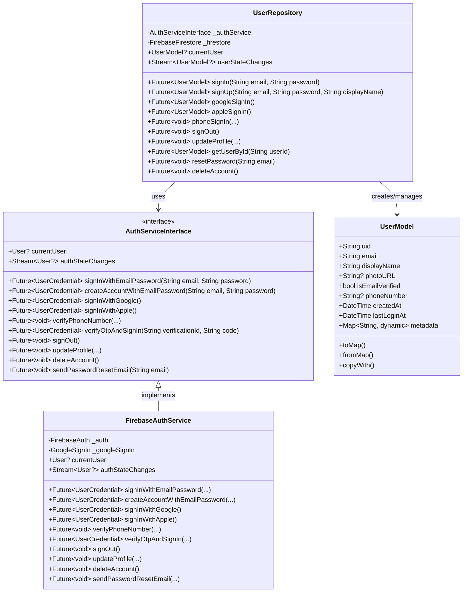
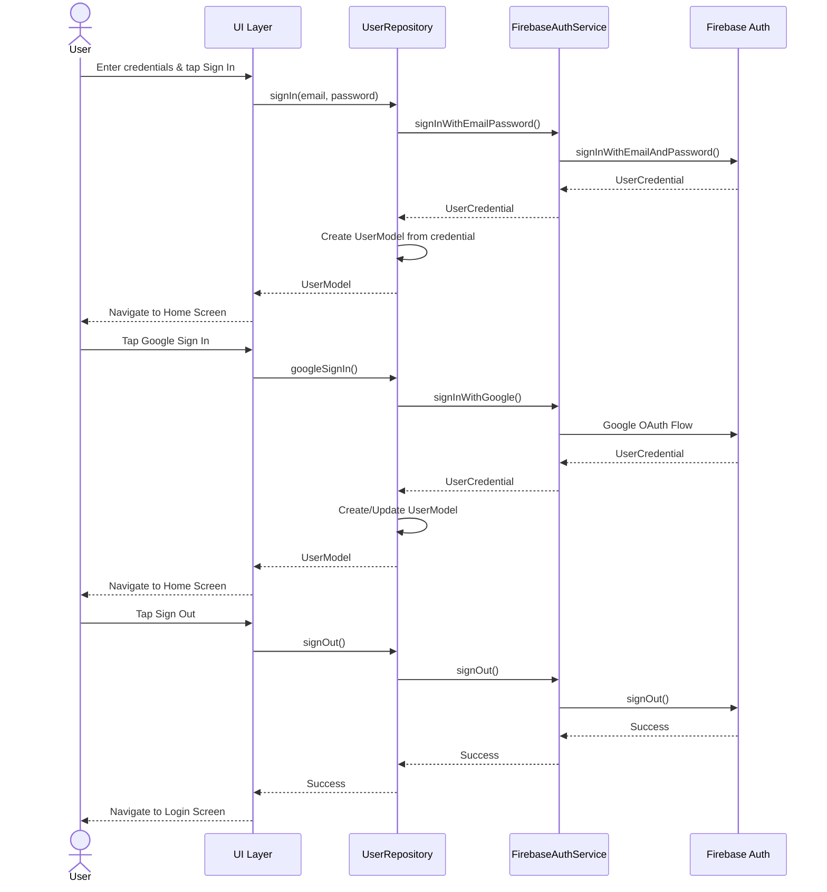
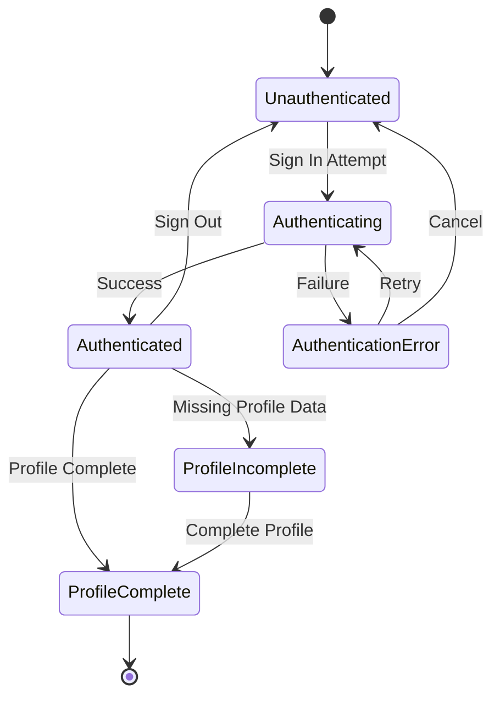

# DuckBuck Authentication System Diagram

## Authentication Class Diagram

```mermaid
classDiagram
    class AuthServiceInterface {
        <<interface>>
        +User? currentUser
        +Stream~User?~ authStateChanges
        +Future~UserCredential~ signInWithEmailPassword(String email, String password)
        +Future~UserCredential~ createAccountWithEmailPassword(String email, String password)
        +Future~UserCredential~ signInWithGoogle()
        +Future~UserCredential~ signInWithApple()
        +Future~void~ verifyPhoneNumber(...)
        +Future~UserCredential~ verifyOtpAndSignIn(String verificationId, String code)
        +Future~void~ signOut()
        +Future~void~ updateProfile(...)
        +Future~void~ deleteAccount()
        +Future~void~ sendPasswordResetEmail(String email)
    }

    class FirebaseAuthService {
        -FirebaseAuth _auth
        -GoogleSignIn _googleSignIn
        +User? currentUser
        +Stream~User?~ authStateChanges
        +Future~UserCredential~ signInWithEmailPassword(...)
        +Future~UserCredential~ createAccountWithEmailPassword(...)
        +Future~UserCredential~ signInWithGoogle()
        +Future~UserCredential~ signInWithApple()
        +Future~void~ verifyPhoneNumber(...)
        +Future~UserCredential~ verifyOtpAndSignIn(...)
        +Future~void~ signOut()
        +Future~void~ updateProfile(...)
        +Future~void~ deleteAccount()
        +Future~void~ sendPasswordResetEmail(...)
    }

    class UserRepository {
        -AuthServiceInterface _authService
        -FirebaseFirestore _firestore
        +UserModel? currentUser
        +Stream~UserModel?~ userStateChanges
        +Future~UserModel~ signIn(String email, String password)
        +Future~UserModel~ signUp(String email, String password, String displayName)
        +Future~UserModel~ googleSignIn()
        +Future~UserModel~ appleSignIn()
        +Future~void~ phoneSignIn(...)
        +Future~void~ signOut()
        +Future~void~ updateProfile(...)
        +Future~UserModel~ getUserById(String userId)
        +Future~void~ resetPassword(String email)
        +Future~void~ deleteAccount()
    }

    class UserModel {
        +String uid
        +String email
        +String displayName
        +String? photoURL
        +bool isEmailVerified
        +String? phoneNumber
        +DateTime createdAt
        +DateTime lastLoginAt
        +Map~String, dynamic~ metadata
        +toMap()
        +fromMap()
        +copyWith()
    }

    AuthServiceInterface <|-- FirebaseAuthService : implements
    UserRepository --> AuthServiceInterface : uses
    UserRepository --> UserModel : creates/manages
```

## Authentication Flow Diagram

```mermaid
sequenceDiagram
    actor User
    participant UI as UI Layer
    participant UserRepo as UserRepository
    participant AuthSvc as FirebaseAuthService
    participant Firebase as Firebase Auth
    
    %% Email Sign In Flow
    User->>UI: Enter credentials & tap Sign In
    UI->>UserRepo: signIn(email, password)
    UserRepo->>AuthSvc: signInWithEmailPassword()
    AuthSvc->>Firebase: signInWithEmailAndPassword()
    Firebase-->>AuthSvc: UserCredential
    AuthSvc-->>UserRepo: UserCredential
    UserRepo->>UserRepo: Create UserModel from credential
    UserRepo-->>UI: UserModel
    UI-->>User: Navigate to Home Screen
    
    %% Social Sign In Flow (Google)
    User->>UI: Tap Google Sign In
    UI->>UserRepo: googleSignIn()
    UserRepo->>AuthSvc: signInWithGoogle()
    AuthSvc->>Firebase: Google OAuth Flow
    Firebase-->>AuthSvc: UserCredential
    AuthSvc-->>UserRepo: UserCredential
    UserRepo->>UserRepo: Create/Update UserModel
    UserRepo-->>UI: UserModel
    UI-->>User: Navigate to Home Screen
    
    %% Sign Out Flow
    User->>UI: Tap Sign Out
    UI->>UserRepo: signOut()
    UserRepo->>AuthSvc: signOut()
    AuthSvc->>Firebase: signOut()
    Firebase-->>AuthSvc: Success
    AuthSvc-->>UserRepo: Success
    UserRepo-->>UI: Success
    UI-->>User: Navigate to Login Screen
```

## Authentication State Management

```mermaid
stateDiagram-v2
    [*] --> Unauthenticated
    Unauthenticated --> Authenticating: Sign In Attempt
    Authenticating --> Authenticated: Success
    Authenticating --> AuthenticationError: Failure
    AuthenticationError --> Authenticating: Retry
    AuthenticationError --> Unauthenticated: Cancel
    Authenticated --> ProfileComplete: Profile Complete
    Authenticated --> ProfileIncomplete: Missing Profile Data
    ProfileIncomplete --> ProfileComplete: Complete Profile
    ProfileComplete --> [*]
    Authenticated --> Unauthenticated: Sign Out
```
