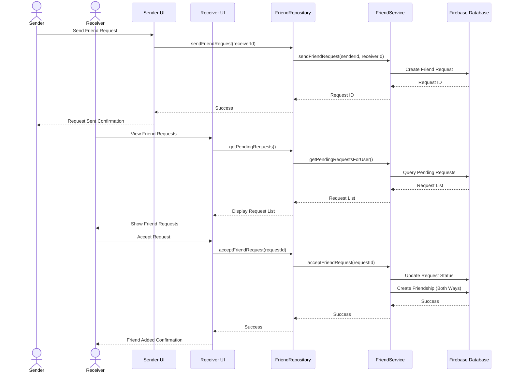
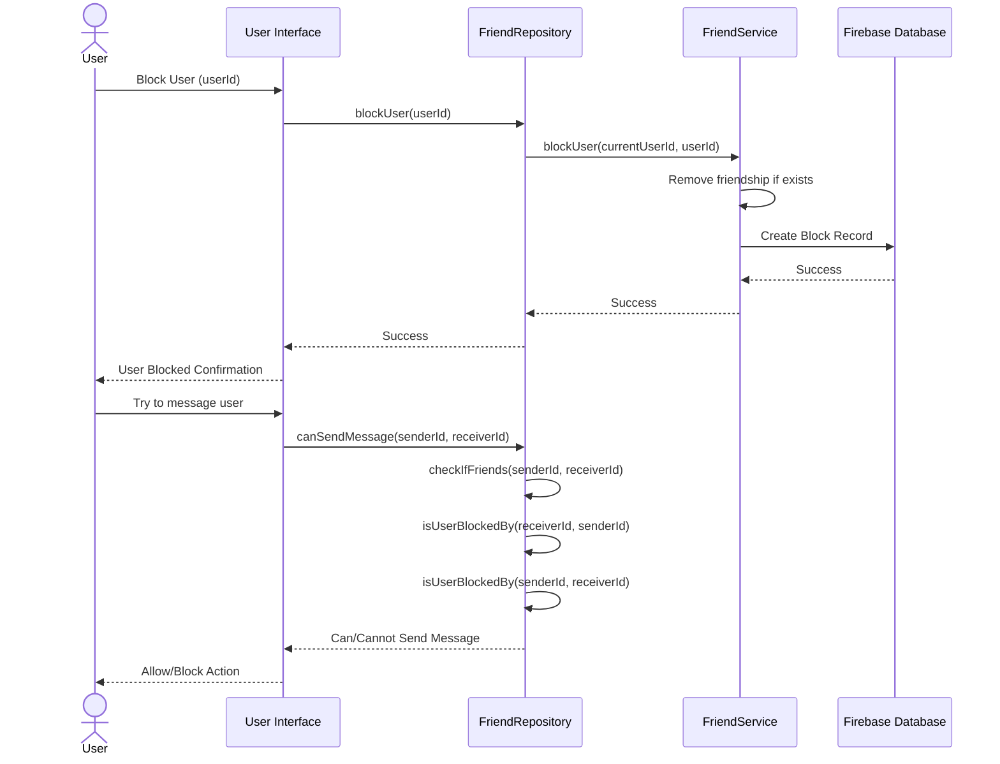
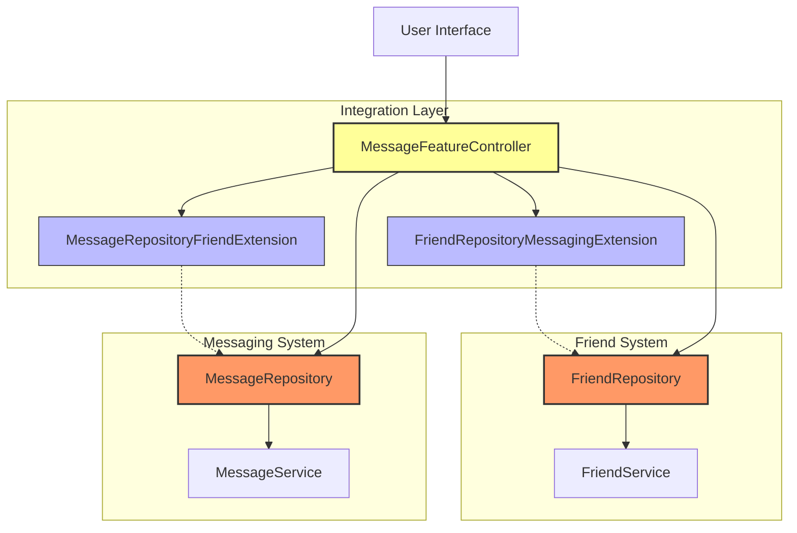

# DuckBuck Friend System Diagram

## Friend System Class Diagram

```mermaid
classDiagram
    class FriendService {
        -FirebaseDatabaseService _databaseService
        +Future~String~ sendFriendRequest(String senderId, String receiverId)
        +Future~FriendRequestModel?~ getFriendRequest(String requestId)
        +Future~List~FriendRequestModel~~ getPendingRequestsForUser(String userId)
        +Future~bool~ acceptFriendRequest(String requestId)
        +Future~bool~ rejectFriendRequest(String requestId)
        +Future~bool~ cancelFriendRequest(String requestId)
        +Future~List~String~~ getUserFriends(String userId)
        +Future~bool~ removeFriend(String userId1, String userId2)
        +Future~bool~ blockUser(String blockerId, String blockedId)
        +Future~bool~ unblockUser(String blockerId, String blockedId)
        +Future~bool~ isUserBlocked(String blockerId, String blockedId)
        +Future~bool~ _checkIfFriends(String user1Id, String user2Id)
        +Stream~List~String~~ streamUserFriends(String userId)
    }

    class FriendRepository {
        -FriendService _friendService
        -UserRepository _userRepository
        +Future~String~ sendFriendRequest(String receiverId)
        +Future~List~FriendRequestModel~~ getPendingRequests()
        +Future~bool~ acceptFriendRequest(String requestId)
        +Future~bool~ rejectFriendRequest(String requestId)
        +Future~bool~ cancelFriendRequest(String requestId)
        +Future~List~String~~ getFriends()
        +Future~List~String~~ getFriendsFor(String userId)
        +Future~bool~ isFriendWith(String userId)
        +Future~bool~ checkIfFriends(String user1Id, String user2Id)
        +Future~bool~ removeFriend(String friendId)
        +Future~bool~ blockUser(String userId)
        +Future~bool~ unblockUser(String userId)
        +Future~bool~ isUserBlocked(String userId)
        +Future~bool~ isUserBlockedBy(String blockerId, String blockedId)
    }

    class FriendRequestModel {
        +String id
        +String senderId
        +String receiverId
        +FriendRequestStatus status
        +DateTime createdAt
        +DateTime updatedAt
        +toMap()
        +fromMap()
        +copyWith()
    }

    class FriendRepositoryMessagingExtension {
        +Future~bool~ canSendMessage(String senderId, String receiverId)
        +Future~List~String~~ getMessagingEnabledFriends(String userId)
    }

    enum FriendRequestStatus {
        pending
        accepted
        rejected
        cancelled
    }

    FriendRepository --> FriendService : uses
    FriendRepository --> UserRepository : uses
    FriendService --> FriendRequestModel : creates/manages
    FriendRepository <|-- FriendRepositoryMessagingExtension : extends
    FriendRequestModel --> FriendRequestStatus : uses
```

## Friend Request Flow Diagram



## Blocking System Flow Diagram



## Friend-Messaging Integration


