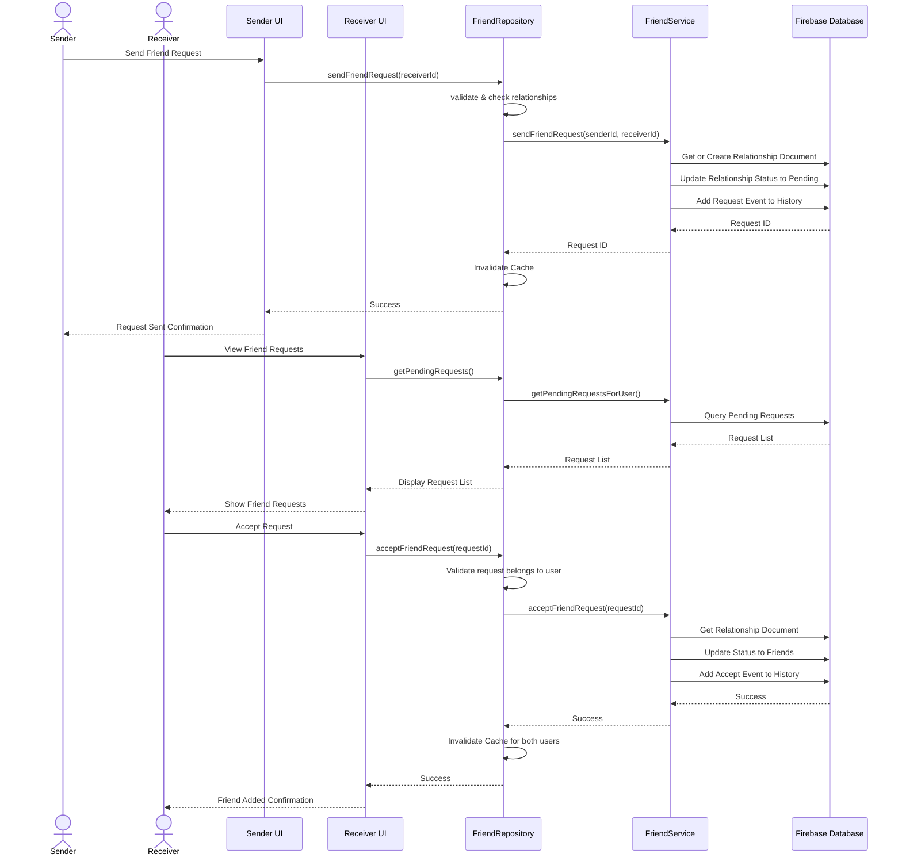
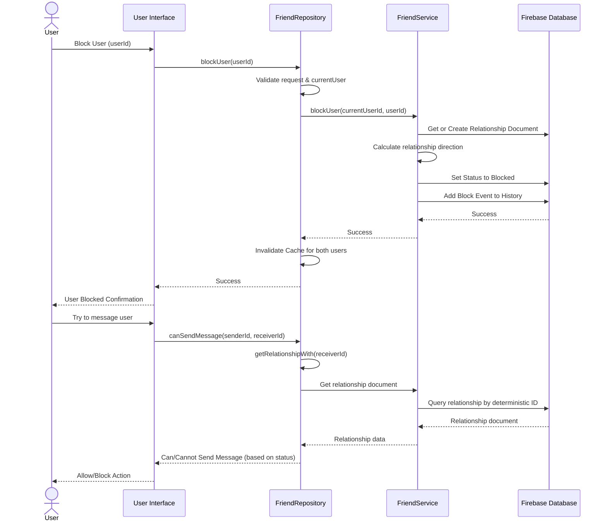
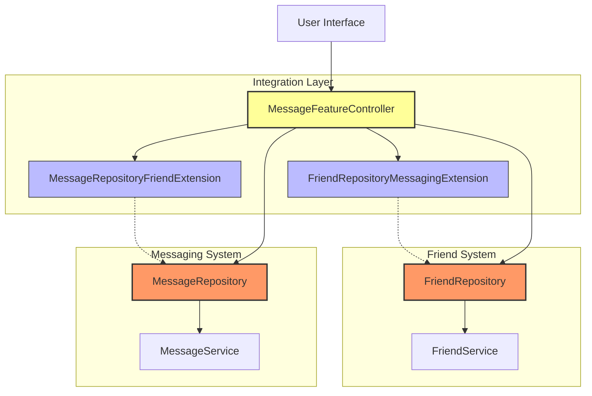

# DuckBuck Friend System Diagram

## Friend System Class Diagram

```mermaid
classDiagram
    class FriendService {
        -FirebaseDatabaseService _databaseService
        +Future~String~ sendFriendRequest(String senderId, String receiverId)
        +Future~FriendRelationshipModel?~ getRelationship(String relationshipId)
        +Future~FriendRelationshipModel?~ getRelationshipBetweenUsers(String user1Id, String user2Id)
        +Future~bool~ acceptFriendRequest(String requestId)
        +Future~bool~ rejectFriendRequest(String requestId)
        +Future~bool~ cancelFriendRequest(String requestId)
        +Future~List~String~~ getUserFriends(String userId)
        +Future~bool~ removeFriend(String userId1, String userId2)
        +Future~bool~ blockUser(String blockerId, String blockedId)
        +Future~bool~ unblockUser(String blockerId, String blockedId)
        +Future~bool~ isUserBlocked(String blockerId, String blockedId)
        +Future~bool~ _checkIfFriends(String user1Id, String user2Id)
        +Stream~List~String~~ streamUserFriends(String userId)
    }

    class FriendRepository {
        -FriendService _friendService
        -UserRepository _userRepository
        -Map~String, List~String~~ _friendsCache
        -Map~String, DateTime~ _cacheTimestamps
        -Map~String, FriendRelationshipModel~ _relationshipCache
        -Duration _cacheDuration
        -Timer? _cacheCleanupTimer
        +Future~String~ sendFriendRequest(String receiverId)
        +Future~List~FriendRelationshipModel~~ getPendingRequests()
        +Future~bool~ acceptFriendRequest(String requestId)
        +Future~bool~ rejectFriendRequest(String requestId)
        +Future~List~String~~ getFriends(bool forceRefresh)
        +Future~List~String~~ getFriendsFor(String userId, bool forceRefresh)
        +Future~RelationshipStatus~ getRelationshipWith(String userId)
        +void invalidateCache(String userId)
        -void _cleanupExpiredCache()
        +Future~List~String~~ getFriends()
        +Future~List~String~~ getFriendsFor(String userId)
        +Future~bool~ isFriendWith(String userId)
        +Future~bool~ checkIfFriends(String user1Id, String user2Id)
        +Future~bool~ removeFriend(String friendId)
        +Future~bool~ blockUser(String userId)
        +Future~bool~ unblockUser(String userId)
        +Future~bool~ isUserBlocked(String userId)
        +Future~bool~ isUserBlockedBy(String blockerId, String blockedId)
    }

    // FriendRequestModel removed - using a single model approach
    
    class FriendRelationshipModel {
        +String id
        +String user1Id
        +String user2Id
        +RelationshipStatus status
        +RelationshipDirection direction
        +DateTime createdAt
        +DateTime updatedAt
        +List~RelationshipEvent~ history
        +toMap()
        +fromMap()
        +addEvent()
        +updateStatus()
        +hasUser()
        +getOtherUserId()
    }
    
    class RelationshipEvent {
        +String eventType
        +String userId
        +DateTime timestamp
        +String? message
        +toMap()
        +fromMap()
    }
    
    enum RelationshipStatus {
        none
        pending
        friends
        blocked
    }
    
    enum RelationshipDirection {
        mutual
        fromUser1ToUser2
        fromUser2ToUser1
    }

    class FriendRepositoryMessagingExtension {
        +Future~bool~ canSendMessage(String senderId, String receiverId)
        +Future~List~String~~ getMessagingEnabledFriends(String userId)
    }

    // Using RelationshipStatus instead of FriendRequestStatus

    FriendRepository --> FriendService : uses
    FriendRepository --> UserRepository : uses
    FriendService --> FriendRelationshipModel : creates/manages
    FriendRepository <|-- FriendRepositoryMessagingExtension : extends
    FriendRelationshipModel --> RelationshipStatus : uses
    FriendRelationshipModel --> RelationshipDirection : uses
    FriendRelationshipModel *-- RelationshipEvent : contains
    RelationshipEvent --> RelationshipStatus : affects
```

## Friend Request Flow Diagram



## Blocking System Flow Diagram



## Friend-Messaging Integration


