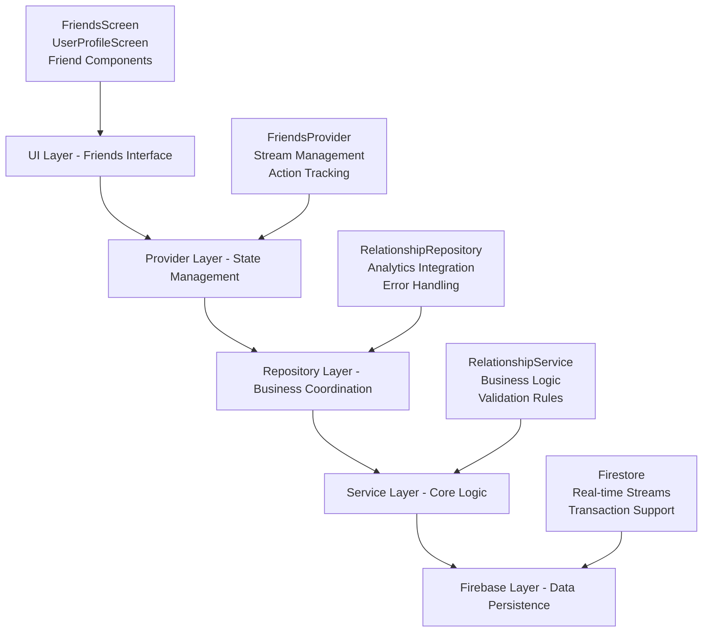
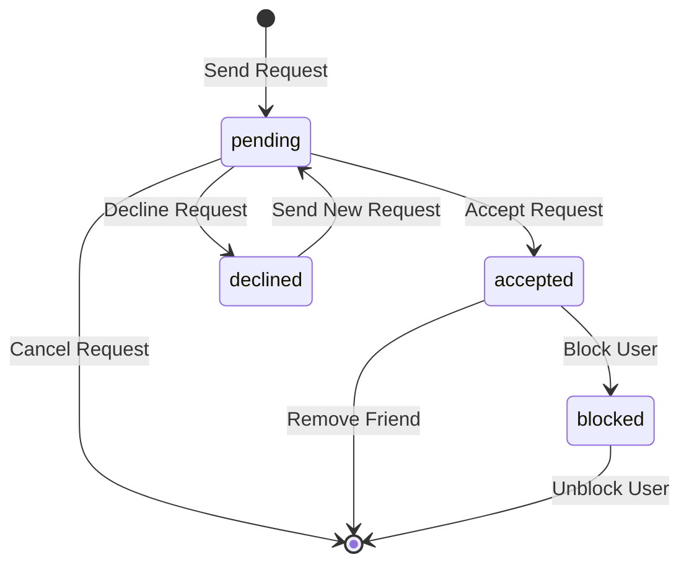

# Friends Feature Documentation - Enhanced v2.0

This directory contains comprehensive documentation for DuckBuck's unified friends system - a production-ready, real-time relationship management platform built with Flutter, Firebase, and intelligent caching.

## 📋 Documentation Overview

### [📐 Architecture Documentation](./friends_architecture.md)
**Complete technical architecture analysis - Enhanced v2.0**
- Unified SharedFriendsProvider architecture with repository-level caching
- Smart caching strategy with 5-minute validity and background refresh
- Real-time Firebase streams with automatic reconnection
- Comprehensive RelationshipModel and UserModel integration
- Performance optimizations including memory management and photo caching
- Analytics integration and error monitoring
- Enhanced mermaid diagrams showing unified data flow

### [🔄 User Flows Documentation](./friends_user_flows.md)
**Detailed sequence diagrams for all user interactions - Enhanced v2.0**
- Send friend request flow with UID search and smart caching
- Accept/reject friend request flows with repository coordination
- Block/unblock user flows with comprehensive state management
- Real-time stream synchronization with SharedFriendsProvider
- Error handling and recovery with analytics integration
- Cache optimization and background photo loading flows

### [🏗️ Code Organization Documentation](./friends_code_organization.md)
**Detailed code structure and class responsibilities - Enhanced v2.0**
- Updated directory structure with SharedFriendsProvider
- Repository-level caching architecture
- Enhanced RelationshipModel and UserModel specifications
- Memory optimization and disposal patterns
- Performance considerations and security features

## 🚀 Quick Start - Enhanced Architecture

### Core Components v2.0
```dart
// Unified state management (Single Source of Truth)
SharedFriendsProvider - Consolidated friends, requests, and blocked users
  ├── Real-time Firebase streams with auto-reconnection
  ├── Repository delegation for all caching operations
  ├── Memory optimization with proper disposal
  └── Error handling with user-friendly messages

// Repository-level caching and business logic
RelationshipRepository - Smart caching, analytics, and service coordination
  ├── 5-minute cache validity with background refresh
  ├── Offline support with local database integration
  ├── Analytics tracking for all operations
  └── Comprehensive error handling and monitoring

// Enhanced data models
RelationshipModel - Comprehensive relationship data
  ├── Sorted participants for consistent querying
  ├── RelationshipType (friendship, future: group, family)
  ├── RelationshipStatus (pending, accepted, blocked, declined)
  └── Metadata (createdAt, updatedAt, initiatorId, acceptedAt)

UserModel - Multi-provider user data
  ├── Authentication fields (uid, email, phoneNumber)
  ├── Profile fields (displayName, photoURL, isEmailVerified)
  ├── App fields (agentRemainingTime, deleted, fcmTokenData)
  └── Smart field management based on auth method

// Enhanced UI Components
FriendsScreen - Platform-specific interface with real-time updates
BlockedUsersScreen - Privacy management with unblock functionality
Settings Integration - Account management with auth state handling
```
```

### Key Features
- **Real-time Updates**: Live synchronization via Firestore streams
- **Transaction Safety**: Atomic operations for data consistency
- **Profile Caching**: Optimized performance with embedded user data
- **Error Recovery**: Comprehensive error handling with retry mechanisms
- **Platform UI**: Native iOS (Cupertino) and Android (Material) interfaces
- **Push Notifications**: Firebase Cloud Messaging for friend requests
- **Analytics Integration**: Complete event tracking and performance metrics

## 🏛️ Architecture Overview

The friends system follows a **layered architecture pattern** with clear separation of concerns:



## 📊 Data Model

### Relationship Structure
```dart
class RelationshipModel {
  final String id;                              // Unique relationship ID
  final List<String> participants;              // [userId1, userId2] (sorted)
  final RelationshipType type;                  // friendship
  final RelationshipStatus status;              // pending/accepted/declined/blocked
  final DateTime createdAt;                     // Creation timestamp
  final DateTime updatedAt;                     // Last modification
  final String? initiatorId;                    // Who sent the request
  final String? blockerId;                      // Who initiated block (if blocked)
  final Map<String, CachedProfile> cachedProfiles; // Performance cache
}
```

### State Transitions


## 🔄 Real-time Synchronization

The friends system uses **Firestore streams** for real-time updates:

### Stream Types
- **Friends Stream**: Accepted relationships (`status == 'accepted'`)
- **Incoming Requests**: Pending requests received (`status == 'pending' && initiatorId != currentUser`)
- **Outgoing Requests**: Pending requests sent (`status == 'pending' && initiatorId == currentUser`)
- **Blocked Users**: Blocked relationships (`status == 'blocked'`)

### Automatic UI Updates
```dart
// Provider automatically subscribes to streams
StreamSubscription<List<RelationshipModel>>? _friendsSubscription;

_friendsSubscription = _relationshipRepository.getFriendsStream().listen(
  (friendsList) {
    _friends = friendsList;
    notifyListeners(); // UI automatically refreshes
  }
);
```

## ⚡ Key Operations

### Send Friend Request
1. **User Search**: Find users by username/display name
2. **Validation**: Check for existing relationships, prevent self-friending
3. **Creation**: Atomic transaction creates relationship document
4. **Notification**: Push notification sent to target user
5. **Stream Update**: Real-time UI updates for both users

### Accept Friend Request
1. **Validation**: Verify pending request state
2. **Update**: Transaction updates status to 'accepted'
3. **Cache Update**: Profile data refreshed
4. **Stream Propagation**: Both users see updated friends list

### Block User
1. **Confirmation**: User confirms destructive action
2. **Update**: Status changed to 'blocked' with blocker ID
3. **Privacy**: Relationship hidden from blocked user
4. **Cleanup**: Removed from friends lists immediately

## 🛡️ Security & Privacy

### Input Validation
- **Authentication**: All operations require valid user session
- **Parameter Validation**: All inputs validated before processing
- **Business Rules**: Prevent invalid state transitions

### Privacy Controls
- **Data Isolation**: Users only see their own relationship data
- **Block Protection**: Blocked users cannot see relationship status
- **Secure Queries**: Firestore rules enforce data access permissions

### Transaction Safety
- **Atomic Operations**: All relationship changes use Firestore transactions
- **Consistency**: Data integrity maintained across concurrent operations
- **Rollback Support**: Failed operations don't leave partial state

## 📈 Performance Optimizations

### Caching Strategy
- **Profile Caching**: User display data embedded in relationship documents
- **Stream Efficiency**: Selective subscriptions based on screen visibility
- **Query Optimization**: Compound Firestore indices for efficient queries

### UI Performance
- **Skeleton Screens**: Immediate feedback during loading
- **Optimistic Updates**: UI updates before server confirmation
- **Smart Rebuilds**: Targeted widget rebuilds with Consumer widgets

### Memory Management
- **Stream Cleanup**: Automatic subscription cancellation
- **Resource Optimization**: Efficient data structures and minimal memory footprint

## 🔧 Error Handling

### Exception Hierarchy
```dart
class RelationshipException implements Exception {
  final RelationshipErrorCodes code;      // Specific error type
  final String message;                   // User-friendly message
  final Exception? originalException;     // Original error for debugging
  final RelationshipOperation operation;  // Context of operation
}
```

### Error Categories
- **Network Errors**: Connection issues, timeouts
- **Validation Errors**: Business rule violations, invalid requests
- **Permission Errors**: Authentication failures, unauthorized operations
- **Data Errors**: Database issues, corrupted data

### Recovery Mechanisms
- **Automatic Retry**: Exponential backoff for transient errors
- **User Actions**: Manual retry buttons and alternative flows
- **Graceful Degradation**: Cached data during service issues

## 📱 Platform Support

### iOS (Cupertino)
- Native iOS design with CupertinoSegmentedControl
- iOS-specific navigation patterns
- Platform-appropriate fonts and spacing

### Android (Material)
- Material Design 3 components
- TabBar with animated indicators
- Material-specific theming and elevation

## 🧪 Testing Strategy

### Unit Tests
- **Model Logic**: Serialization, validation, immutability
- **Provider Logic**: State management, stream handling
- **Repository Logic**: Service coordination, error translation
- **Service Logic**: Business rules, transaction handling

### Integration Tests
- **Firebase Integration**: Database operations, real-time streams
- **Authentication Flow**: User context validation
- **Notification Flow**: Push notification delivery

### Widget Tests
- **UI Components**: Screen rendering, user interactions
- **Error States**: Error display and recovery actions
- **Platform Differences**: iOS vs Android behavior

## 📊 Analytics & Monitoring

### Key Events
- `friend_request_sent/accepted/declined/cancelled`
- `user_blocked/unblocked`
- `friend_removed`
- `friends_screen_viewed`

### Performance Metrics
- **Response Times**: Operation latency tracking
- **Error Rates**: Success/failure ratios
- **Stream Performance**: Real-time update delays
- **Cache Hit Rates**: Profile cache effectiveness

## 🔮 Future Enhancements

### Advanced Features
- **Friend Suggestions**: ML-based recommendations
- **Group Management**: Multi-user relationship groups
- **Activity Feed**: Real-time friendship activity

### Performance Improvements
- **Pagination**: Large friends list optimization
- **Offline Support**: Local caching with sync
- **Background Sync**: Periodic data synchronization

### Social Features
- **Mutual Friends**: Shared connection display
- **Friend Insights**: Relationship analytics
- **Social Graphs**: Advanced relationship mapping

---

## 📚 Additional Resources

### Related Documentation
- [Authentication Architecture](../auth/auth_architecture.md) - User authentication system
- [User Management](../auth/auth_user_flows.md) - User data and profiles
- [Firebase Setup](../ENVIRONMENT_SETUP.md) - Development environment

### External Documentation
- [Flutter Provider Pattern](https://pub.dev/packages/provider)
- [Firestore Best Practices](https://firebase.google.com/docs/firestore/best-practices)
- [Firebase Cloud Messaging](https://firebase.google.com/docs/cloud-messaging)

### Support
For questions about the friends system implementation:
- Review the architecture documentation for design decisions
- Check user flows for interaction patterns  
- Examine code organization for implementation details
- Refer to error handling patterns for troubleshooting
