# DuckBuck Friends Feature Architecture - Comprehensive

## Overview

The DuckBuck friends system implements a **production-ready, real-time relationship management platform** that supports:
- **Friend Requests** with bi-directional pending states
- **Real-time Updates** via Firebase streams  
- **User Search & Discovery** with cached profiles
- **Blocking & Unblocking** with privacy controls
- **Relationship Status Management** with comprehensive state transitions

The architecture follows a **layered design pattern** with clear separation of concerns, real-time data synchronization, comprehensive error handling, and optimized performance. This structured approach enables scalable relationship management, exceptional user experience, and maintainable code while providing enterprise-level reliability.

## Enhanced Architecture Diagram

> **Viewing Tip:** Click the diagram to expand to full screen. The diagram uses advanced color coding and flow visualization to show the complete friends ecosystem including all relationship states and real-time updates.

```mermaid
%%{init: {'theme': 'neutral', 'flowchart': {'htmlLabels': true, 'curve': 'basis', 'padding': 30, 'useMaxWidth': false, 'diagramPadding': 30, 'rankSpacing': 100, 'nodeSpacing': 100}}}%%
flowchart TD
    %% Configuration for enhanced display
    linkStyle default stroke-width:2px,fill:none
    
    %% UI Layer - Friends Interface
    subgraph UI_Layer ["🎨 UI Layer - Friends Interface"]
        direction TB
        subgraph Friends_Screens ["Friends Screens"]
            FS["Friends Screen<br/>👥<br/>Multi-Tab Interface<br/>Real-time Updates"]
            UPS["User Profile Screen<br/>👤<br/>Profile Details<br/>Friend Actions"]
            HF["Home Friends List<br/>🏠<br/>Quick Friend Access"]
        end
        subgraph Friends_Widgets ["Interactive Components"]
            AFD["Add Friend Dialog<br/>➕<br/>User Search<br/>Send Requests"]
            RFD["Remove Friend Dialog<br/>❌<br/>Confirm Actions"]
            FT["Friend Tile<br/>📱<br/>Profile Display<br/>Action Buttons"]
            ES["Error State Widget<br/>⚠️<br/>Retry Mechanisms"]
        end
        subgraph Section_Components ["Section Widgets"]
            FriendsSection["Friends Section<br/>✅<br/>Accepted Friends<br/>Block/Remove Actions"]
            PendingSection["Pending Section<br/>⏳<br/>Incoming/Outgoing<br/>Accept/Decline Actions"]
        end
    end
    
    %% Provider Layer - State Management
    subgraph Provider_Layer ["🔄 Provider Layer - Real-time State Management"]
        direction TB
        FP["Friends Provider<br/>🔄<br/>Centralized Friends State<br/>Stream Subscriptions<br/>Action Processing<br/>Error Handling"]
        
        subgraph Provider_State ["State Management Features"]
            StreamMgmt["Stream Management<br/>📡<br/>Friends/Incoming/Outgoing<br/>Auto-reconnection<br/>Real-time Sync"]
            ActionState["Action State Tracking<br/>⚡<br/>Accept/Decline/Cancel<br/>Block/Unblock<br/>Loading Indicators"]
            CacheState["Cache & Summary<br/>💾<br/>Relationship Counts<br/>Profile Caching<br/>Performance Optimization"]
        end
    end
    
    %% Repository Layer - Business Logic Coordination
    subgraph Repository_Layer ["📂 Repository Layer - Relationship Coordination"]
        RR["Relationship Repository<br/>📂<br/>Business Logic Orchestration<br/>Analytics Integration<br/>Error Tracking<br/>Service Coordination"]
        
        subgraph Repository_Features ["Enhanced Features"]
            AnalyticsInteg["Analytics Integration<br/>📊<br/>Action Tracking<br/>Success/Failure Metrics<br/>User Behavior Analysis"]
            ErrorHandling["Error Management<br/>🛡️<br/>Exception Translation<br/>Crashlytics Logging<br/>Recovery Strategies"]
            ValidationLayer["Validation Layer<br/>✅<br/>Request Validation<br/>State Verification<br/>Business Rules"]
        end
    end
    
    %% Service Layer - Core Business Logic
    subgraph Service_Layer ["⚙️ Service Layer - Relationship Logic"]
        direction TB
        RS["Relationship Service<br/>⚙️<br/>Core Friendship Logic<br/>Transaction Management<br/>State Transitions<br/>Notification Triggers"]
        
        subgraph Service_Components ["Service Dependencies"]
            US["User Service<br/>👤<br/>Profile Management<br/>User Validation<br/>Data Enrichment"]
            AS["Auth Service<br/>🔐<br/>Authentication<br/>User Context<br/>Security Validation"]
            NS["Notification Service<br/>📨<br/>Push Notifications<br/>Friend Request Alerts<br/>Action Confirmations"]
            LS["Logger Service<br/>📝<br/>Structured Logging<br/>Debug Information<br/>Operation Tracking"]
        end
    end
    
    %% Data Models & Core Infrastructure
    subgraph Model_Layer ["📋 Data Models & Infrastructure"]
        direction TB
        subgraph Core_Models ["Core Models"]
            RM["Relationship Model<br/>📋<br/>Friendship Data<br/>State Management<br/>Profile Caching"]
            CP["Cached Profile<br/>👤<br/>User Display Info<br/>Photo URLs<br/>Performance Cache"]
            RE["Relationship Exceptions<br/>⚠️<br/>Custom Error Types<br/>Operation Context<br/>Error Recovery"]
        end
        subgraph Model_Enums ["Enums & Types"]
            RT["Relationship Type<br/>🏷️<br/>Friendship"]
            RStat["Relationship Status<br/>📊<br/>Pending/Accepted<br/>Declined/Blocked"]
            ROp["Relationship Operation<br/>⚡<br/>Send/Accept/Decline<br/>Cancel/Block/Unblock"]
        end
    end
    
    %% Firebase & External Services
    subgraph Firebase_Layer ["🔥 Firebase & External Services"]
        direction TB
        subgraph Firebase_Services ["Firebase Stack"]
            FDB["Firebase Database Service<br/>🔥<br/>Firestore Operations<br/>Transaction Support<br/>Real-time Streams"]
            FStore["Firestore Collection<br/>☁️<br/>relationships<br/>Document-based Storage<br/>Compound Queries"]
            FAnalytics["Firebase Analytics<br/>📊<br/>Event Tracking<br/>User Metrics<br/>Performance Data"]
            FCrash["Firebase Crashlytics<br/>🐛<br/>Error Reporting<br/>Crash Analysis<br/>Debug Information"]
        end
        subgraph External_APIs ["External Integrations"]
            FCM["Firebase Cloud Messaging<br/>📱<br/>Push Notifications<br/>Friend Request Alerts<br/>Real-time Updates"]
        end
    end
                
    %% ==========================================
    %% ENHANCED FLOW CONNECTIONS
    %% ==========================================
    
    %% UI Navigation Flow - Primary user journey
    FS ==>|"Friend Details"| UPS
    FS ==>|"Add Friend"| AFD
    FS ==>|"Remove Friend"| RFD
    HF ==>|"View Profile"| UPS
    FS -.->|"displays"| FT
    FS -.->|"sections"| FriendsSection
    FS -.->|"sections"| PendingSection
    FS -.->|"error handling"| ES
    
    %% Provider State Management - Real-time coordination
    FS -.->|"consumes"| FP
    UPS -.->|"consumes"| FP
    AFD -.->|"actions"| FP
    RFD -.->|"actions"| FP
    FriendsSection -.->|"uses"| FP
    PendingSection -.->|"uses"| FP
    FP -.->|"manages"| StreamMgmt
    FP -.->|"tracks"| ActionState
    FP -.->|"optimizes"| CacheState
    
    %% Repository Integration - Business logic coordination
    FP ===>|"orchestrates"| RR
    RR -.->|"tracks via"| AnalyticsInteg
    RR -.->|"handles via"| ErrorHandling
    RR -.->|"validates via"| ValidationLayer
    
    %% Service Dependencies - Core functionality
    RR ====>|"relationship operations"| RS
    RS -.->|"user data"| US
    RS -.->|"authentication"| AS
    RS -.->|"notifications"| NS
    RS -.->|"logging"| LS
    
    %% Model Usage - Data flow
    RS -.-|"creates/updates"| RM
    RS -.-|"caches"| CP
    RS -.-|"throws"| RE
    RM -.-|"uses"| RT
    RM -.-|"tracks"| RStat
    RE -.-|"categorizes"| ROp
    FP -.-|"exposes"| RM
    FP -.-|"handles"| RE
    
    %% Firebase Integration - Data persistence
    RS ====>|"database operations"| FDB
    FDB ===>|"stores in"| FStore
    RR ====>|"tracks via"| FAnalytics
    RR ====>|"reports via"| FCrash
    NS ====>|"sends via"| FCM
    
    %% Real-time Stream Connections
    FDB -.->|"streams changes"| FP
    FStore -.->|"real-time updates"| StreamMgmt
    StreamMgmt -.->|"notifies"| ActionState
    ActionState -.->|"updates"| CacheState
    
    %% Enhanced Data Flow for Friend Operations
    AFD -->|"1️⃣ Search Request"| FP
    FP -->|"2️⃣ User Lookup"| RR
    RR -->|"3️⃣ Send Friend Request"| RS
    RS -->|"4️⃣ Validate & Create"| FDB
    FDB -->|"5️⃣ Store Relationship"| FStore
    RS -->|"6️⃣ Send Notification"| NS
    NS -->|"7️⃣ Push Alert"| FCM
    FStore -->|"8️⃣ Stream Update"| FP
    FP -->|"9️⃣ UI Refresh"| FS
    
    %% Error Flow
    RS -.->|"validation error"| RE
    RE -.->|"logs error"| LS
    RE -.->|"reports to"| FCrash
    RE -.->|"tracks in"| FAnalytics
    RE -.->|"surfaces to"| FP
    FP -.->|"displays in"| ES
    
    %% State Transition Flow
    RM -->|"pending → accepted"| RStat
    RM -->|"pending → declined"| RStat
    RM -->|"accepted → blocked"| RStat
    RStat -.->|"triggers analytics"| FAnalytics
    RStat -.->|"updates cache"| CacheState
    RStat -.->|"notifies streams"| StreamMgmt

    %% Styling
    classDef uiClass fill:#e1f5fe,stroke:#01579b,stroke-width:2px
    classDef providerClass fill:#f3e5f5,stroke:#4a148c,stroke-width:2px
    classDef repoClass fill:#e8f5e8,stroke:#1b5e20,stroke-width:2px
    classDef serviceClass fill:#fff3e0,stroke:#e65100,stroke-width:2px
    classDef modelClass fill:#fce4ec,stroke:#880e4f,stroke-width:2px
    classDef firebaseClass fill:#ffebee,stroke:#b71c1c,stroke-width:2px
    
    class FS,UPS,HF,AFD,RFD,FT,ES,FriendsSection,PendingSection uiClass
    class FP,StreamMgmt,ActionState,CacheState providerClass
    class RR,AnalyticsInteg,ErrorHandling,ValidationLayer repoClass
    class RS,US,AS,NS,LS serviceClass
    class RM,CP,RE,RT,RStat,ROp modelClass
    class FDB,FStore,FAnalytics,FCrash,FCM firebaseClass
```



## Layer-by-Layer Architecture Analysis

### 1. UI Layer - Friends Interface

The UI layer provides comprehensive friend management through multiple screens and components:

#### Core Screens
- **FriendsScreen**: Main interface with tabbed view (Friends/Pending)
- **UserProfileScreen**: Detailed profile view with friend actions
- **Home Friends Integration**: Quick access to friends list

#### Interactive Components
- **Add Friend Dialog**: User search and friend request sending
- **Remove Friend Dialog**: Confirmation dialogs for destructive actions
- **Friend Tile**: Reusable component for displaying friend information
- **Error State Widget**: Consistent error handling with retry mechanisms

#### Key Features
- **Platform-specific UI**: iOS (Cupertino) and Android (Material) implementations
- **Real-time Updates**: Automatic UI refresh via Provider pattern
- **Loading States**: Skeleton screens and loading indicators
- **Error Handling**: User-friendly error messages with recovery options

### 2. Provider Layer - Real-time State Management

The FriendsProvider manages all friendship-related state using reactive programming:

#### State Management
```dart
class FriendsProvider extends ChangeNotifier {
  // Core data streams
  List<RelationshipModel> _friends = [];
  List<RelationshipModel> _incomingRequests = [];
  List<RelationshipModel> _outgoingRequests = [];
  List<RelationshipModel> _blockedUsers = [];
  
  // Real-time subscriptions
  StreamSubscription<List<RelationshipModel>>? _friendsSubscription;
  StreamSubscription<List<RelationshipModel>>? _incomingRequestsSubscription;
  StreamSubscription<List<RelationshipModel>>? _outgoingRequestsSubscription;
  StreamSubscription<List<RelationshipModel>>? _blockedUsersSubscription;
}
```

#### Key Capabilities
- **Stream Management**: Automatic subscription/unsubscription lifecycle
- **Action State Tracking**: Individual request processing states
- **Cache Optimization**: Smart caching with summary data
- **Error Recovery**: Comprehensive error handling with user feedback

### 3. Repository Layer - Business Logic Coordination

The RelationshipRepository orchestrates between UI state and core services:

#### Core Responsibilities
- **Service Coordination**: Bridges Provider and Service layers
- **Analytics Integration**: Tracks all friendship actions
- **Error Translation**: Converts service exceptions to user-friendly messages
- **Validation**: Business rule enforcement

#### Analytics Integration
```dart
await _analytics.logEvent(
  name: 'friend_request_sent',
  parameters: {
    'target_user_id_hash': targetUserId.hashCode.toString(),
    'success': true,
  },
);
```

### 4. Service Layer - Core Relationship Logic

The RelationshipService implements core friendship business logic:

#### Transaction Management
- **Atomic Operations**: Firestore transactions for consistency
- **State Validation**: Prevents invalid state transitions
- **Duplicate Prevention**: Checks existing relationships before creation

#### Notification Integration
- **Push Notifications**: Firebase Cloud Messaging for friend requests
- **Real-time Alerts**: Immediate notification delivery
- **Privacy Controls**: Respects user notification preferences

### 5. Data Models - Relationship Infrastructure

#### RelationshipModel Structure
```dart
class RelationshipModel {
  final String id;
  final List<String> participants; // Always sorted [userId1, userId2]
  final RelationshipType type; // Currently: friendship
  final RelationshipStatus status; // pending, accepted, declined, blocked
  final DateTime createdAt;
  final DateTime updatedAt;
  final String? initiatorId; // Who sent the request
  final String? blockerId; // Who initiated the block
  final Map<String, CachedProfile> cachedProfiles; // Performance optimization
}
```

#### State Transitions


### 6. Firebase Layer - Data Persistence

#### Firestore Schema
```javascript
// Collection: relationships
{
  id: "auto-generated",
  participants: ["userId1", "userId2"], // Sorted array
  type: "friendship",
  status: "pending|accepted|declined|blocked",
  createdAt: Timestamp,
  updatedAt: Timestamp,
  initiatorId: "userId1",
  blockerId?: "userId1", // Optional
  acceptedAt?: Timestamp, // Optional
  cachedProfiles: {
    "userId1": {
      displayName: "John Doe",
      photoURL: "https://...",
      lastUpdated: Timestamp
    },
    "userId2": {
      displayName: "Jane Smith", 
      photoURL: "https://...",
      lastUpdated: Timestamp
    }
  }
}
```

#### Query Patterns
- **Friends**: `where('participants', 'array-contains', userId) && where('status', '==', 'accepted')`
- **Incoming**: `where('participants', 'array-contains', userId) && where('status', '==', 'pending') && where('initiatorId', '!=', userId)`
- **Outgoing**: `where('initiatorId', '==', userId) && where('status', '==', 'pending')`
- **Blocked**: `where('participants', 'array-contains', userId) && where('status', '==', 'blocked')`

## Performance Optimizations

### 1. Stream Management
- **Selective Subscriptions**: Only active when screen is visible
- **Automatic Cleanup**: Subscriptions cancelled on dispose
- **Error Recovery**: Automatic reconnection on stream errors

### 2. Profile Caching
- **Embedded Profiles**: User data cached in relationship documents
- **Lazy Loading**: Profiles updated on-demand
- **Cache Invalidation**: Smart updates when user data changes

### 3. Real-time Updates
- **Firestore Streams**: Instant UI updates on data changes
- **Optimistic Updates**: UI updates before server confirmation
- **Conflict Resolution**: Handles concurrent modifications gracefully

## Security Features

### 1. Input Validation
- **User Existence**: Validates target users before requests
- **Self-Prevention**: Blocks self-friending attempts
- **State Validation**: Prevents invalid state transitions

### 2. Privacy Controls
- **Block Functionality**: Complete relationship termination
- **Notification Preferences**: Respects user settings
- **Data Isolation**: Users only see their own relationship data

### 3. Rate Limiting
- **Request Throttling**: Prevents spam friend requests
- **Action Cooldowns**: Prevents rapid-fire actions
- **Error Handling**: Graceful degradation on limits

## Error Handling Strategy

### 1. Exception Hierarchy
```dart
class RelationshipException implements Exception {
  final RelationshipErrorCodes code;
  final String message;
  final Exception? originalException;
  final RelationshipOperation operation;
}
```

### 2. Error Categories
- **Network Errors**: Connection issues, timeouts
- **Validation Errors**: Invalid requests, business rule violations
- **Permission Errors**: Authentication, authorization failures
- **Data Errors**: Corrupted data, missing resources

### 3. Recovery Mechanisms
- **Retry Logic**: Automatic retry for transient errors
- **User Actions**: Manual retry buttons, alternative flows
- **Graceful Degradation**: Fallback experiences when features fail

## Testing Strategy

### 1. Unit Tests
- **Provider Logic**: State management and stream handling
- **Repository Logic**: Service coordination and error handling
- **Service Logic**: Core business rules and validations
- **Model Logic**: Data transformation and validation

### 2. Integration Tests
- **Firebase Integration**: Database operations and streams
- **Notification Flow**: End-to-end notification delivery
- **Error Scenarios**: Exception handling and recovery

### 3. Widget Tests
- **UI Components**: Screen rendering and user interactions
- **Error States**: Error display and recovery actions
- **Loading States**: Progress indicators and skeleton screens

## Future Enhancements

### 1. Advanced Features
- **Friend Suggestions**: ML-based friend recommendations
- **Group Management**: Multi-user relationship groups
- **Activity Feed**: Real-time friendship activity updates

### 2. Performance Improvements
- **Pagination**: Large friends list optimization
- **Offline Support**: Local caching and sync
- **Background Sync**: Periodic data synchronization

### 3. Social Features
- **Mutual Friends**: Display shared connections
- **Friend Insights**: Relationship analytics and insights
- **Social Graphs**: Advanced relationship mapping

## Monitoring & Analytics

### 1. Key Metrics
- **Friend Request Success Rate**: Acceptance vs decline ratios
- **User Engagement**: Active friendship interactions
- **Error Rates**: Failed operations and recovery success

### 2. Performance Tracking
- **Stream Performance**: Real-time update latency
- **Query Optimization**: Database operation efficiency
- **UI Responsiveness**: User interaction response times

### 3. User Behavior
- **Feature Usage**: Most/least used features
- **User Flows**: Common navigation patterns
- **Retention Impact**: Friends feature effect on app retention

---

## Quick Reference

### Key Files
- **UI Layer**: `lib/features/friends/screens/friends_screen.dart`
- **Provider**: `lib/features/friends/providers/friends_provider.dart`
- **Repository**: `lib/core/repositories/relationship_repository.dart`
- **Service**: `lib/core/services/relationship/relationship_service.dart`
- **Models**: `lib/core/models/relationship_model.dart`

### Key Classes
- **FriendsScreen**: Main UI interface
- **FriendsProvider**: State management
- **RelationshipRepository**: Business logic coordination
- **RelationshipService**: Core friendship operations
- **RelationshipModel**: Data model

### Key Concepts
- **Real-time Streams**: Live data synchronization
- **State Transitions**: Friendship status management
- **Transaction Safety**: Atomic operations
- **Profile Caching**: Performance optimization
- **Error Recovery**: Comprehensive error handling
