# DuckBuck Friends Feature Architecture - Enhanced v2.0

## Overview

The DuckBuck friends system implements a **production-ready, unified relationship management platform** that supports:
- **Unified Friend Management** via SharedFriendsProvider with repository-level caching
- **Real-time Relationship Streams** with Firebase integration and offline resilience
- **Comprehensive Relationship States** (pending, accepted, blocked, declined)
- **Smart Caching Strategy** with cache-first loading and background synchronization
- **User Search & Discovery** with intelligent profile caching
- **Privacy Controls** including blocking/unblocking with state persistence

The architecture follows a **clean repository pattern** with clear separation between UI state management (SharedFriendsProvider) and data operations (RelationshipRepository). This unified approach consolidates all friends-related functionality into a single source of truth while maintaining optimal performance through intelligent caching and real-time updates.

## Enhanced Architecture Diagram

> **Viewing Tip:** Click the diagram to expand to full screen. The diagram shows the unified SharedFriendsProvider architecture with repository-level caching and real-time stream management.

```mermaid
%%{init: {'theme': 'neutral', 'flowchart': {'htmlLabels': true, 'curve': 'basis', 'padding': 30, 'useMaxWidth': false, 'diagramPadding': 30, 'rankSpacing': 100, 'nodeSpacing': 100}}}%%
flowchart TD
    %% Configuration for enhanced display
    linkStyle default stroke-width:2px,fill:none
    
    %% UI Layer - Friends Interface
    subgraph UI_Layer ["🎨 UI Layer - Friends Interface"]
        direction TB
        subgraph Friends_Screens ["Friends Screens"]
            FS["Friends Screen<br/>👥<br/>Multi-Tab Interface<br/>Real-time Updates"]
            HS["Home Screen<br/>🏠<br/>Friends Quick Access<br/>Activity Feed"]
            BUS["Blocked Users Screen<br/>🚫<br/>Privacy Management<br/>Unblock Actions"]
            SS["Settings Screen<br/>⚙️<br/>Account Management<br/>Privacy Controls"]
        end
        subgraph Friends_Widgets ["Interactive Components"]
            AFD["Add Friend Dialog<br/>➕<br/>UID Search<br/>Send Requests"]
            FT["Friend Tile<br/>📱<br/>Profile Display<br/>Action Buttons"]
            RT["Request Tile<br/>�<br/>Accept/Reject<br/>Request Details"]
            ES["Error State Widget<br/>⚠️<br/>Retry Mechanisms<br/>User Feedback"]
        end
    end
    
    %% Provider Layer - Unified State Management
    subgraph Provider_Layer ["🔄 Provider Layer - Unified State Management"]
        direction TB
        SFP["SharedFriendsProvider<br/>🎯<br/>Single Source of Truth<br/>Real-time Streams<br/>Error Handling<br/>Memory Optimization"]
        
        subgraph Provider_Features ["State Management Features"]
            StreamMgmt["Stream Management<br/>📡<br/>Friends/Requests/Blocked<br/>Auto-reconnection<br/>Error Recovery"]
            CacheCoord["Cache Coordination<br/>🗄️<br/>Repository Delegation<br/>Offline Resilience<br/>Memory Optimization"]
            StateSync["State Synchronization<br/>⚡<br/>UI Updates<br/>Loading States<br/>Error States"]
        end
    end
    
    %% Repository Layer - Business Logic & Caching
    subgraph Repository_Layer ["📂 Repository Layer - Business Logic & Data Coordination"]
        direction TB
        RR["RelationshipRepository<br/>🏗️<br/>Data Operations<br/>Caching Strategy<br/>Analytics Tracking<br/>Error Handling"]
        UR["UserRepository<br/>👤<br/>Profile Management<br/>User Data<br/>Photo Caching"]
        
        subgraph Repository_Features ["Repository Features"]
            SmartCache["Smart Caching<br/>🧠<br/>5-min Cache Validity<br/>Background Refresh<br/>Memory Optimization"]
            DataSync["Data Synchronization<br/>🔄<br/>Firebase Integration<br/>Offline Support<br/>Conflict Resolution"]
            Analytics["Analytics Integration<br/>📊<br/>Usage Tracking<br/>Error Monitoring<br/>Performance Metrics"]
        end
    end
    
    %% Service Layer - External Integrations
    subgraph Service_Layer ["� Service Layer - External Integrations"]
        direction TB
        RSI["RelationshipService<br/>🤝<br/>Firebase Operations<br/>CRUD Operations<br/>Stream Management"]
        US["UserService<br/>👥<br/>Profile Operations<br/>Search Functionality<br/>Photo Management"]
        LDB["LocalDatabaseService<br/>💾<br/>Offline Caching<br/>Background Sync<br/>Data Persistence"]
        
        subgraph Service_Features ["Service Features"]
            Firebase["Firebase Integration<br/>🔥<br/>Firestore Operations<br/>Real-time Listeners<br/>Authentication"]
            LocalStorage["Local Storage<br/>�<br/>SQLite Integration<br/>Offline Capability<br/>Cache Management"]
            PhotoCache["Photo Caching<br/>📸<br/>Image Optimization<br/>Background Downloads<br/>Storage Management"]
        end
    end
    
    %% Data Layer - External Systems
    subgraph Data_Layer ["💾 Data Layer - External Systems"]
        direction TB
        subgraph Firebase_Services ["Firebase Services"]
            FS_DB["Firestore Database<br/>📚<br/>relationships Collection<br/>users Collection<br/>Real-time Updates"]
            FS_Auth["Firebase Auth<br/>🔐<br/>User Authentication<br/>UID Management<br/>Security Rules"]
            FS_Storage["Firebase Storage<br/>🖼️<br/>Profile Photos<br/>Cached Images<br/>Optimized Downloads"]
        end
        subgraph Local_Storage ["Local Storage"]
            SQLite["SQLite Database<br/>🗄️<br/>Cached Relationships<br/>User Profiles<br/>Offline Data"]
            FileCache["File Cache<br/>📁<br/>Profile Images<br/>Temporary Data<br/>Background Sync"]
        end
    end
    
    %% Model Layer - Data Structures
    subgraph Model_Layer ["📋 Model Layer - Data Structures"]
        direction TB
        RM["RelationshipModel<br/>🤝<br/>id, participants, type<br/>status, timestamps<br/>initiatorId, acceptedAt"]
        UM["UserModel<br/>�<br/>uid, displayName, photoURL<br/>email, phoneNumber<br/>agentRemainingTime, deleted"]
        
        subgraph Model_Features ["Model Features"]
            RelTypes["Relationship Types<br/>🏷️<br/>friendship<br/>Future: group, family"]
            RelStatus["Relationship Status<br/>🔄<br/>pending, accepted<br/>blocked, declined"]
            UserData["User Data<br/>📊<br/>Auth Fields<br/>Profile Fields<br/>App State"]
        end
    end
    
    %% Data Flow Connections - Enhanced Unified Architecture
    %% UI to Provider
    FS --> SFP
    HS --> SFP
    BUS --> SFP
    SS --> SFP
    AFD --> SFP
    FT --> SFP
    RT --> SFP
    ES --> SFP
    
    %% Provider to Repository
    SFP --> RR
    SFP --> UR
    StreamMgmt --> SFP
    CacheCoord --> RR
    StateSync --> SFP
    
    %% Repository to Service
    RR --> RSI
    RR --> LDB
    UR --> US
    SmartCache --> RR
    DataSync --> RR
    Analytics --> RR
    
    %% Service to Data
    RSI --> FS_DB
    RSI --> FS_Auth
    US --> FS_DB
    US --> FS_Storage
    LDB --> SQLite
    LDB --> FileCache
    Firebase --> FS_DB
    LocalStorage --> SQLite
    PhotoCache --> FileCache
    
    %% Model Integration
    RR --> RM
    UR --> UM
    RSI --> RM
    US --> UM
    RelTypes --> RM
    RelStatus --> RM
    UserData --> UM
    
    %% Styling for better visualization
    classDef uiLayer fill:#e1f5fe,stroke:#01579b,stroke-width:2px
    classDef providerLayer fill:#f3e5f5,stroke:#4a148c,stroke-width:2px
    classDef repositoryLayer fill:#e8f5e8,stroke:#1b5e20,stroke-width:2px
    classDef serviceLayer fill:#fff3e0,stroke:#e65100,stroke-width:2px
    classDef dataLayer fill:#fce4ec,stroke:#880e4f,stroke-width:2px
    classDef modelLayer fill:#f1f8e9,stroke:#33691e,stroke-width:2px
    
    class UI_Layer,FS,HS,BUS,SS,AFD,FT,RT,ES uiLayer
    class Provider_Layer,SFP,StreamMgmt,CacheCoord,StateSync providerLayer
    class Repository_Layer,RR,UR,SmartCache,DataSync,Analytics repositoryLayer
    class Service_Layer,RSI,US,LDB,Firebase,LocalStorage,PhotoCache serviceLayer
    class Data_Layer,FS_DB,FS_Auth,FS_Storage,SQLite,FileCache dataLayer
    class Model_Layer,RM,UM,RelTypes,RelStatus,UserData modelLayer
```


    
    %% Firebase & External Services
    subgraph Firebase_Layer ["🔥 Firebase & External Services"]
        direction TB
        subgraph Firebase_Services ["Firebase Stack"]
            FDB["Firebase Database Service<br/>🔥<br/>Firestore Operations<br/>Transaction Support<br/>Real-time Streams"]
            FStore["Firestore Collection<br/>☁️<br/>relationships<br/>Document-based Storage<br/>Compound Queries"]
            FAnalytics["Firebase Analytics<br/>📊<br/>Event Tracking<br/>User Metrics<br/>Performance Data"]
            FCrash["Firebase Crashlytics<br/>🐛<br/>Error Reporting<br/>Crash Analysis<br/>Debug Information"]
        end
        subgraph External_APIs ["External Integrations"]
            FCM["Firebase Cloud Messaging<br/>📱<br/>Push Notifications<br/>Friend Request Alerts<br/>Real-time Updates"]
        end
    end
                
    %% ==========================================
    %% ENHANCED FLOW CONNECTIONS
    %% ==========================================
    
    %% UI Navigation Flow - Primary user journey
    FS ==>|"Friend Details"| UPS
    FS ==>|"Add Friend"| AFD
    FS ==>|"Remove Friend"| RFD
    HF ==>|"View Profile"| UPS
    FS -.->|"displays"| FT
    FS -.->|"sections"| FriendsSection
    FS -.->|"sections"| PendingSection
    FS -.->|"error handling"| ES
    
    %% Provider State Management - Real-time coordination
    FS -.->|"consumes"| FP
    UPS -.->|"consumes"| FP
    AFD -.->|"actions"| FP
    RFD -.->|"actions"| FP
    FriendsSection -.->|"uses"| FP
    PendingSection -.->|"uses"| FP
    FP -.->|"manages"| StreamMgmt
    FP -.->|"tracks"| ActionState
    FP -.->|"optimizes"| CacheState
    
    %% Repository Integration - Business logic coordination
    FP ===>|"orchestrates"| RR
    RR -.->|"tracks via"| AnalyticsInteg
    RR -.->|"handles via"| ErrorHandling
    RR -.->|"validates via"| ValidationLayer
    
    %% Service Dependencies - Core functionality
    RR ====>|"relationship operations"| RS
    RS -.->|"user data"| US
    RS -.->|"authentication"| AS
    RS -.->|"notifications"| NS
    RS -.->|"logging"| LS
    
    %% Model Usage - Data flow
    RS -.-|"creates/updates"| RM
    RS -.-|"caches"| CP
    RS -.-|"throws"| RE
    RM -.-|"uses"| RT
    RM -.-|"tracks"| RStat
    RE -.-|"categorizes"| ROp
    FP -.-|"exposes"| RM
    FP -.-|"handles"| RE
    
    %% Firebase Integration - Data persistence
    RS ====>|"database operations"| FDB
    FDB ===>|"stores in"| FStore
    RR ====>|"tracks via"| FAnalytics
    RR ====>|"reports via"| FCrash
    NS ====>|"sends via"| FCM
    
    %% Real-time Stream Connections
    FDB -.->|"streams changes"| FP
    FStore -.->|"real-time updates"| StreamMgmt
    StreamMgmt -.->|"notifies"| ActionState
    ActionState -.->|"updates"| CacheState
    
    %% Enhanced Data Flow for Friend Operations
    AFD -->|"1️⃣ Search Request"| FP
    FP -->|"2️⃣ User Lookup"| RR
    RR -->|"3️⃣ Send Friend Request"| RS
    RS -->|"4️⃣ Validate & Create"| FDB
    FDB -->|"5️⃣ Store Relationship"| FStore
    RS -->|"6️⃣ Send Notification"| NS
    NS -->|"7️⃣ Push Alert"| FCM
    FStore -->|"8️⃣ Stream Update"| FP
    FP -->|"9️⃣ UI Refresh"| FS
    
    %% Error Flow
    RS -.->|"validation error"| RE
    RE -.->|"logs error"| LS
    RE -.->|"reports to"| FCrash
    RE -.->|"tracks in"| FAnalytics
    RE -.->|"surfaces to"| FP
    FP -.->|"displays in"| ES
    
    %% State Transition Flow
    RM -->|"pending → accepted"| RStat
    RM -->|"pending → declined"| RStat
    RM -->|"accepted → blocked"| RStat
    RStat -.->|"triggers analytics"| FAnalytics
    RStat -.->|"updates cache"| CacheState
    RStat -.->|"notifies streams"| StreamMgmt

    %% Styling
    classDef uiClass fill:#e1f5fe,stroke:#01579b,stroke-width:2px
    classDef providerClass fill:#f3e5f5,stroke:#4a148c,stroke-width:2px
    classDef repoClass fill:#e8f5e8,stroke:#1b5e20,stroke-width:2px
    classDef serviceClass fill:#fff3e0,stroke:#e65100,stroke-width:2px
    classDef modelClass fill:#fce4ec,stroke:#880e4f,stroke-width:2px
    classDef firebaseClass fill:#ffebee,stroke:#b71c1c,stroke-width:2px
    
    class FS,UPS,HF,AFD,RFD,FT,ES,FriendsSection,PendingSection uiClass
    class FP,StreamMgmt,ActionState,CacheState providerClass
    class RR,AnalyticsInteg,ErrorHandling,ValidationLayer repoClass
    class RS,US,AS,NS,LS serviceClass
    class RM,CP,RE,RT,RStat,ROp modelClass
    class FDB,FStore,FAnalytics,FCrash,FCM firebaseClass
```

## Layer-by-Layer Architecture Analysis

### 1. UI Layer - Friends Interface

The UI layer provides comprehensive friend management through multiple screens and components:

#### Core Screens
- **FriendsScreen**: Main interface with tabbed view (Friends/Pending)
- **UserProfileScreen**: Detailed profile view with friend actions
- **Home Friends Integration**: Quick access to friends list

#### Interactive Components
- **Add Friend Dialog**: User search and friend request sending
- **Remove Friend Dialog**: Confirmation dialogs for destructive actions
- **Friend Tile**: Reusable component for displaying friend information
- **Error State Widget**: Consistent error handling with retry mechanisms

## Key Architectural Features

### 1. Unified SharedFriendsProvider Architecture

The new unified architecture consolidates all friends-related functionality into a single provider:

#### Unified State Management
```dart
class SharedFriendsProvider extends ChangeNotifier {
  // Single source of truth for all friend data
  List<Map<String, dynamic>> _friends = [];
  List<Map<String, dynamic>> _pendingRequests = [];
  List<Map<String, dynamic>> _blockedUsers = [];
  
  // Repository delegation for caching
  final RelationshipRepository _relationshipRepository;
  final UserRepository _userRepository;
  
  // Real-time stream subscriptions
  StreamSubscription<List<Map<String, dynamic>>>? _friendsStreamSubscription;
  StreamSubscription<List<Map<String, dynamic>>>? _requestsStreamSubscription;
  StreamSubscription<List<Map<String, dynamic>>>? _blockedUsersStreamSubscription;
}
```

#### Core Advantages
- **Single Source of Truth**: All friends data managed in one place
- **Repository Delegation**: All caching logic moved to RelationshipRepository
- **Simplified State**: Reduced complexity compared to multiple providers
- **Memory Optimized**: Efficient disposal and memory management
- **Real-time Sync**: Firebase streams with automatic reconnection

### 2. Smart Repository-Level Caching

The RelationshipRepository implements intelligent caching with offline support:

#### Cache Strategy
```dart
class RelationshipRepository {
  // Cache configuration
  static const Duration _cacheValidDuration = Duration(minutes: 5);
  DateTime? _lastFriendsRefresh;
  DateTime? _lastRequestsRefresh;
  DateTime? _lastBlockedUsersRefresh;
  
  // Cache-first loading with background refresh
  Future<List<Map<String, dynamic>>> getFriendsWithCaching({
    required String userId,
    bool forceRefresh = false,
  }) async {
    // Check cache validity
    if (!forceRefresh && _isCacheValid(_lastFriendsRefresh)) {
      return await _loadFromCache();
    }
    
    // Fetch fresh data and update cache
    final freshData = await _relationshipService.getFriends(userId);
    await _updateCache(freshData);
    return freshData;
  }
}
```

#### Key Benefits
- **Offline Resilience**: Works without network connectivity
- **Performance**: Fast loading from local cache
- **Background Sync**: Fresh data loaded in background
- **Memory Efficient**: Automatic cache cleanup

### 3. Enhanced RelationshipModel & UserModel

The data models provide comprehensive relationship and user management:

#### RelationshipModel Features
```dart
class RelationshipModel {
  final String id;
  final List<String> participants;  // Sorted for consistency
  final RelationshipType type;      // Currently: friendship
  final RelationshipStatus status;  // pending, accepted, blocked, declined
  final DateTime createdAt;
  final DateTime updatedAt;
  final String? initiatorId;
  final DateTime? acceptedAt;
  
  // Helper methods
  String getFriendId(String currentUserId);
  static List<String> sortParticipants(List<String> participants);
}
```

#### UserModel Features
```dart
class UserModel {
  final String uid;
  final String? email;
  final String? displayName;
  final String? photoURL;
  final String? phoneNumber;
  final bool isEmailVerified;
  final int agentRemainingTime;  // Premium feature time
  final bool deleted;            // Soft delete support
  final Map<String, dynamic>? metadata;
  final Map<String, dynamic>? fcmTokenData;
}
```

### 4. Real-time Firebase Integration

The system implements comprehensive real-time updates:

#### Stream Management
- **Friends Stream**: Real-time updates to accepted friendships
- **Requests Stream**: Live pending requests (incoming/outgoing)
- **Blocked Users Stream**: Dynamic privacy control updates
- **Auto-reconnection**: Handles network interruptions gracefully
- **Error Recovery**: Automatic retry with exponential backoff

#### Firebase Collections
- **relationships**: Core relationship data with compound indexes
- **users**: User profiles with search optimization
- **Real-time Listeners**: Efficient snapshot-based updates

### 5. Comprehensive Analytics & Monitoring

Full observability for all friendship operations:

#### Analytics Tracking
```dart
await _analytics.logEvent(
  name: 'friend_request_sent',
  parameters: {
    'target_user_id_hash': targetUserId.hashCode.toString(),
    'success': true,
  },
);
```

#### Error Monitoring
```dart
await _crashlytics.recordError(
  error,
  stackTrace,
  reason: 'Failed to send friend request',
  fatal: false,
);
```

### 6. Memory & Performance Optimizations

#### Memory Management
- **Proper Disposal**: All stream subscriptions cancelled on dispose
- **Cache Cleanup**: Automatic memory cleanup for large datasets
- **Image Optimization**: Low-quality loading for profile images
- **Background Processing**: Heavy operations moved to background

#### Performance Features
- **Lazy Loading**: Data loaded only when needed
- **Cache-First**: Immediate UI updates from cache
- **Photo Caching**: Optimized image loading and storage
- **Pagination**: Large datasets handled efficiently
  name: 'friend_request_sent',
  parameters: {
    'target_user_id_hash': targetUserId.hashCode.toString(),
    'success': true,
  },
);
```

### 4. Service Layer - Core Relationship Logic

The RelationshipService implements core friendship business logic:

#### Transaction Management
- **Atomic Operations**: Firestore transactions for consistency
- **State Validation**: Prevents invalid state transitions
- **Duplicate Prevention**: Checks existing relationships before creation

#### Notification Integration
- **Push Notifications**: Firebase Cloud Messaging for friend requests
- **Real-time Alerts**: Immediate notification delivery
- **Privacy Controls**: Respects user notification preferences

### 5. Data Models - Relationship Infrastructure

#### RelationshipModel Structure
```dart
class RelationshipModel {
  final String id;
  final List<String> participants; // Always sorted [userId1, userId2]
  final RelationshipType type; // Currently: friendship
  final RelationshipStatus status; // pending, accepted, declined, blocked
  final DateTime createdAt;
  final DateTime updatedAt;
  final String? initiatorId; // Who sent the request
  final String? blockerId; // Who initiated the block
  final Map<String, CachedProfile> cachedProfiles; // Performance optimization
}
```

#### State Transitions


### 6. Firebase Layer - Data Persistence

#### Firestore Schema
```javascript
// Collection: relationships
{
  id: "auto-generated",
  participants: ["userId1", "userId2"], // Sorted array
  type: "friendship",
  status: "pending|accepted|declined|blocked",
  createdAt: Timestamp,
  updatedAt: Timestamp,
  initiatorId: "userId1",
  blockerId?: "userId1", // Optional
  acceptedAt?: Timestamp, // Optional
  cachedProfiles: {
    "userId1": {
      displayName: "John Doe",
      photoURL: "https://...",
      lastUpdated: Timestamp
    },
    "userId2": {
      displayName: "Jane Smith", 
      photoURL: "https://...",
      lastUpdated: Timestamp
    }
  }
}
```

#### Query Patterns
- **Friends**: `where('participants', 'array-contains', userId) && where('status', '==', 'accepted')`
- **Incoming**: `where('participants', 'array-contains', userId) && where('status', '==', 'pending') && where('initiatorId', '!=', userId)`
- **Outgoing**: `where('initiatorId', '==', userId) && where('status', '==', 'pending')`
- **Blocked**: `where('participants', 'array-contains', userId) && where('status', '==', 'blocked')`

## Performance Optimizations

### 1. Stream Management
- **Selective Subscriptions**: Only active when screen is visible
- **Automatic Cleanup**: Subscriptions cancelled on dispose
- **Error Recovery**: Automatic reconnection on stream errors

### 2. Profile Caching
- **Embedded Profiles**: User data cached in relationship documents
- **Lazy Loading**: Profiles updated on-demand
- **Cache Invalidation**: Smart updates when user data changes

### 3. Real-time Updates
- **Firestore Streams**: Instant UI updates on data changes
- **Optimistic Updates**: UI updates before server confirmation
- **Conflict Resolution**: Handles concurrent modifications gracefully

## Security Features

### 1. Input Validation
- **User Existence**: Validates target users before requests
- **Self-Prevention**: Blocks self-friending attempts
- **State Validation**: Prevents invalid state transitions

### 2. Privacy Controls
- **Block Functionality**: Complete relationship termination
- **Notification Preferences**: Respects user settings
- **Data Isolation**: Users only see their own relationship data

### 3. Rate Limiting
- **Request Throttling**: Prevents spam friend requests
- **Action Cooldowns**: Prevents rapid-fire actions
- **Error Handling**: Graceful degradation on limits

## Error Handling Strategy

### 1. Exception Hierarchy
```dart
class RelationshipException implements Exception {
  final RelationshipErrorCodes code;
  final String message;
  final Exception? originalException;
  final RelationshipOperation operation;
}
```

### 2. Error Categories
- **Network Errors**: Connection issues, timeouts
- **Validation Errors**: Invalid requests, business rule violations
- **Permission Errors**: Authentication, authorization failures
- **Data Errors**: Corrupted data, missing resources

### 3. Recovery Mechanisms
- **Retry Logic**: Automatic retry for transient errors
- **User Actions**: Manual retry buttons, alternative flows
- **Graceful Degradation**: Fallback experiences when features fail

## Testing Strategy

### 1. Unit Tests
- **Provider Logic**: State management and stream handling
- **Repository Logic**: Service coordination and error handling
- **Service Logic**: Core business rules and validations
- **Model Logic**: Data transformation and validation

### 2. Integration Tests
- **Firebase Integration**: Database operations and streams
- **Notification Flow**: End-to-end notification delivery
- **Error Scenarios**: Exception handling and recovery

### 3. Widget Tests
- **UI Components**: Screen rendering and user interactions
- **Error States**: Error display and recovery actions
- **Loading States**: Progress indicators and skeleton screens

## Future Enhancements

### 1. Advanced Features
- **Friend Suggestions**: ML-based friend recommendations
- **Group Management**: Multi-user relationship groups
- **Activity Feed**: Real-time friendship activity updates

### 2. Performance Improvements
- **Pagination**: Large friends list optimization
- **Offline Support**: Local caching and sync
- **Background Sync**: Periodic data synchronization

### 3. Social Features
- **Mutual Friends**: Display shared connections
- **Friend Insights**: Relationship analytics and insights
- **Social Graphs**: Advanced relationship mapping

## Monitoring & Analytics

### 1. Key Metrics
- **Friend Request Success Rate**: Acceptance vs decline ratios
- **User Engagement**: Active friendship interactions
- **Error Rates**: Failed operations and recovery success

### 2. Performance Tracking
- **Stream Performance**: Real-time update latency
- **Query Optimization**: Database operation efficiency
- **UI Responsiveness**: User interaction response times

### 3. User Behavior
- **Feature Usage**: Most/least used features
- **User Flows**: Common navigation patterns
- **Retention Impact**: Friends feature effect on app retention

---

## Quick Reference

### Key Files
- **UI Layer**: `lib/features/friends/screens/friends_screen.dart`
- **Provider**: `lib/features/friends/providers/friends_provider.dart`
- **Repository**: `lib/core/repositories/relationship_repository.dart`
- **Service**: `lib/core/services/relationship/relationship_service.dart`
- **Models**: `lib/core/models/relationship_model.dart`

### Key Classes
- **FriendsScreen**: Main UI interface
- **FriendsProvider**: State management
- **RelationshipRepository**: Business logic coordination
- **RelationshipService**: Core friendship operations
- **RelationshipModel**: Data model

### Key Concepts
- **Real-time Streams**: Live data synchronization
- **State Transitions**: Friendship status management
- **Transaction Safety**: Atomic operations
- **Profile Caching**: Performance optimization
- **Error Recovery**: Comprehensive error handling
