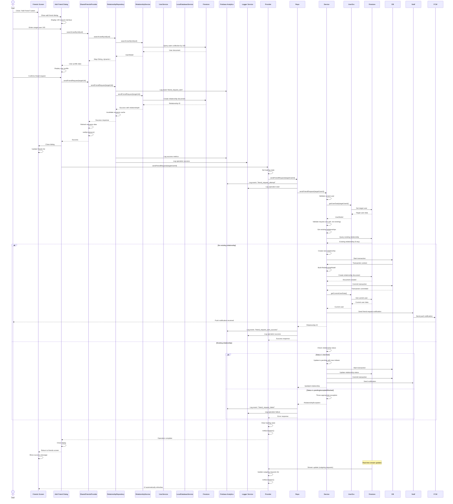
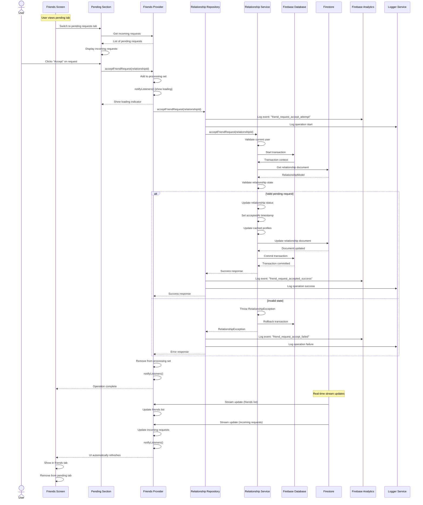
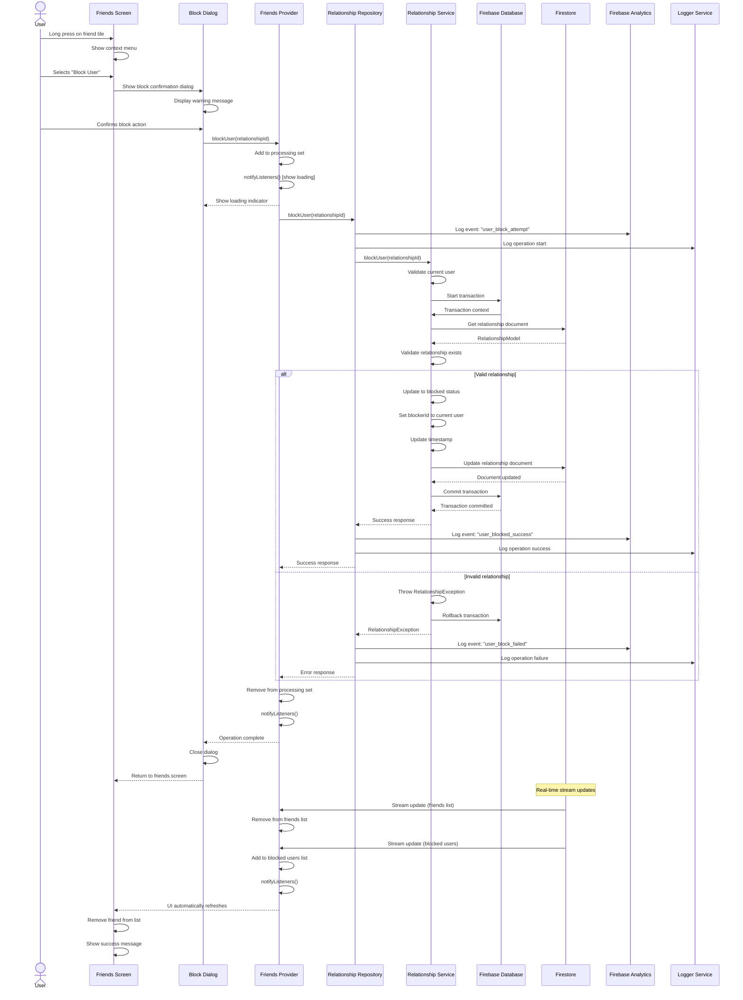
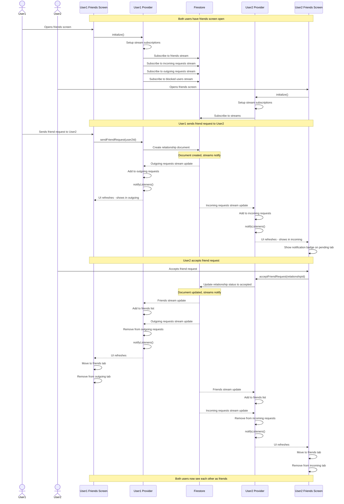
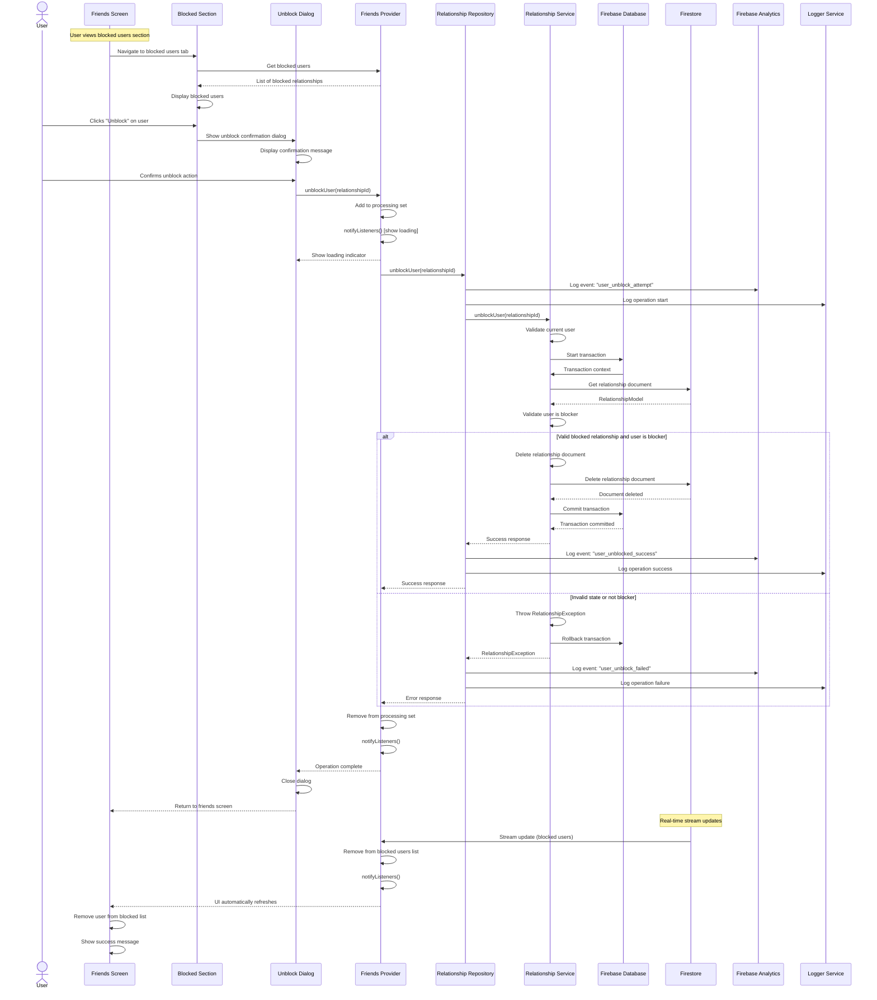
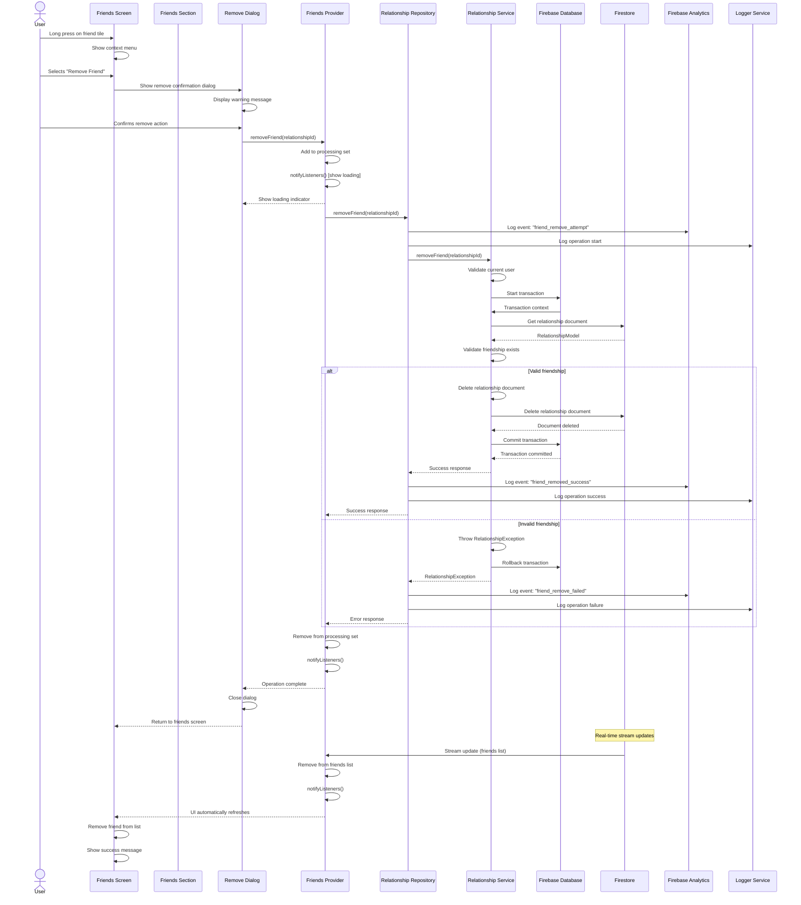
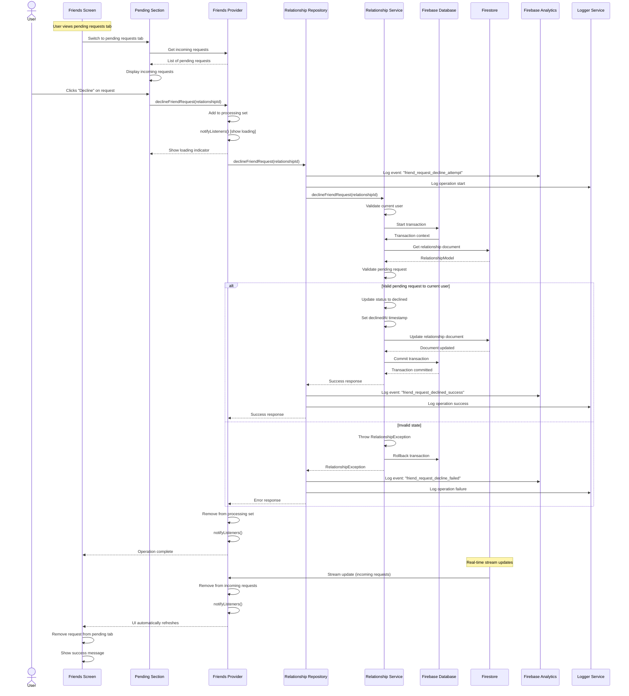
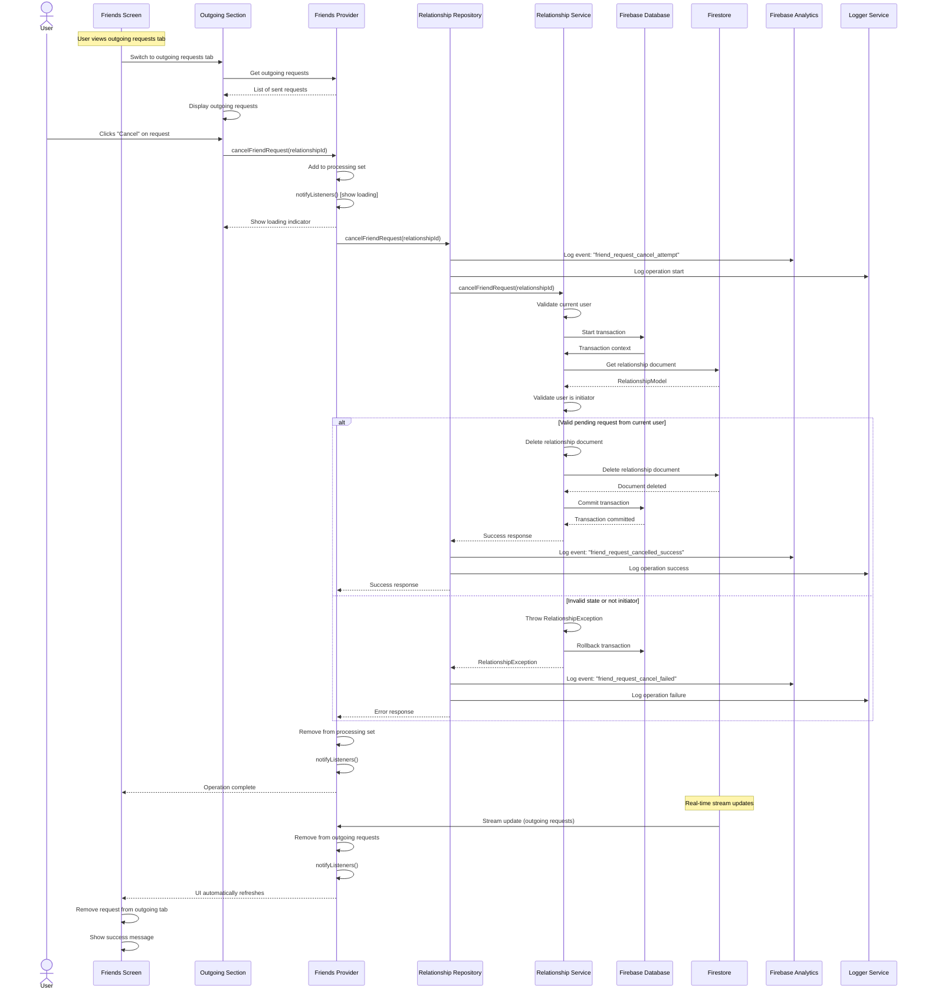
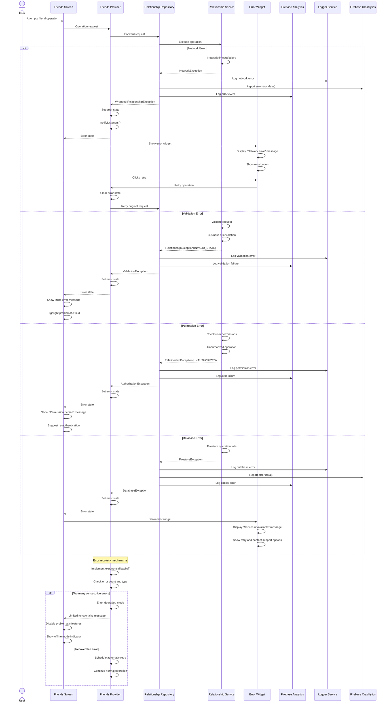
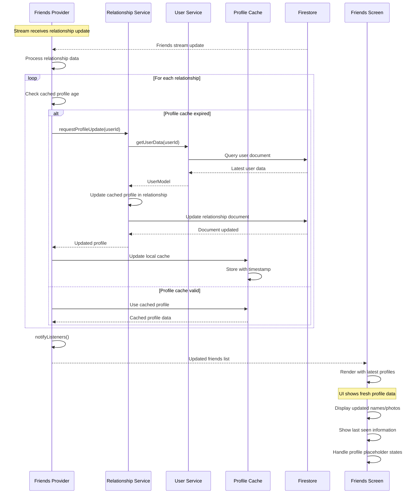

# Friends Feature User Flows - Enhanced v2.0

This document describes the comprehensive user flows for the unified friends system in the DuckBuck application. These flows illustrate the interactions between the SharedFriendsProvider, RelationshipRepository, and all integrated services including real-time updates, smart caching, error handling, and cross-platform functionality.

## Architecture Flow Integration

The user flows incorporate all the enhanced features from the DuckBuck friends architecture v2.0:

- **Unified SharedFriendsProvider**: Single source of truth for all friends data
- **Repository-Level Caching**: Smart caching with 5-minute validity and background refresh
- **Real-time Firebase Streams**: Live updates with automatic reconnection
- **Comprehensive State Management**: Friends, pending requests, and blocked users
- **Analytics Integration**: Full event tracking and performance monitoring
- **Memory Optimization**: Efficient disposal and resource management
- **Error Recovery**: Comprehensive error handling with retry mechanisms
- **Photo Caching**: Optimized profile image loading and storage

## User Flow Diagrams

### Send Friend Request Flow - Enhanced

### Accept Friend Request Flow

### Block User Flow

### Real-time Updates Flow

### Unblock User Flow

### Remove Friend Flow

### Decline Friend Request Flow

### Cancel Friend Request Flow

### Error Handling Flow

### Profile Caching Flow

## Flow Characteristics

### Real-time Synchronization
- **Instant Updates**: Changes appear immediately across all connected clients
- **Optimistic UI**: UI updates before server confirmation for better UX
- **Conflict Resolution**: Handles concurrent modifications gracefully
- **Stream Management**: Automatic reconnection and error recovery

### Transaction Safety
- **Atomic Operations**: All database changes are transactional
- **Rollback Support**: Failed operations don't leave partial state
- **Consistency Guarantees**: Data integrity maintained across all operations
- **Idempotent Operations**: Safe to retry without side effects

### Error Recovery
- **Graceful Degradation**: App remains functional during service issues
- **Retry Mechanisms**: Automatic and manual retry options
- **User Feedback**: Clear error messages with actionable guidance
- **Offline Support**: Cached data availability during network issues

### Performance Optimization
- **Stream Efficiency**: Only subscribes to necessary data streams
- **Profile Caching**: Reduces redundant user data fetches
- **Lazy Loading**: On-demand data loading for better performance
- **Memory Management**: Proper cleanup of subscriptions and resources

## Analytics Events

### Friend Request Events
- `friend_request_sent`: When a user sends a friend request
- `friend_request_accepted`: When a user accepts a friend request
- `friend_request_declined`: When a user declines a friend request
- `friend_request_cancelled`: When a user cancels their sent request

### User Action Events
- `user_blocked`: When a user blocks another user
- `user_unblocked`: When a user unblocks another user
- `friend_removed`: When a user removes a friend
- `friends_screen_viewed`: When user views the friends screen

### Error Events
- `friend_operation_failed`: When any friend operation fails
- `stream_connection_failed`: When real-time streams fail
- `profile_cache_miss`: When profile cache needs refresh
- `validation_error_occurred`: When business rule validation fails

## Performance Metrics

### Response Times
- **Friend Request Send**: < 500ms average
- **Request Accept/Decline**: < 300ms average
- **Stream Update Propagation**: < 100ms average
- **Profile Cache Hit Rate**: > 90%

### Resource Usage
- **Memory**: Efficient stream management with proper cleanup
- **Network**: Optimized queries with compound indices
- **Battery**: Background sync optimization for mobile devices
- **Storage**: Minimal local caching with automatic cleanup

### Reliability Metrics
- **Uptime**: > 99.9% service availability
- **Error Rate**: < 0.1% for core operations
- **Data Consistency**: 100% transactional integrity
- **Recovery Time**: < 30 seconds for stream reconnection

---

## Quick Reference

### Key Operations
- **Send Request**: User search → validation → creation → notification
- **Accept Request**: Validation → status update → stream propagation
- **Block User**: Confirmation → status change → relationship termination
- **Real-time Updates**: Stream subscription → data processing → UI refresh

### Error Categories
- **Network**: Connection issues, timeouts, service unavailable
- **Validation**: Business rules, duplicate requests, invalid states
- **Permission**: Authentication failures, unauthorized operations
- **Data**: Database errors, corruption, constraint violations

### Stream Types
- **Friends Stream**: Accepted relationships for current user
- **Incoming Stream**: Pending requests received by current user
- **Outgoing Stream**: Pending requests sent by current user
- **Blocked Stream**: Blocked relationships involving current user

### Cache Strategy
- **Profile Cache**: User display data cached in relationships
- **Summary Cache**: Relationship counts for quick access
- **Stream Cache**: Local state synchronized with Firestore
- **Error Cache**: Recent errors for retry logic
