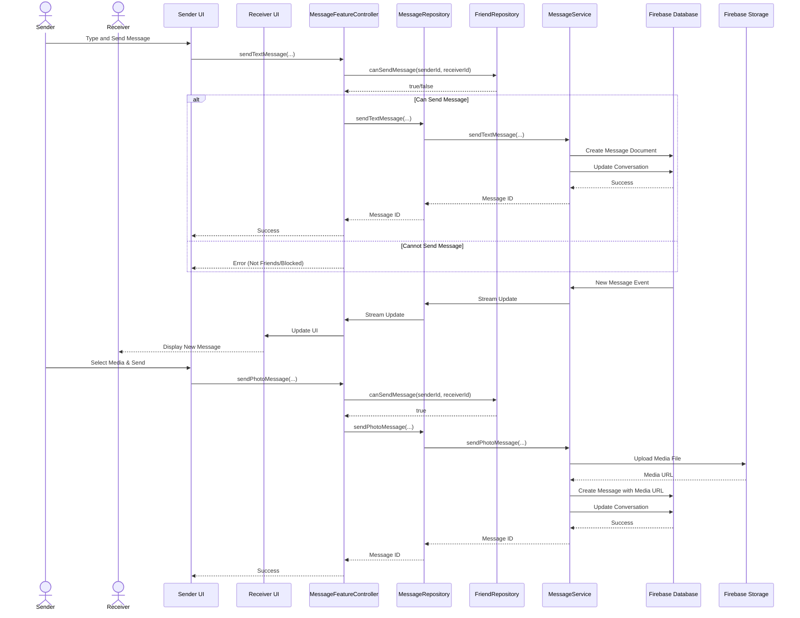
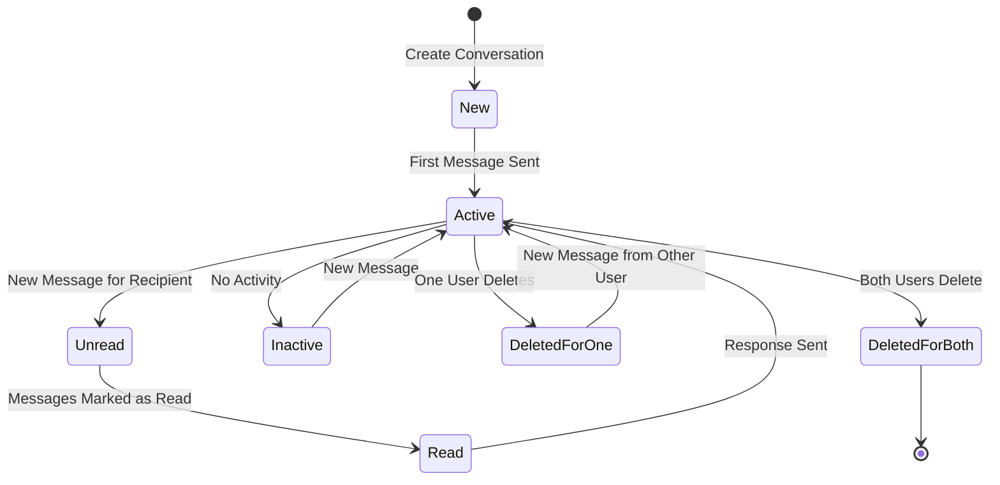
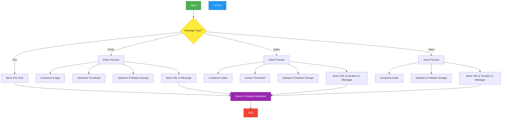

# DuckBuck Messaging System Diagram

## Messaging System Class Diagram

```mermaid
classDiagram
    class MessageModel {
        +String id
        +String conversationId
        +String senderId
        +String receiverId
        +String content
        +MessageType type
        +MessageStatus status
        +DateTime createdAt
        +DateTime? readAt
        +bool isDeleted
        +String? mediaPath
        +Map~String, dynamic~? metadata
        +toMap()
        +fromMap()
        +copyWith()
    }
    
    class ConversationModel {
        +String id
        +List~String~ participantIds
        +String? lastMessageId
        +String? lastMessagePreview
        +MessageType? lastMessageType
        +DateTime? lastMessageTimestamp
        +Map~String, int~ unreadCounts
        +DateTime createdAt
        +DateTime lastUpdatedAt
        +toMap()
        +fromMap()
        +copyWith()
    }
    
    class MessageService {
        -FirebaseDatabaseService _databaseService
        -FirebaseStorageService _storageService
        -MessageCacheService _cacheService
        +Future~String~ getOrCreateConversation(String userId1, String userId2)
        +Future~String~ sendTextMessage(...)
        +Future~String~ sendPhotoMessage(...)
        +Future~String~ sendVideoMessage(...)
        +Future~String~ sendVoiceMessage(...)
        +Future~List~MessageModel~~ getMessages(String conversationId)
        +Future~void~ markMessagesAsRead(String conversationId, String userId)
        +Future~List~ConversationModel~~ getConversations(String userId)
        +Future~bool~ deleteMessage(String messageId, String userId, bool deleteForEveryone)
        +Future~bool~ deleteConversation(String conversationId, String userId)
        +Stream~List~MessageModel~~ streamMessages(String conversationId)
        +Stream~ConversationModel?~ streamConversation(String conversationId)
        +Stream~List~ConversationModel~~ streamUserConversations(String userId)
        +void dispose()
    }
    
    class MessageCacheService {
        -Map~String, List~MessageModel~~ _messageCache
        -Map~String, ConversationModel~ _conversationCache
        -Map~String, List~ConversationModel~~ _userConversationsCache
        +List~MessageModel~? getCachedMessages(String conversationId)
        +void cacheMessages(String conversationId, List~MessageModel~ messages)
        +ConversationModel? getCachedConversation(String conversationId)
        +void cacheConversation(String conversationId, ConversationModel conversation)
        +List~ConversationModel~? getCachedUserConversations(String userId)
        +void cacheUserConversations(String userId, List~ConversationModel~ conversations)
        +void clearCache()
        +void updateCachedMessage(String conversationId, MessageModel message)
        +void updateCachedConversation(ConversationModel conversation)
    }
    
    class MessageRepository {
        -MessageService _messageService
        -FriendService _friendService
        +Future~String~ getOrCreateConversation(String userId1, String userId2)
        +Future~String~ sendTextMessage(...)
        +Future~String~ sendPhotoMessage(...)
        +Future~String~ sendVideoMessage(...)
        +Future~String~ sendVoiceMessage(...)
        +Future~List~MessageModel~~ getMessages(String conversationId)
        +Future~void~ markMessagesAsRead(String conversationId, String userId)
        +Future~List~ConversationModel~~ getConversations(String userId)
        +Future~bool~ deleteMessage(String messageId, String userId, bool deleteForEveryone)
        +Stream~List~MessageModel~~ streamMessages(String conversationId)
        +Stream~List~ConversationModel~~ streamUserConversations(String userId)
        +void dispose()
    }
    
    class MessageRepositoryFriendExtension {
        +Future~List~ConversationModel~~ filterConversationsToFriendsOnly(String userId, FriendRepository friendRepository, List~ConversationModel~ conversations)
    }

    class MessageFeatureController {
        -MessageRepository _messageRepository
        -FriendRepository _friendRepository
        -List~ConversationModel~ _conversations
        -ConversationModel? _activeConversation
        -List~MessageModel~ _messages
        -bool _isLoading
        -String? _errorMessage
        +List~ConversationModel~ get conversations
        +ConversationModel? get activeConversation
        +List~MessageModel~ get messages
        +bool get isLoading
        +String? get errorMessage
        +Future~void~ loadConversations(String userId)
        +Future~void~ loadMessages(String conversationId)
        +Future~String?~ startConversation(String currentUserId, String otherUserId)
        +Future~bool~ sendTextMessage(...)
        +Future~bool~ sendPhotoMessage(...)
        +Future~bool~ sendVideoMessage(...)
        +Future~bool~ sendVoiceMessage(...)
        +Future~void~ markAsRead(String conversationId, String userId)
        +Future~bool~ deleteMessage(...)
        +void startMessageStream(String conversationId)
        +void startConversationsStream(String userId)
        +void dispose()
    }
    
    enum MessageType {
        text
        photo
        video
        voice
    }
    
    enum MessageStatus {
        sent
        delivered
        read
        failed
    }
    
    MessageModel --> MessageType : uses
    MessageModel --> MessageStatus : uses
    ConversationModel --> MessageType : uses
    MessageService --> MessageCacheService : uses
    MessageRepository --> MessageService : uses
    MessageRepository --> FriendService : uses
    MessageRepository <|-- MessageRepositoryFriendExtension : extends
    MessageFeatureController --> MessageRepository : uses
    MessageFeatureController --> FriendRepository : uses
```

## Message Flow Diagram



## Conversation Lifecycle Diagram



## Media Handling Diagram


