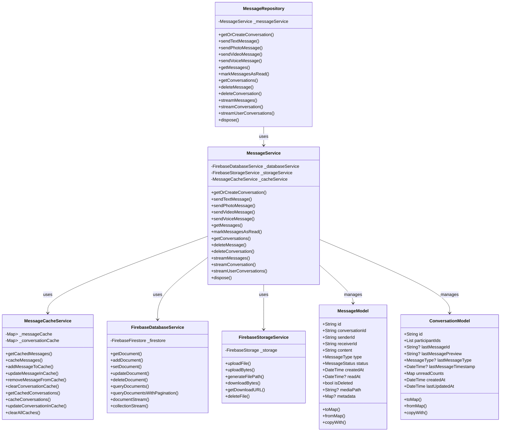

```mermaid
classDiagram
    class MessageModel {
        +String id
        +String conversationId
        +String senderId
        +String receiverId
        +String content
        +MessageType type
        +MessageStatus status
        +DateTime createdAt
        +DateTime? readAt
        +bool isDeleted
        +String? mediaPath
        +Map<String, dynamic>? metadata
        +toMap()
        +fromMap()
        +copyWith()
    }
    
    class ConversationModel {
        +String id
        +List<String> participantIds
        +String? lastMessageId
        +String? lastMessagePreview
        +MessageType? lastMessageType
        +DateTime? lastMessageTimestamp
        +Map<String, int> unreadCounts
        +DateTime createdAt
        +DateTime lastUpdatedAt
        +toMap()
        +fromMap()
        +copyWith()
    }
    
    class MessageService {
        -FirebaseDatabaseService _databaseService
        -FirebaseStorageService _storageService
        -MessageCacheService _cacheService
        +getOrCreateConversation()
        +sendTextMessage()
        +sendPhotoMessage()
        +sendVideoMessage()
        +sendVoiceMessage()
        +getMessages()
        +markMessagesAsRead()
        +getConversations()
        +deleteMessage()
        +deleteConversation()
        +streamMessages()
        +streamConversation()
        +streamUserConversations()
        +dispose()
    }
    
    class MessageCacheService {
        -Map<String, List<MessageModel>> _messageCache
        -Map<String, List<ConversationModel>> _conversationCache
        +getCachedMessages()
        +cacheMessages()
        +addMessageToCache()
        +updateMessageInCache()
        +removeMessageFromCache()
        +clearConversationCache()
        +getCachedConversations()
        +cacheConversations()
        +updateConversationInCache()
        +clearAllCaches()
    }
    
    class MessageRepository {
        -MessageService _messageService
        +getOrCreateConversation()
        +sendTextMessage()
        +sendPhotoMessage()
        +sendVideoMessage()
        +sendVoiceMessage()
        +getMessages()
        +markMessagesAsRead()
        +getConversations()
        +deleteMessage()
        +deleteConversation()
        +streamMessages()
        +streamConversation()
        +streamUserConversations()
        +dispose()
    }
    
    class FirebaseDatabaseService {
        -FirebaseFirestore _firestore
        +getDocument()
        +addDocument()
        +setDocument()
        +updateDocument()
        +deleteDocument()
        +queryDocuments()
        +queryDocumentsWithPagination()
        +documentStream()
        +collectionStream()
    }
    
    class FirebaseStorageService {
        -FirebaseStorage _storage
        +uploadFile()
        +uploadBytes()
        +generateFilePath()
        +downloadBytes()
        +getDownloadURL()
        +deleteFile()
    }

    MessageRepository --> MessageService: uses
    MessageService --> MessageCacheService: uses
    MessageService --> FirebaseDatabaseService: uses
    MessageService --> FirebaseStorageService: uses
    MessageService --> MessageModel: manages
    MessageService --> ConversationModel: manages
```
