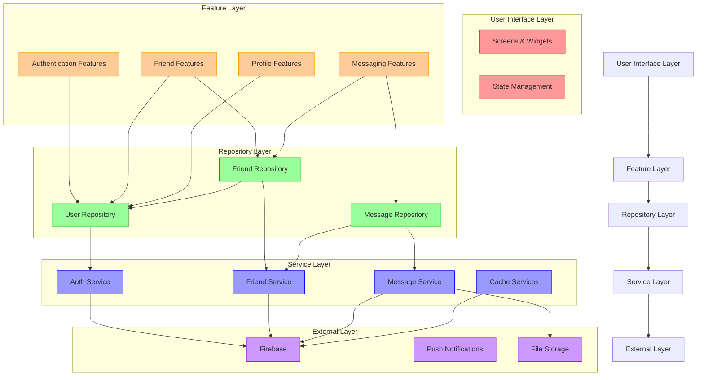
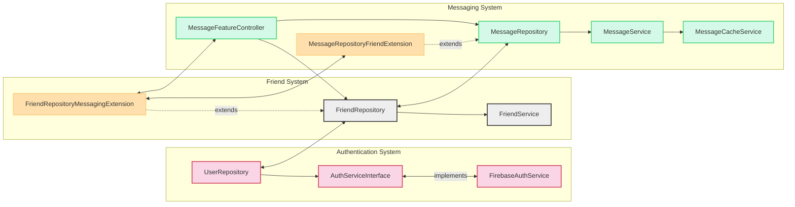
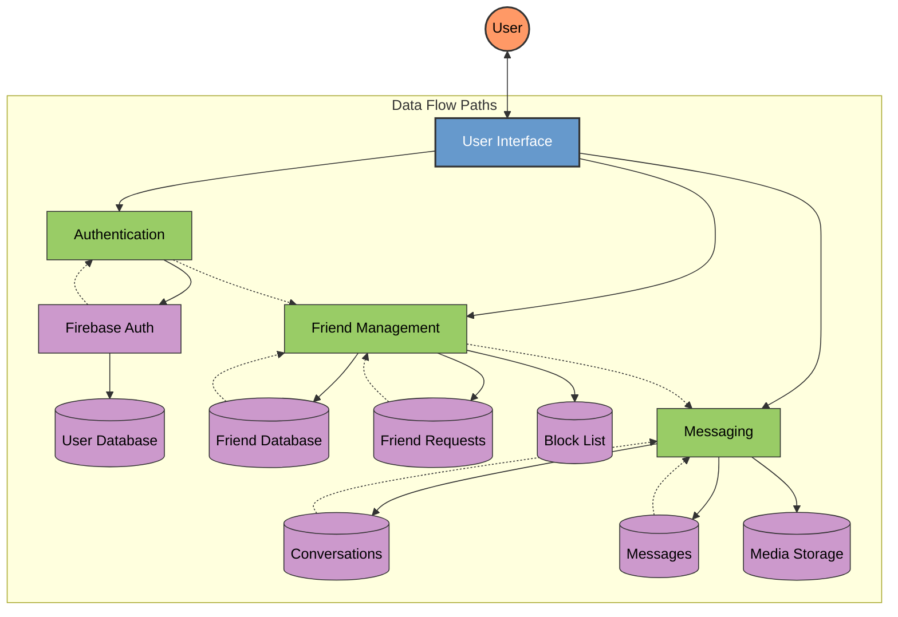
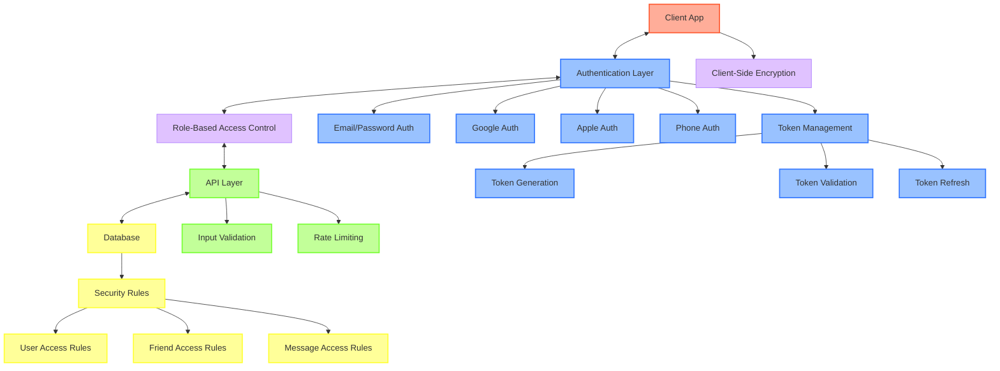
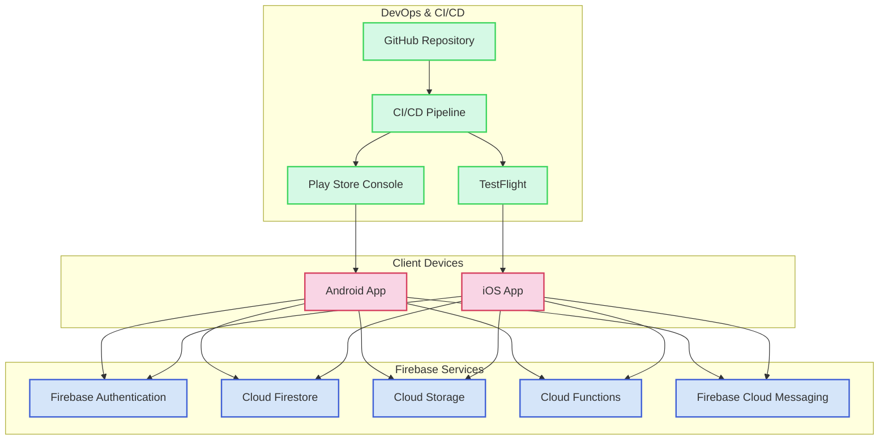

# DuckBuck System Architecture Diagrams

## Overall System Architecture

```mermaid
flowchart TD
    UI[User Interface Layer] --> FL[Feature Layer]
    FL --> RL[Repository Layer]
    RL --> SL[Service Layer]
    SL --> EL[External Layer]
    
    subgraph "User Interface Layer"
        Screens[Screens & Widgets]
        StateManagement[State Management]
    end
    
    subgraph "Feature Layer"
        AuthFeatures[Authentication Features]
        FriendFeatures[Friend Features]
        MessageFeatures[Messaging Features]
        ProfileFeatures[Profile Features]
    end
    
    subgraph "Repository Layer"
        UserRepo[User Repository]
        FriendRepo[Friend Repository]
        MessageRepo[Message Repository]
    end
    
    subgraph "Service Layer"
        AuthSvc[Auth Service]
        FriendSvc[Friend Service]
        MessageSvc[Message Service]
        CacheSvc[Cache Services]
    end
    
    subgraph "External Layer"
        Firebase[Firebase]
        PushNotif[Push Notifications]
        Storage[File Storage]
    end
    
    %% Feature to Repository connections
    AuthFeatures --> UserRepo
    FriendFeatures --> FriendRepo
    FriendFeatures --> UserRepo
    MessageFeatures --> MessageRepo
    MessageFeatures --> FriendRepo
    ProfileFeatures --> UserRepo
    
    %% Repository to Service connections
    UserRepo --> AuthSvc
    FriendRepo --> FriendSvc
    FriendRepo --> UserRepo
    MessageRepo --> MessageSvc
    MessageRepo --> FriendSvc
    
    %% Service to External connections
    AuthSvc --> Firebase
    FriendSvc --> Firebase
    MessageSvc --> Firebase
    MessageSvc --> Storage
    CacheSvc --> Firebase
    
    classDef uiLayer fill:#ff9999,stroke:#ff0000
    classDef featureLayer fill:#ffcc99,stroke:#ff9900
    classDef repoLayer fill:#99ff99,stroke:#009900
    classDef serviceLayer fill:#9999ff,stroke:#0000ff
    classDef externalLayer fill:#cc99ff,stroke:#9900cc
    
    class Screens,StateManagement uiLayer
    class AuthFeatures,FriendFeatures,MessageFeatures,ProfileFeatures featureLayer
    class UserRepo,FriendRepo,MessageRepo repoLayer
    class AuthSvc,FriendSvc,MessageSvc,CacheSvc serviceLayer
    class Firebase,PushNotif,Storage externalLayer
```

## Component Integration Diagram

```mermaid
flowchart LR
    subgraph Auth[Authentication System]
        AuthSI[AuthServiceInterface]
        FirebaseAS[FirebaseAuthService]
        UR[UserRepository]
        
        AuthSI <-- implements --> FirebaseAS
        UR --> AuthSI
    end
    
    subgraph Friend[Friend System]
        FS[FriendService]
        FR[FriendRepository]
        FRME[FriendRepositoryMessagingExtension]
        
        FR --> FS
        FRME -. extends .-> FR
    end
    
    subgraph Messaging[Messaging System]
        MS[MessageService]
        MCS[MessageCacheService]
        MR[MessageRepository]
        MRFE[MessageRepositoryFriendExtension]
        MFC[MessageFeatureController]
        
        MR --> MS
        MS --> MCS
        MRFE -. extends .-> MR
        MFC --> MR
        MFC --> FR
    end
    
    %% Cross-system dependencies
    UR <--> FR
    FR <--> MR
    
    %% Extensions provide integration points
    FRME <--> MRFE
    FRME <--> MFC
    
    classDef auth fill:#f9d5e5,stroke:#d64161,stroke-width:2px
    classDef friend fill:#eeeeee,stroke:#333333,stroke-width:2px
    classDef messaging fill:#d5f9e8,stroke:#41d67d,stroke-width:2px
    classDef extension fill:#ffe0ac,stroke:#ffb347,stroke-width:1px
    
    class AuthSI,FirebaseAS,UR auth
    class FS,FR friend
    class MS,MCS,MR,MFC messaging
    class FRME,MRFE extension
```

## Data Flow Diagram

```mermaid
flowchart TD
    User((User)) <--> UI[User Interface]
    
    subgraph "Data Flow Paths"
        %% Authentication Path
        UI --> Auth[Authentication]
        Auth --> Firebase[Firebase Auth]
        Firebase --> UserDB[(User Database)]
        
        %% Friend Path
        UI --> Friends[Friend Management]
        Friends --> FriendDB[(Friend Database)]
        Friends --> RequestDB[(Friend Requests)]
        Friends --> BlockDB[(Block List)]
        
        %% Messaging Path
        UI --> Msg[Messaging]
        Msg --> ConvDB[(Conversations)]
        Msg --> MsgDB[(Messages)]
        Msg --> MediaStore[(Media Storage)]
    end
    
    %% Cross-functional flows
    Auth -.-> Friends
    Friends -.-> Msg
    
    %% Real-time updates
    Firebase -.-> Auth
    FriendDB -.-> Friends
    RequestDB -.-> Friends
    ConvDB -.-> Msg
    MsgDB -.-> Msg
    
    classDef userNode fill:#f96,stroke:#333,stroke-width:2px,color:#000
    classDef uiNode fill:#69c,stroke:#333,stroke-width:2px,color:#fff
    classDef processNode fill:#9c6,stroke:#333,stroke-width:1px,color:#000
    classDef dbNode fill:#c9c,stroke:#333,stroke-width:1px,color:#000
    
    class User userNode
    class UI uiNode
    class Auth,Friends,Msg processNode
    class Firebase,UserDB,FriendDB,RequestDB,BlockDB,ConvDB,MsgDB,MediaStore dbNode
```

## Security Architecture

```mermaid
flowchart TD
    Client[Client App] <--> Auth[Authentication Layer]
    Auth <--> RBAC[Role-Based Access Control]
    RBAC <--> API[API Layer]
    API <--> DB[Database]
    
    %% Authentication Methods
    Auth --> EmailPass[Email/Password Auth]
    Auth --> Google[Google Auth]
    Auth --> Apple[Apple Auth]
    Auth --> Phone[Phone Auth]
    
    %% Security Features
    Client --> Encryption[Client-Side Encryption]
    API --> Validation[Input Validation]
    API --> RateLimiting[Rate Limiting]
    
    %% Database Security
    DB --> DBRules[Security Rules]
    DBRules --> UserAccess[User Access Rules]
    DBRules --> FriendAccess[Friend Access Rules]
    DBRules --> MessageAccess[Message Access Rules]
    
    %% Token Management
    Auth --> TokenMgmt[Token Management]
    TokenMgmt --> TokenGeneration[Token Generation]
    TokenMgmt --> TokenValidation[Token Validation]
    TokenMgmt --> TokenRefresh[Token Refresh]
    
    classDef clientNode fill:#ffad99,stroke:#ff5c33,stroke-width:2px
    classDef authNode fill:#99c2ff,stroke:#3377ff,stroke-width:2px
    classDef apiNode fill:#c2ff99,stroke:#77ff33,stroke-width:2px
    classDef dbNode fill:#ffff99,stroke:#ffff33,stroke-width:2px
    classDef securityNode fill:#e0c2ff,stroke:#aa77ff,stroke-width:1px
    
    class Client clientNode
    class Auth,EmailPass,Google,Apple,Phone,TokenMgmt,TokenGeneration,TokenValidation,TokenRefresh authNode
    class API,Validation,RateLimiting apiNode
    class DB,DBRules,UserAccess,FriendAccess,MessageAccess dbNode
    class RBAC,Encryption securityNode
```

## Deployment Architecture

```mermaid
flowchart TB
    subgraph Client[Client Devices]
        AndroidApp[Android App]
        iOSApp[iOS App]
    end
    
    subgraph Firebase[Firebase Services]
        Auth[Firebase Authentication]
        Firestore[Cloud Firestore]
        Storage[Cloud Storage]
        Functions[Cloud Functions]
        Messaging[Firebase Cloud Messaging]
    end
    
    subgraph DevOps[DevOps & CI/CD]
        GitHub[GitHub Repository]
        CI[CI/CD Pipeline]
        TestFlight[TestFlight]
        PlayStore[Play Store Console]
    end
    
    %% Client to Firebase connections
    AndroidApp --> Auth
    AndroidApp --> Firestore
    AndroidApp --> Storage
    AndroidApp --> Functions
    AndroidApp --> Messaging
    
    iOSApp --> Auth
    iOSApp --> Firestore
    iOSApp --> Storage
    iOSApp --> Functions
    iOSApp --> Messaging
    
    %% DevOps workflow
    GitHub --> CI
    CI --> TestFlight
    CI --> PlayStore
    
    %% Release paths
    TestFlight --> iOSApp
    PlayStore --> AndroidApp
    
    classDef client fill:#f9d5e5,stroke:#d64161,stroke-width:2px
    classDef firebase fill:#d5e5f9,stroke:#4161d6,stroke-width:2px
    classDef devops fill:#d5f9e5,stroke:#41d661,stroke-width:2px
    
    class AndroidApp,iOSApp client
    class Auth,Firestore,Storage,Functions,Messaging firebase
    class GitHub,CI,TestFlight,PlayStore devops
```
