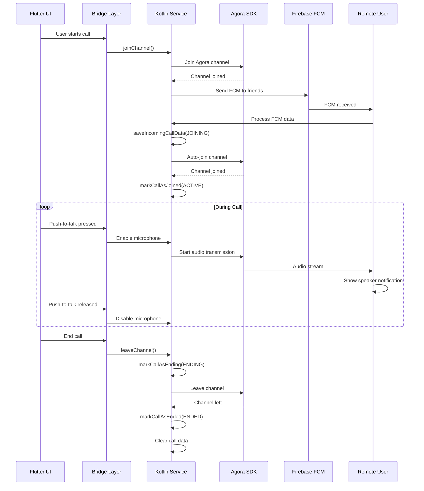

# DuckBuck Walkie-Talkie Architecture - Enhanced v2.0

## Overview

The DuckBuck walkie-talkie system implements a **production-ready, real-time voice communication platform** that supports:
- **Instant Voice Communication** with auto-connect FCM-triggered calls
- **Background Service Architecture** ensuring persistent connection
- **Agora RTC Integration** with optimized audio quality and low latency
- **Advanced Call State Management** with simplified state machine
- **Smart Notification System** showing speaker activity (not self)
- **Cross-Platform Bridge** between Flutter UI and Kotlin service layer

The architecture follows a **layered service-oriented design** with clear separation between Flutter UI layer, Kotlin service layer, and native Android integrations. This approach ensures reliable walkie-talkie functionality even when the app is backgrounded, killed, or the device is locked.

## Enhanced Architecture Diagram

> **Viewing Tip:** The diagram shows the complete walkie-talkie ecosystem from FCM reception to audio output, including the Kotlin service layer and Agora RTC integration.

```mermaid
%%{init: {'theme': 'neutral', 'flowchart': {'htmlLabels': true, 'curve': 'basis', 'padding': 30, 'useMaxWidth': false, 'diagramPadding': 30, 'rankSpacing': 100, 'nodeSpacing': 100}}}%%
flowchart TD
    %% Configuration for enhanced display
    linkStyle default stroke-width:2px,fill:none
    
    %% Flutter UI Layer
    subgraph Flutter_Layer ["🎨 Flutter UI Layer - User Interface"]
        direction TB
        subgraph UI_Screens ["Walkie-Talkie Screens"]
            HS["Home Screen<br/>🏠<br/>Friend Selection<br/>Call Initiation"]
            CS["Call Screen<br/>📞<br/>Active Call UI<br/>Mute/Speaker Controls"]
            IS["Incoming Call Screen<br/>📱<br/>Auto-Accept Display<br/>Call Information"]
        end
        subgraph UI_Components ["Interactive Components"]
            PTB["Push-to-Talk Button<br/>🎤<br/>Audio Transmission<br/>Visual Feedback"]
            SF["Speaker Feedback<br/>🔊<br/>Audio Visualization<br/>Speaking Indicators"]
            CC["Call Controls<br/>⚙️<br/>Mute/Unmute<br/>Speaker/Earpiece"]
        end
    end
    
    %% Flutter Bridge Layer
    subgraph Bridge_Layer ["🌉 Flutter-Kotlin Bridge Layer"]
        direction TB
        FBM["FlutterBridgeManager<br/>🔗<br/>Method Channel Coordinator<br/>Cross-Platform Communication"]
        AMCH["AgoraMethodChannelHandler<br/>📡<br/>Agora Operations Bridge<br/>Call State Synchronization"]
        CUT["CallUITrigger<br/>🎯<br/>UI Event Triggering<br/>Screen Navigation"]
        
        subgraph Bridge_Features ["Bridge Features"]
            MC["Method Channels<br/>📨<br/>Flutter ↔ Kotlin<br/>Bidirectional Communication"]
            ES["Event Streaming<br/>📊<br/>Real-time Updates<br/>State Synchronization"]
            EM["Error Management<br/>⚠️<br/>Cross-Platform Errors<br/>Exception Translation"]
        end
    end
    
    %% Kotlin Service Layer - Core Logic
    subgraph Kotlin_Service_Layer ["⚙️ Kotlin Service Layer - Core Business Logic"]
        direction TB
        WTS["WalkieTalkieService<br/>🎙️<br/>Foreground Service<br/>Persistent Connection<br/>Wake Lock Management"]
        FSO["FcmServiceOrchestrator<br/>📨<br/>FCM Message Processing<br/>Call State Coordination"]
        
        subgraph Service_Components ["Service Components"]
            ACM["AgoraCallManager<br/>🎵<br/>Call Lifecycle<br/>Audio Management<br/>State Transitions"]
            ASM["AgoraServiceManager<br/>🔧<br/>Service Coordination<br/>Resource Management"]
            AS["AgoraService<br/>📡<br/>RTC Operations<br/>Channel Management"]
        end
        
        subgraph State_Management ["State Management"]
            CSPM["CallStatePersistenceManager<br/>💾<br/>JOINING → ACTIVE → ENDING → ENDED<br/>SharedPreferences Storage"]
            COM["ChannelOccupancyManager<br/>👥<br/>Speaker Detection<br/>User Presence Tracking"]
            ASMgr["AppStateManager<br/>📱<br/>Foreground/Background<br/>UI State Detection"]
        end
    end
    
    %% Data Processing Layer
    subgraph Data_Processing_Layer ["📊 Data Processing Layer"]
        direction TB
        FDH["FcmDataHandler<br/>📥<br/>FCM Data Extraction<br/>Call Data Validation<br/>Payload Processing"]
        FASD["FcmAppStateDetector<br/>🔍<br/>App State Detection<br/>Background/Foreground<br/>UI Decision Logic"]
        
        subgraph Processing_Features ["Processing Features"]
            DataValidation["Data Validation<br/>✅<br/>FCM Payload Verification<br/>Required Fields Check<br/>Security Validation"]
            StateDetection["State Detection<br/>📊<br/>App Lifecycle Tracking<br/>UI Visibility Assessment<br/>Background Processing"]
        end
    end
    
    %% Infrastructure Layer
    subgraph Infrastructure_Layer ["🏗️ Infrastructure Layer - System Integration"]
        direction TB
        subgraph Audio_Management ["Audio Management"]
            VAM["VolumeAcquireManager<br/>🔊<br/>Audio Focus Control<br/>Volume Management<br/>Speaker/Earpiece"]
            AEI["AgoraEngineInitializer<br/>🎛️<br/>RTC Engine Setup<br/>Audio Configuration<br/>Performance Tuning"]
        end
        
        subgraph System_Services ["System Services"]
            UNM["UniversalNotificationManager<br/>🔔<br/>Notification Display<br/>Channel Management<br/>User Interaction"]
            CNM["CallNotificationManager<br/>📞<br/>Call-specific Notifications<br/>Speaker Alerts<br/>Status Updates"]
            ESM["EngineStartupManager<br/>🚀<br/>Service Initialization<br/>Dependency Injection<br/>Lifecycle Management"]
        end
        
        subgraph Monitoring ["Monitoring & Logging"]
            AL["AppLogger<br/>📝<br/>Structured Logging<br/>Debug Information<br/>Performance Metrics<br/>Error Tracking"]
        end
    end
    
    %% External Services Layer
    subgraph External_Services_Layer ["🌐 External Services Layer"]
        direction TB
        subgraph Agora_RTC ["Agora RTC Platform"]
            AgoraSDK["Agora RTC SDK<br/>🎙️<br/>Real-time Audio<br/>Low Latency<br/>High Quality"]
            AgoraChannel["Agora Channel<br/>📡<br/>Voice Room<br/>Multi-user Support<br/>Audio Mixing"]
        end
        
        subgraph Firebase_Services ["Firebase Services"]
            FCM["Firebase Cloud Messaging<br/>📨<br/>Push Notifications<br/>Call Triggers<br/>Background Delivery"]
            FST["Firestore Database<br/>🗄️<br/>User Data<br/>Call Metadata<br/>Friend Relationships"]
        end
        
        subgraph Android_System ["Android System"]
            PWM["PowerManager<br/>🔋<br/>Wake Lock<br/>CPU Stay Awake<br/>Background Processing"]
            AM["AudioManager<br/>🎵<br/>Audio Routing<br/>Volume Control<br/>Hardware Integration"]
            NM["NotificationManager<br/>🔔<br/>System Notifications<br/>Channel Management<br/>User Alerts"]
        end
    end
    
    %% Data Flow Connections
    %% Flutter to Bridge
    HS --> FBM
    CS --> AMCH
    IS --> CUT
    PTB --> AMCH
    SF --> FBM
    CC --> FBM
    
    %% Bridge to Service
    FBM --> WTS
    AMCH --> ACM
    CUT --> FSO
    MC --> FBM
    ES --> AMCH
    EM --> FBM
    
    %% Service Internal Flow
    WTS --> ACM
    WTS --> ASM
    FSO --> FDH
    FSO --> FASD
    ACM --> AS
    ASM --> AS
    
    %% State Management Flow
    ACM --> CSPM
    AS --> COM
    WTS --> ASMgr
    CSPM --> WTS
    COM --> ACM
    ASMgr --> FSO
    
    %% Data Processing Flow
    FDH --> FSO
    FASD --> FSO
    DataValidation --> FDH
    StateDetection --> FASD
    
    %% Infrastructure Integration
    WTS --> VAM
    AS --> AEI
    WTS --> UNM
    ACM --> CNM
    FSO --> ESM
    WTS --> AL
    
    %% External Services Integration
    AS --> AgoraSDK
    AgoraSDK --> AgoraChannel
    FSO --> FCM
    ACM --> FST
    WTS --> PWM
    VAM --> AM
    UNM --> NM
    
    %% Styling for better visualization
    classDef flutterLayer fill:#e3f2fd,stroke:#0d47a1,stroke-width:2px
    classDef bridgeLayer fill:#f3e5f5,stroke:#4a148c,stroke-width:2px
    classDef kotlinLayer fill:#e8f5e8,stroke:#1b5e20,stroke-width:2px
    classDef dataLayer fill:#fff3e0,stroke:#e65100,stroke-width:2px
    classDef infraLayer fill:#fce4ec,stroke:#880e4f,stroke-width:2px
    classDef externalLayer fill:#f1f8e9,stroke:#33691e,stroke-width:2px
    
    class Flutter_Layer,HS,CS,IS,PTB,SF,CC flutterLayer
    class Bridge_Layer,FBM,AMCH,CUT,MC,ES,EM bridgeLayer
    class Kotlin_Service_Layer,WTS,FSO,ACM,ASM,AS,CSPM,COM,ASMgr kotlinLayer
    class Data_Processing_Layer,FDH,FASD,DataValidation,StateDetection dataLayer
    class Infrastructure_Layer,VAM,AEI,UNM,CNM,ESM,AL infraLayer
    class External_Services_Layer,AgoraSDK,AgoraChannel,FCM,FST,PWM,AM,NM externalLayer
```



## Key Architectural Features

### 1. Foreground Service Architecture

The WalkieTalkieService ensures persistent functionality:

#### Service Characteristics
```kotlin
class WalkieTalkieService : Service() {
    private var wakeLock: PowerManager.WakeLock? = null
    private var isServiceRunning = false
    
    override fun onStartCommand(intent: Intent?, flags: Int, startId: Int): Int {
        when (intent?.getStringExtra(EXTRA_ACTION)) {
            ACTION_JOIN_CHANNEL -> handleJoinChannel(intent)
            ACTION_LEAVE_CHANNEL -> handleLeaveChannel()
            ACTION_STOP_SERVICE -> stopSelf()
        }
        return START_STICKY  // Restart if killed
    }
}
```

#### Key Features
- **Foreground Service**: Prevents Android from killing the app
- **Wake Lock Management**: Keeps CPU awake during calls
- **START_STICKY**: Automatic restart if service is killed
- **Persistent Notification**: Shows ongoing call status
- **Speaker Detection**: Notifications only for other speakers (not self)

### 2. Simplified Call State Management

Optimized CallState enum with only necessary states:

#### CallState Enum
```kotlin
enum class CallState {
    JOINING,    // In process of joining call
    ACTIVE,     // Successfully joined and in call  
    ENDING,     // Call is ending
    ENDED       // Call has ended
}
```

#### State Flow Optimization
- **Removed INCOMING**: Walkie-talkie calls auto-connect immediately
- **Direct to JOINING**: FCM reception → saveIncomingCallData() sets JOINING
- **Simplified Logic**: Cleaner state machine reflecting actual usage
- **Persistent Storage**: SharedPreferences for cross-lifecycle persistence

### 3. Advanced FCM Processing

Sophisticated FCM message handling with app state awareness:

#### FCM Data Handler
```kotlin
object FcmDataHandler {
    data class CallData(
        val token: String,
        val uid: Int,
        val channelId: String,
        val callName: String,
        val callerPhoto: String?,
        val timestamp: Long
    )
    
    fun extractCallData(remoteMessage: RemoteMessage): CallData? {
        // Validate and extract call data
        return if (isValidCallMessage(remoteMessage)) {
            CallData(/* ... */)
        } else null
    }
}
```

#### App State Detection
```kotlin
object FcmAppStateDetector {
    fun isAppInForeground(context: Context): Boolean {
        val activityManager = context.getSystemService(Context.ACTIVITY_SERVICE) as ActivityManager
        val runningAppProcesses = activityManager.runningAppProcesses
        return runningAppProcesses?.any { 
            it.processName == context.packageName && 
            it.importance == ActivityManager.RunningAppProcessInfo.IMPORTANCE_FOREGROUND 
        } ??? false
    }
}
```

### 4. Agora RTC Integration

Optimized real-time audio communication:

#### Engine Configuration
```kotlin
class AgoraEngineInitializer {
    fun initializeEngine(context: Context): RtcEngine {
        val config = RtcEngineConfig().apply {
            mContext = context
            mAppId = BuildConfig.AGORA_APP_ID
            mEventHandler = agoraEventHandler
            mAudioScenario = Constants.AUDIO_SCENARIO_CHATROOM_ENTERTAINMENT
            mChannelProfile = Constants.CHANNEL_PROFILE_COMMUNICATION
            mAreaCode = RtcEngineConfig.AreaCode.AREA_CODE_GLOB
        }
        return RtcEngine.create(config)
    }
}
```

#### Audio Optimization
- **Low Latency**: Optimized for real-time communication
- **Audio Focus**: Proper audio routing and volume control
- **Quality Settings**: Balanced quality vs. bandwidth
- **Echo Cancellation**: Built-in noise reduction

### 5. Cross-Platform Bridge System

Seamless Flutter-Kotlin communication:

#### Method Channel Handler
```kotlin
class AgoraMethodChannelHandler(
    private val agoraCallManager: AgoraCallManager,
    private val callUITrigger: CallUITrigger
) : MethodChannel.MethodCallHandler {
    
    override fun onMethodCall(call: MethodCall, result: MethodChannel.Result) {
        when (call.method) {
            "joinChannel" -> handleJoinChannel(call, result)
            "leaveChannel" -> handleLeaveChannel(result)
            "muteLocalAudio" -> handleMuteAudio(call, result)
        }
    }
}
```

#### Flutter Bridge Manager
```kotlin
class FlutterBridgeManager {
    fun setupMethodChannels(flutterEngine: FlutterEngine) {
        val agoraChannel = MethodChannel(
            flutterEngine.dartExecutor.binaryMessenger,
            "agora_method_channel"
        )
        agoraChannel.setMethodCallHandler(agoraMethodChannelHandler)
    }
}
```

### 6. Smart Notification System

Intelligent notification management that shows only relevant information:

#### Call Notification Manager
```kotlin
class CallNotificationManager(private val context: Context) {
    fun showSpeakerNotification(speakerUsername: String, callerPhoto: String?) {
        // Only show notifications for OTHER users speaking, not self
        if (speakerUsername != getCurrentUserName()) {
            val notification = buildSpeakerNotification(speakerUsername, callerPhoto)
            notificationManager.notify(SPEAKER_NOTIFICATION_ID, notification)
        }
    }
}
```

#### Notification Features
- **Speaker Detection**: Shows who is currently speaking
- **Self-filtering**: Never shows notifications for own voice
- **Rich Content**: Displays speaker name and profile photo
- **Background Aware**: Works even when app is backgrounded
- **Channel Management**: Proper notification channel configuration

### 7. Audio Management & Hardware Integration

Professional audio handling with system integration:

#### Volume Acquire Manager
```kotlin
class VolumeAcquireManager(private val context: Context) {
    fun acquireAudioFocus(): Boolean {
        val audioManager = context.getSystemService(Context.AUDIO_SERVICE) as AudioManager
        return when {
            Build.VERSION.SDK_INT >= Build.VERSION_CODES.O -> {
                audioFocusRequest?.let { audioManager.requestAudioFocus(it) } == AudioManager.AUDIOFOCUS_REQUEST_GRANTED
            }
            else -> {
                audioManager.requestAudioFocus(this, AudioManager.STREAM_VOICE_CALL, AudioManager.AUDIOFOCUS_GAIN) == AudioManager.AUDIOFOCUS_REQUEST_GRANTED
            }
        }
    }
}
```

#### Audio Features
- **Audio Focus**: Proper integration with Android audio system
- **Volume Control**: Automatic volume management
- **Speaker/Earpiece**: Dynamic audio routing
- **Hardware Integration**: Works with Bluetooth, wired headsets

### 8. Performance & Memory Optimization

Efficient resource management for sustained performance:

#### Memory Management
- **Proper Disposal**: All resources cleaned up on service stop
- **Wake Lock Management**: Acquired only when needed
- **Notification Cleanup**: Automatic cleanup on call end
- **Engine Optimization**: Agora engine properly initialized/destroyed

#### Performance Features
- **Background Processing**: Core functionality continues when app backgrounded
- **Efficient State Persistence**: Minimal SharedPreferences usage
- **Smart Resource Allocation**: Resources allocated only when in call
- **Battery Optimization**: Minimal battery drain when idle

## Call Flow Sequence

The complete walkie-talkie call flow from initiation to completion:



This enhanced architecture provides a robust, scalable, and performance-optimized walkie-talkie system that works reliably across all Android scenarios including backgrounded apps, killed processes, and locked devices.
