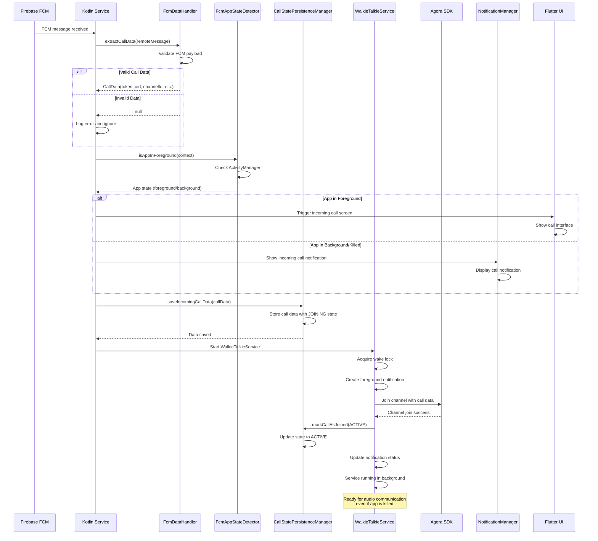
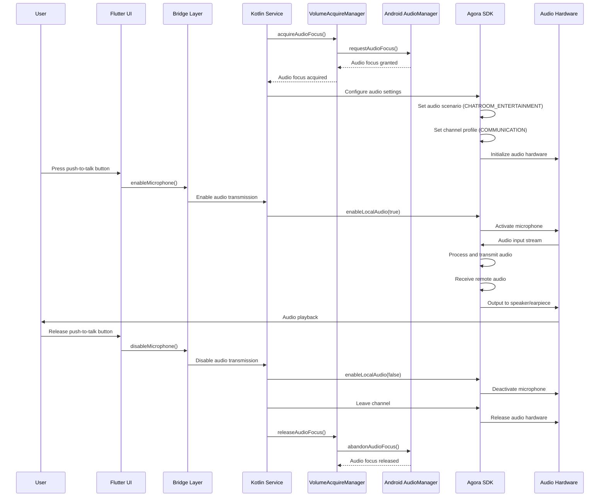
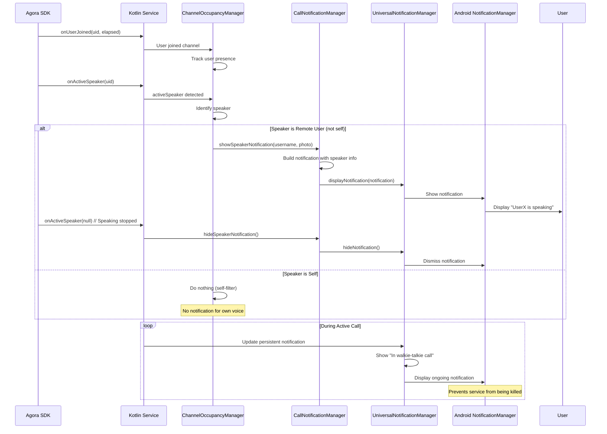

# Walkie-Talkie User Flows - Enhanced v2.0

This document describes the comprehensive user flows for the walkie-talkie system in the DuckBuck application. These flows illustrate the complete journey from call initiation through FCM processing to audio communication, including the Kotlin service layer, Agora RTC integration, background processing, and notification system.

## Architecture Flow Integration

The user flows incorporate all the enhanced features from the DuckBuck walkie-talkie architecture v2.0:

- **Foreground Service Architecture**: Persistent background processing with WalkieTalkieService
- **Simplified Call State Management**: Optimized state machine (JOINING → ACTIVE → ENDING → ENDED)
- **Advanced FCM Processing**: Smart message handling with app state detection
- **Agora RTC Integration**: Professional real-time audio communication
- **Cross-Platform Bridge**: Seamless Flutter-Kotlin communication
- **Smart Notification System**: Speaker detection with self-filtering
- **Audio Management**: Professional audio routing and hardware integration
- **Performance Optimization**: Memory management and battery efficiency

## User Flow Diagrams

### Complete Walkie-Talkie Call Flow

### FCM Processing Flow - Background App Handling

### Audio Management Flow

### Notification System Flow

## Key User Experience Features

### 1. Seamless Background Operation
- **Auto-Connect**: Incoming calls connect automatically via FCM
- **Background Persistence**: WalkieTalkieService keeps calls active when app is backgrounded
- **Wake Lock Management**: Ensures device stays responsive during calls
- **Battery Optimization**: Minimal power consumption when not actively speaking

### 2. Smart Notification System
- **Speaker Detection**: Shows who is currently speaking
- **Self-Filtering**: Never shows notifications for user's own voice
- **Rich Notifications**: Displays speaker name and profile photo
- **Persistent Status**: Ongoing notification shows call status

### 3. Professional Audio Quality
- **Low Latency**: Optimized for real-time communication
- **Audio Focus**: Proper integration with Android audio system
- **Hardware Integration**: Works with Bluetooth, wired headsets
- **Echo Cancellation**: Built-in noise reduction and audio processing

### 4. Robust State Management
- **Simplified States**: JOINING → ACTIVE → ENDING → ENDED
- **Persistent Storage**: Call state survives app kills and device restarts
- **Error Recovery**: Automatic reconnection and error handling
- **Cross-Platform Sync**: Flutter UI stays synchronized with Kotlin service

### 5. Performance Optimization
- **Memory Efficient**: Proper resource cleanup and disposal
- **CPU Optimization**: Minimal processing when not in active call
- **Network Efficient**: Optimized audio compression and transmission
- **Battery Conscious**: Smart power management throughout call lifecycle

This comprehensive user flow documentation ensures reliable walkie-talkie functionality across all Android scenarios including backgrounded apps, killed processes, locked devices, and various hardware configurations.
